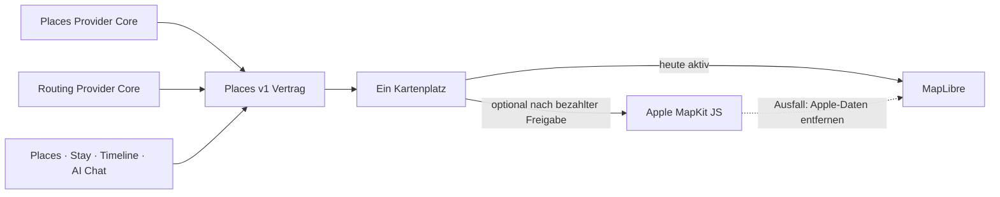

# P02 Apple MapKit Renderer Foundation

<!-- LUVIA-CURRENT-STATUS:START -->
## Aktueller Stand und nächster Schritt

**Stand 2026-09-06:** Integration **13.82.168.119**, Core **4.82.238**. M16.5 Schritte 15–18: P15/P17 bleibt aktiv und teilweise. Der Composer-Transportfehler ist für die exakte Kandidatenadresse serverseitig korrigiert. Die Zielsuche ist für Stadt und Region im Browser-Vertrag belegt. Der Slider ist keine abgenommene Gestaltung; die neue Reisewelt-Richtung liegt als Konzeptauswahl vor. Frontend .119 / Stable .104 bleiben unverändert; Gateway v234 und Intelligence v37 sind veröffentlicht.

**Zuletzt geliefert:** Serverkorrektur 06.09.2026: Der genaue .119-Composer-Link lieferte vor dem Fix für die Zielsuche NETWORK_UNAVAILABLE; Gateway und Intelligence lehnten seine Origin mit HTTP 403 ab, während Stable erlaubt war. Die auf den eigenen Integration-Worker begrenzte Freigabe ist jetzt in Gateway v234 / 4.64.37 und Intelligence v37 / 4.35.1 veröffentlicht. Rom, Toskana und Lissabon wurden danach über den tatsächlichen places.v1-Such- und Auswahlvertrag in der Browser-Origin des Kandidaten bestätigt (2.730 / 1.213 / 1.039 ms, gültige Place-ID und Koordinaten). Das ist ein echter Browser-Vertragsnachweis; kein neuer angemeldeter UI-Klicklauf oder physischer iPhone-Nachweis. 30/30 gezielte Origin-/Auth-Verhaltensproben und 237/237 kontrollierte Regression sind grün; 32/32 erneut heruntergeladene Function-Quellen entsprechen nach Zeilenenden-Normalisierung dem Deployment-Commit. Frontend .119 und Stable .104 bleiben unverändert. Der bisherige Slider ist vom Nutzer als Gestaltung abgelehnt; drei Reisewelt-Konzepte sind dokumentiert, noch nicht umgesetzt.

**Nächster Schritt (AKTIV): P15/P17: die Reisewelt-Richtung festlegen und als zusammenhängende mobile Szene ausarbeiten.** Der Nutzer verlangt eine kleine spielbare Weltkarte mit bedeutungsvollen Entscheidungen. Empfohlen ist Eure kleine Reisewelt mit direkter tageweiser Gestaltung; Alternativen sind Reisebauen und spielbare Reisegeschichte. Die Konzeptauswahl ist noch nicht als fertige Oberfläche oder Nutzerentscheidung zu behandeln.

**Abnahme dieses Schritts:**

- Die ausgewählte Richtung führt räumlich zusammenhängend von Welt/Region und überprüfbarer Zielauswahl über zwei Reiseentscheidungen zu realen Places und einem bearbeitbaren Tag. Eine sichtbare direkte Ortsuche bleibt jederzeit verfügbar.
- Jede Interaktion verändert den kanonischen Trip-Entwurf und dieselben Places-/Journey-Projektionen; Kamera, Dekoration und Animation lösen keine Anbieteranfragen aus. Keine kopierte Fachlogik und kein Pflicht-Minispiel.
- Touch, direkte Antipp-Alternative zu Ziehen, Tastatur, Reduced Motion, Reisefarbe und Wiederaufnahme auf kleinem Bildschirm abnehmen. Die öffentliche Abnahme prüft den tatsächlich ausgegebenen Versionslink, einschließlich seiner Origin, und anschließend echte iOS-/Android-Geräte.
- Echte KI-Planung bleibt ein getrenntes Produktgate innerhalb P15/P17: nach Klärung des zuvor belegten API-Guthabenproblems strukturierten Modellauftrag, Restriktionen, Kontextbelege und ausdrückliche Bestätigung positiv nachweisen. Szenische Effekte ersetzen diesen Nachweis nicht.

**Danach:** Nach der gewählten ersten Reisewelt-Szene den gesamten Composer in derselben Gestaltungslogik ausarbeiten: Zeitraum, Budget, Mitreisende und ganze Tagesvorschau. P15/P17 umfasst weiterhin vollständige KI-/Kontextplanung, echte Kontoübernahme, getrennte Identity-Bestätigung und Trip-Archivieren/Löschen/Wiederherstellen. M18–M22 behalten Mitreisendenverwaltung, Administration, Social und Intelligence II.

**Weiter offen:** P02/P03: Google-Berechtigung, breite echte Ortsbilder und physischer Mobil-Kaltstart. P07/P08: echte Booking-Provider. P09/P10/P11/P12: begrenzte interne Belege, physische Abnahme und echte Context-Signale fehlen. P15/P17: öffentlicher KI-Positivlauf wegen HTTP 429, vollständige Kontextplanung, finale interaktive Gestaltung, echte Kontoübernahme, dauerhafte Identity-Übergabe und Trip-Lifecycle offen. Die 17 Karten-USPs bleiben verbindlich; kein weiterer P-Block wird aufgrund des Teilnachweises als vollständig abgeschlossen markiert. Zusätzlich zeigte Supabase am 06.09. eine Fair-Use-Warnung wegen Egress im vorigen Abrechnungszyklus, Schonfrist bis 07.09.; im aktuellen Zyklus sind 2,517 von 5 GB genutzt. Keine Zahlung oder Planänderung vorgenommen.

Aktuelle Paketstände und nächste Abschlussnachweise: docs/planning/status-plan.v1.json. Nach jedem Arbeitsabschnitt Stand, Beleg, Restumfang und genau einen nächsten Schritt gemeinsam fortschreiben.
<!-- LUVIA-CURRENT-STATUS:END -->

Stand: 5. September 2026

## Ergebnis dieses Abschnitts

Luvia behält genau einen sichtbaren Kartenplatz. MapLibre bleibt für die kostenlose Providerstrategie der aktive und geplante Hauptrenderer. Apple MapKit JS ist ein optionaler kostenpflichtiger Kandidat, der erst nach einer ausdrücklichen Entscheidung für das Apple Developer Program, vollständiger Einrichtung, fachlicher Gleichwertigkeit und sichtbarer Desktop-/Mobilabnahme im selben Kartenplatz erprobt werden darf. MapLibre bleibt dabei der Rückfall; beide Renderer dürfen nie gleichzeitig sichtbar oder aktiv sein.

Die verbindliche Maschinenkonfiguration liegt in `config/luvia-map-renderers.v1.json`. Sie hält den aktuellen und den geplanten Renderer, die Aktivierungsgates und den atomaren Rückfall fest. Der Rückfall entfernt zuerst alle Apple-Kartendaten aus dem Arbeitsspeicher und lädt danach den für MapLibre zulässigen Providerbestand bei erhaltenem Kartenausschnitt und erhaltener Kategorie.

## Architektur

Apple wird nicht als zweites Kartenfenster ergänzt. Die Luvia-Navigation, Suche, Filter, Pins, Passend-Markierung, Detail-Sheet und Timeline-Aktionen bleiben Produktoberfläche; nur die Karte darunter wird über den gemeinsamen Renderer-Vertrag ausgewählt.

## Vorbereiteter Serveradapter

`supabase/functions/luvia-gateway/_shared/apple-maps.ts` bereitet Apple Maps Server API für Folgendes vor:

- Suche nach Orten innerhalb des Zielgebiets,
- Abruf eines konkreten Apple-Orts,
- Auto-, Fuß- und Fahrradrouten,
- serverseitig signierte ES256-Tokens aus Supabase-Secrets,
- zentrale Provider-Budgetreservierung vor jedem Apple-Aufruf,
- normalisierte Luvia-Orts- und Routenantworten mit Apple-Attribution.

Der Adapter ist absichtlich noch nicht in der automatischen Providerkaskade aktiv. Seine Policy `apple-maps-services` wird mit `enabled=false` und Nullbudget angelegt. Er akzeptiert Aufrufe nur mit `renderer=apple-mapkit` und `storage=transient`.

## Daten- und Darstellungsregeln

Apple-Ortsdaten dürfen in diesem Entwurf nur vorübergehend in der Apple-Kartenansicht gehalten werden. Sie werden nicht in den dauerhaften Luvia-Ortsbestand geschrieben, nicht mit MapLibre dargestellt und nicht zu einer abgeleiteten Ortsdatenbank zusammengeführt.

Apple-Ortsergebnisse liefern belastbar Name, Adresse, Koordinaten und Apple-POI-Kategorie. Sie liefern für Luvias fachliche Zusagen keine verlässliche Quelle für echte Place-Fotos, Bewertungen, Landesküche oder vegetarische beziehungsweise vegane Eignung. Deshalb gilt:

- kein Apple-Ort wird allein aufgrund eines allgemeinen Restauranttyps als `Passend` markiert,
- keine Landesküche wird aus Namen oder Vermutungen erfunden,
- Apple ist keine Lösung für den Anspruch „immer ein echtes Place-Bild“,
- fremde Providerdaten dürfen erst nach Prüfung ihrer Lizenzbedingungen auf Apple MapKit erscheinen.

## Apple-Kontingent

Apple dokumentiert für eine Apple-Developer-Program-Mitgliedschaft derzeit 250.000 Kartenaufrufe und 25.000 Serviceaufrufe pro Tag. Die Maps-ID und der private MapKit-Schlüssel stehen nur eingeschriebenen Mitgliedern oder berechtigten Mitgliedern eines eingeschriebenen Teams zur Verfügung. Das Apple Developer Program kostet derzeit 99 USD pro Mitgliedschaftsjahr beziehungsweise den regionalen Betrag. Maps Server API verwendet einen Maps-Identifier, Team-ID, Key-ID und privaten `.p8`-Schlüssel. Diese Werte fehlen; ohne sie meldet der Health-Endpunkt `configured=false` und kein Apple-Aufruf wird versucht. Für Luvias Free-first-Strategie bleibt Apple deshalb geparkt, bis die Mitgliedschaft ohnehin für eine native iOS-Veröffentlichung benötigt oder ausdrücklich separat beschlossen wird.

## Aktivierungsgates

Apple darf nur nach einer ausdrücklichen bezahlten Produktentscheidung als optionaler Renderer erprobt werden. Vor einer Aktivierung müssen alle Punkte erfüllt sein:

1. Eine aktive Apple-Developer-Program-Mitgliedschaft oder berechtigter Teamzugang ist belegt.
2. Maps-Identifier, Team-ID, Key-ID und privater Schlüssel liegen ausschließlich als Supabase-Secrets vor.
3. MapKit JS lädt auf Integration im Desktop-Browser und auf einem echten Mobilgerät.
4. Places und Stay zeigen dieselben Luvia-Pins, Filter, `Alle`/`Passend`, Detail-Sheets und Aktionen.
5. Timeline-Vorschläge und AI Chat konsumieren denselben `places.v1`-Bestand.
6. Attribution und Apple-Nutzungsbedingungen sind sichtbar eingehalten.
7. Die Anzeigeerlaubnis aller zusätzlich eingeblendeten Provider ist dokumentiert.
8. Der atomare Rückfall auf MapLibre ist sichtbar getestet, ohne zweite Karte und ohne verbliebene Apple-Daten.
9. Die vollständige Safe Regression ist grün.

## Offizielle Grundlagen

- Apple Maps Server API: https://developer.apple.com/documentation/applemapsserverapi
- Apple-Mitgliedschaften und Kosten: https://developer.apple.com/support/compare-memberships/
- Tokens für Maps Server API: https://developer.apple.com/documentation/applemapsserverapi/creating-and-using-tokens-with-maps-server-api
- Maps-Identifier und privater Schlüssel: https://developer.apple.com/help/account/capabilities/create-a-maps-identifier-and-private-key
- Apple-Ortssuche: https://developer.apple.com/documentation/applemapsserverapi/-v1-search
- Apple-Routen: https://developer.apple.com/documentation/applemapsserverapi/-v1-directions
- MapKit JS auf dem Web: https://developer.apple.com/maps/web/
- Apple Developer Program License Agreement, Attachment 6: https://developer.apple.com/support/terms/apple-developer-program-license-agreement/
