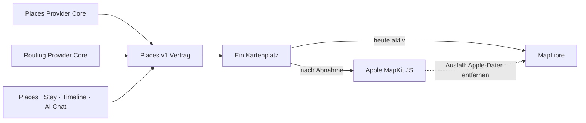

# P02 Apple MapKit Renderer Foundation

<!-- LUVIA-CURRENT-STATUS:START -->
## Aktueller Stand und nächster Schritt

**Stand 2026-09-05:** Integration **13.82.168.86**, Core **4.82.208**. M16.5 Schritte 15–18 aktiv. P09/P10 Visit- und Memory-Verwaltung sind geliefert. P02/P03 enthält jetzt zusätzlich die abgesicherte Apple-MapKit-Grundlage mit genau einem sichtbaren Kartenplatz; Apple bleibt bis Zugangsdaten und sichtbarer Parität deaktiviert. Google-Permission-Abgleich bleibt offen.

**Zuletzt geliefert:** App 13.82.168.86 / Core 4.82.208 läuft unverändert auf Integration über Worker 1d936ac3-fd72-40ca-a5f4-513f414b74d2. Gateway v205 / 4.64.22 und Places 4.38.3-apple-renderer-contract sind ACTIVE. Apple-Ortssuche und Auto-/Fuß-/Fahrradrouten sind serverseitig vorbereitet, aber mit Remote-Policy enabled=false, Nullbudget, configured=false und automaticCascade=false gesperrt. Der Ein-Karten-Vertrag hält MapLibre als aktuellen Renderer und Apple MapKit als Zielrenderer im selben Kartenplatz fest. Der sichtbare Test belegte 1 MapLibre, 0 MapKit, 1 Canvas und 50 Pins vor/nach Zoom. 228/228 Safe Regression sind grün; Frontend, Main und Production blieben unverändert.

**Nächster Schritt (AKTIV): Apple-Zugang einrichten und MapKit JS als einzigen sichtbaren Integrationsrenderer abnehmen.** Serveradapter, Nullbudget-Policy und Ein-Karten-Vertrag sind bereit. Für einen echten Apple-Aufruf und den sichtbaren MapKit-JS-Prototyp fehlen Maps-Identifier, Team-ID, Key-ID und privater .p8-Schlüssel.

**Abnahme dieses Schritts:**

- Apple-Developer-Mitgliedschaft, Maps-Identifier und zugehöriger privater Maps-Schlüssel sind vorhanden.
- Team-ID, Key-ID und privater .p8-Schlüssel liegen ausschließlich als Supabase-Secrets vor; kein Secret erscheint in Client, Git, Logs oder Health.
- MapKit JS ersetzt MapLibre nur im bestehenden Kartenplatz; es existiert zu jedem Zeitpunkt höchstens ein sichtbarer Renderer.
- Places und Stay zeigen Suche, Kategorien, alle Filter, Alle/Passend, Pins, Detail-Sheet und Timeline-Aktionen mit demselben places.v1-Vertrag.
- Timeline-Vorschläge und AI Chat verwenden denselben Place-Bestand und dieselben belegten Passend-Gründe.
- Apple-Attribution sowie Anzeigerechte zusätzlicher Provider sind geprüft und dokumentiert.
- Desktop- und echter Mobiltest belegen MapKit-Interaktion sowie atomaren Rückfall auf MapLibre ohne verbliebene Apple-Daten.
- Safe Regression, öffentliche App-Identität und unveränderter Main-/Production-Stand sind erneut belegt.

**Danach:** Danach die offene Google-Key-Beschränkung für den positiven Ernährungsbeleg abschließen, anschließend der positive Booking-Provider-Weg und die physische iOS-/Android-Langdruckabnahme; danach P12/P15/P17 Trip Composer, P19/P20/P22/P23/P26 Context Matrix und P33/P34/P35 AI-Parität.

**Weiter offen:** P02/P03 aktiv: Apple-Maps-Zugangsdaten, sichtbarer einzelner MapKit-Renderer, Provider-Lizenzmatrix und Rückfallabnahme; bestehende Google-Key-Beschränkung beziehungsweise Key-Projekt-/Billing-Zuordnung für positiven Ernährungsbeleg. P09/P10 teilweise: positiver Booking-Provider-Weg, Visit-AI-Parität und physische Langdruckabnahme. Danach P12/P15/P17 Trip Composer; P19/P20/P22/P23/P26 Context Matrix; P33/P34/P35 AI-Parität. M18 mit Mitreisendenverwaltung, Administration, Social und Intelligence II bleibt bis M22 erhalten. Operativ offen: Die Supabase-Free-Plan-Schonfrist wegen des Egress-Overruns im vorherigen Zyklus endet am 07.09.2026; danach können eingeschränkte Anfragen HTTP 402 liefern. Der aktuelle Zyklus 23.08.–23.09.2026 steht bei 2,359/5 GB Egress (47 %, kein Overrun) und 63.540/500.000 Edge-Function-Aufrufen (13 %).

Aktuelle Paketstände und nächste Abschlussnachweise: docs/planning/status-plan.v1.json. Nach jedem Arbeitsabschnitt Stand, Beleg, Restumfang und genau einen nächsten Schritt gemeinsam fortschreiben.
<!-- LUVIA-CURRENT-STATUS:END -->

Stand: 5. September 2026

## Ergebnis dieses Abschnitts

Luvia behält genau einen sichtbaren Kartenplatz. Die heutige MapLibre-Karte bleibt der aktive Renderer, bis Apple MapKit JS vollständig eingerichtet, fachlich gleichwertig und auf Desktop sowie Mobilgeräten sichtbar abgenommen ist. Danach darf Apple MapKit im selben Kartenplatz Hauptrenderer werden. MapLibre bleibt dort als Rückfall; beide Renderer dürfen nie gleichzeitig sichtbar oder aktiv sein.

Die verbindliche Maschinenkonfiguration liegt in `config/luvia-map-renderers.v1.json`. Sie hält den aktuellen und den geplanten Renderer, die Aktivierungsgates und den atomaren Rückfall fest. Der Rückfall entfernt zuerst alle Apple-Kartendaten aus dem Arbeitsspeicher und lädt danach den für MapLibre zulässigen Providerbestand bei erhaltenem Kartenausschnitt und erhaltener Kategorie.

## Architektur

Apple wird nicht als zweites Kartenfenster ergänzt. Die Luvia-Navigation, Suche, Filter, Pins, Passend-Markierung, Detail-Sheet und Timeline-Aktionen bleiben Produktoberfläche; nur die Karte darunter wird über den gemeinsamen Renderer-Vertrag ausgewählt.

## Vorbereiteter Serveradapter

`supabase/functions/luvia-gateway/_shared/apple-maps.ts` bereitet Apple Maps Server API für Folgendes vor:

- Suche nach Orten innerhalb des Zielgebiets,
- Abruf eines konkreten Apple-Orts,
- Auto-, Fuß- und Fahrradrouten,
- serverseitig signierte ES256-Tokens aus Supabase-Secrets,
- zentrale Provider-Budgetreservierung vor jedem Apple-Aufruf,
- normalisierte Luvia-Orts- und Routenantworten mit Apple-Attribution.

Der Adapter ist absichtlich noch nicht in der automatischen Providerkaskade aktiv. Seine Policy `apple-maps-services` wird mit `enabled=false` und Nullbudget angelegt. Er akzeptiert Aufrufe nur mit `renderer=apple-mapkit` und `storage=transient`.

## Daten- und Darstellungsregeln

Apple-Ortsdaten dürfen in diesem Entwurf nur vorübergehend in der Apple-Kartenansicht gehalten werden. Sie werden nicht in den dauerhaften Luvia-Ortsbestand geschrieben, nicht mit MapLibre dargestellt und nicht zu einer abgeleiteten Ortsdatenbank zusammengeführt.

Apple-Ortsergebnisse liefern belastbar Name, Adresse, Koordinaten und Apple-POI-Kategorie. Sie liefern für Luvias fachliche Zusagen keine verlässliche Quelle für echte Place-Fotos, Bewertungen, Landesküche oder vegetarische beziehungsweise vegane Eignung. Deshalb gilt:

- kein Apple-Ort wird allein aufgrund eines allgemeinen Restauranttyps als `Passend` markiert,
- keine Landesküche wird aus Namen oder Vermutungen erfunden,
- Apple ist keine Lösung für den Anspruch „immer ein echtes Place-Bild“,
- fremde Providerdaten dürfen erst nach Prüfung ihrer Lizenzbedingungen auf Apple MapKit erscheinen.

## Apple-Kontingent

Apple dokumentiert für eine Apple-Developer-Program-Mitgliedschaft derzeit 250.000 Kartenaufrufe und 25.000 Serviceaufrufe pro Tag. Maps Server API verwendet einen Maps-Identifier, Team-ID, Key-ID und privaten `.p8`-Schlüssel. Diese Werte fehlen noch; ohne sie meldet der Health-Endpunkt nur `configured=false` und kein Apple-Aufruf wird versucht.

## Aktivierungsgates

Apple darf erst Hauptrenderer werden, wenn alle Punkte erfüllt sind:

1. Maps-Identifier, Team-ID, Key-ID und privater Schlüssel liegen ausschließlich als Supabase-Secrets vor.
2. MapKit JS lädt auf Integration im Desktop-Browser und auf einem echten Mobilgerät.
3. Places und Stay zeigen dieselben Luvia-Pins, Filter, `Alle`/`Passend`, Detail-Sheets und Aktionen.
4. Timeline-Vorschläge und AI Chat konsumieren denselben `places.v1`-Bestand.
5. Attribution und Apple-Nutzungsbedingungen sind sichtbar eingehalten.
6. Die Anzeigeerlaubnis aller zusätzlich eingeblendeten Provider ist dokumentiert.
7. Der atomare Rückfall auf MapLibre ist sichtbar getestet, ohne zweite Karte und ohne verbliebene Apple-Daten.
8. Die vollständige Safe Regression ist grün.

## Offizielle Grundlagen

- Apple Maps Server API: https://developer.apple.com/documentation/applemapsserverapi
- Tokens für Maps Server API: https://developer.apple.com/documentation/applemapsserverapi/creating-and-using-tokens-with-maps-server-api
- Maps-Identifier und privater Schlüssel: https://developer.apple.com/help/account/capabilities/create-a-maps-identifier-and-private-key
- Apple-Ortssuche: https://developer.apple.com/documentation/applemapsserverapi/-v1-search
- Apple-Routen: https://developer.apple.com/documentation/applemapsserverapi/-v1-directions
- MapKit JS auf dem Web: https://developer.apple.com/maps/web/
- Apple Developer Program License Agreement, Attachment 6: https://developer.apple.com/support/terms/apple-developer-program-license-agreement/
