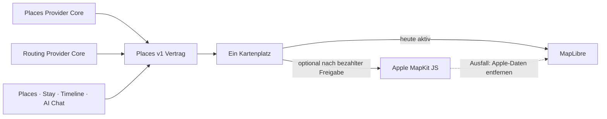

# P02 Apple MapKit Renderer Foundation

<!-- LUVIA-CURRENT-STATUS:START -->
## Aktueller Stand und nächster Schritt

**Stand 2026-09-06:** Integration **13.82.168.117**, Core **4.82.236**. M16.5 Schritte 15–18: P09/P10/P11/P12 behalten ihre begrenzten internen Belege. P15/P17 ist aktiv und noch nicht produktfertig. App .117 ergänzt robuste Composer-Übernahme, Auswahl-/Reload-Schutz, Kategorieabdeckung und eine erste interaktive Gestaltungsrunde. Die frühere Aussage, es fehle nur noch Lifecycle, ist korrigiert. Stable Integration bleibt auf App .104; .117 ist ein unveränderlicher Prüfkandidat. Main und Production bleiben unverändert.

**Zuletzt geliefert:** App .117 sichert getauschte Vorschläge, Auswahlarten, Uhrzeiten, Dauern und bestätigte Teilschritte über Reload. Feste Daten und Reisezeitzone werden geprüft; Vormerken und Weglassen fließen in die echte Journey-Tagesprüfung ein. Positive, identitätsgebundene Owner-Readbacks sind für eine erfolgreiche Übernahme erforderlich. Alle gewählten Kategorien nutzen den gemeinsamen Provider-Router; gecachte passende Kategorien sparen Anbieterabfragen. Der öffentliche Browserlauf zeigte fünf echte Scharbeutz-Orte aus Essen, Kultur und Aktivitäten, vier Pins nach Teilwahl und den nach Reload erhaltenen Stand 3 einplanen / 1 vormerken / 1 weglassen. Er endete vor der echten Kontomutation. Lokal bestätigte der sichtbare mobile Lauf fünf simulierte Schreibaktionen mit echten Vertragsregeln. 24 neue Verhaltensprüfungen, 236/236 Safe Regression, NFR-0 3/3 und 30/30 öffentliche Byteidentität sind grün. Reisefarbige Fortschrittsübersicht, erhaltene Karte, Kartenfokus, besser lesbare Karten und kurze Schrittübergänge wurden sichtbar auf Desktop und bei 390 × 844 Pixeln geprüft.

**Nächster Schritt (AKTIV): P15/P17: echten KI-Reiseauftrag mit bearbeitbarer Tagesplanung verbinden.** Der Nutzer verlangt eine lebendige interaktive Reiseerstellung und KI mit nachvollziehbarem Verständnis. Die aktuelle Vorschau verwendet gewählte Kategorien und höchstens drei Tage; Freitext wird noch nicht für eine vollständige Reiseplanung interpretiert. Dieser Produktnachweis muss vor einem P15/P17-Abschluss erbracht werden.

**Abnahme dieses Schritts:**

- Freitext, ausgewählte Schwerpunkte und bestätigte Profilrestriktionen werden über den Intelligence Owner zu einem sichtbaren Reiseauftrag aufgelöst. Widersprüche oder fehlende wesentliche Angaben lösen gezielte Rückfragen aus; unbelegte Eigenschaften werden nicht als passend behauptet.
- Die nötigen Kontextbelege aus P19/P20/P22/P23/P26 und P33/P34/P35 werden für Zeit, Wege, Budget, Öffnung und Saison angebunden. Eine vollständige Reise über den gewählten Zeitraum enthält tatsächliche Auswahlgründe, Freiraum und klar benannte unbekannte Faktoren.
- Eine interaktive tageweise Gesamtvorschau mit der gemeinsamen Places-Karte erlaubt Datum-/Zeitänderung, Alternativen, Vormerken und Teilübernahme. Die Gestaltung nutzt Reisefarbe und angemessene Bewegung; mobile Bedienung und Reduced Motion bleiben erhalten.
- Ein realer Konto-End-to-End-Lauf muss Trip-Erstellung und exakt gewählte Place-/Journey-Einträge samt Dauer, Reload und Teilfehler-Wiederaufnahme bestätigen. Fixture-Receipts allein gelten nicht als Produktfreigabe.

**Danach:** Danach werden innerhalb P15/P17 die getrennte dauerhafte Identity-Übergabe und Archivieren/Löschen/Wiederherstellen der Reise geschlossen. Die übrige Context Matrix und AI-Parität bleiben unter P19/P20/P22/P23/P26 und P33/P34/P35 verfolgt; M18–M22 behalten Mitreisendenverwaltung, Administration, Social und Intelligence II.

**Weiter offen:** P02/P03: Google-Berechtigung, breite echte Ortsbilder und physischer Mobil-Kaltstart. P07/P08: reale Booking-Provider. P09/P10/P11/P12: begrenzte interne Nachweise; physische iOS-/Android-Abnahme und bei P12 echte Context-Signale fehlen. P15/P17: tatsächliche Freitext-/Gesamtreiseplanung, finale Gestaltung, echte Kontoübernahme, dauerhafte Identity-Übergabe und Trip-Lifecycle fehlen. Die 17 Karten-USPs bleiben verbindlich; kein weiterer P-Block wird aufgrund dieser Composer-Teilverbesserung als vollständig abgeschlossen markiert.

Aktuelle Paketstände und nächste Abschlussnachweise: docs/planning/status-plan.v1.json. Nach jedem Arbeitsabschnitt Stand, Beleg, Restumfang und genau einen nächsten Schritt gemeinsam fortschreiben.
<!-- LUVIA-CURRENT-STATUS:END -->

Stand: 5. September 2026

## Ergebnis dieses Abschnitts

Luvia behält genau einen sichtbaren Kartenplatz. MapLibre bleibt für die kostenlose Providerstrategie der aktive und geplante Hauptrenderer. Apple MapKit JS ist ein optionaler kostenpflichtiger Kandidat, der erst nach einer ausdrücklichen Entscheidung für das Apple Developer Program, vollständiger Einrichtung, fachlicher Gleichwertigkeit und sichtbarer Desktop-/Mobilabnahme im selben Kartenplatz erprobt werden darf. MapLibre bleibt dabei der Rückfall; beide Renderer dürfen nie gleichzeitig sichtbar oder aktiv sein.

Die verbindliche Maschinenkonfiguration liegt in `config/luvia-map-renderers.v1.json`. Sie hält den aktuellen und den geplanten Renderer, die Aktivierungsgates und den atomaren Rückfall fest. Der Rückfall entfernt zuerst alle Apple-Kartendaten aus dem Arbeitsspeicher und lädt danach den für MapLibre zulässigen Providerbestand bei erhaltenem Kartenausschnitt und erhaltener Kategorie.

## Architektur

Apple wird nicht als zweites Kartenfenster ergänzt. Die Luvia-Navigation, Suche, Filter, Pins, Passend-Markierung, Detail-Sheet und Timeline-Aktionen bleiben Produktoberfläche; nur die Karte darunter wird über den gemeinsamen Renderer-Vertrag ausgewählt.

## Vorbereiteter Serveradapter

`supabase/functions/luvia-gateway/_shared/apple-maps.ts` bereitet Apple Maps Server API für Folgendes vor:

- Suche nach Orten innerhalb des Zielgebiets,
- Abruf eines konkreten Apple-Orts,
- Auto-, Fuß- und Fahrradrouten,
- serverseitig signierte ES256-Tokens aus Supabase-Secrets,
- zentrale Provider-Budgetreservierung vor jedem Apple-Aufruf,
- normalisierte Luvia-Orts- und Routenantworten mit Apple-Attribution.

Der Adapter ist absichtlich noch nicht in der automatischen Providerkaskade aktiv. Seine Policy `apple-maps-services` wird mit `enabled=false` und Nullbudget angelegt. Er akzeptiert Aufrufe nur mit `renderer=apple-mapkit` und `storage=transient`.

## Daten- und Darstellungsregeln

Apple-Ortsdaten dürfen in diesem Entwurf nur vorübergehend in der Apple-Kartenansicht gehalten werden. Sie werden nicht in den dauerhaften Luvia-Ortsbestand geschrieben, nicht mit MapLibre dargestellt und nicht zu einer abgeleiteten Ortsdatenbank zusammengeführt.

Apple-Ortsergebnisse liefern belastbar Name, Adresse, Koordinaten und Apple-POI-Kategorie. Sie liefern für Luvias fachliche Zusagen keine verlässliche Quelle für echte Place-Fotos, Bewertungen, Landesküche oder vegetarische beziehungsweise vegane Eignung. Deshalb gilt:

- kein Apple-Ort wird allein aufgrund eines allgemeinen Restauranttyps als `Passend` markiert,
- keine Landesküche wird aus Namen oder Vermutungen erfunden,
- Apple ist keine Lösung für den Anspruch „immer ein echtes Place-Bild“,
- fremde Providerdaten dürfen erst nach Prüfung ihrer Lizenzbedingungen auf Apple MapKit erscheinen.

## Apple-Kontingent

Apple dokumentiert für eine Apple-Developer-Program-Mitgliedschaft derzeit 250.000 Kartenaufrufe und 25.000 Serviceaufrufe pro Tag. Die Maps-ID und der private MapKit-Schlüssel stehen nur eingeschriebenen Mitgliedern oder berechtigten Mitgliedern eines eingeschriebenen Teams zur Verfügung. Das Apple Developer Program kostet derzeit 99 USD pro Mitgliedschaftsjahr beziehungsweise den regionalen Betrag. Maps Server API verwendet einen Maps-Identifier, Team-ID, Key-ID und privaten `.p8`-Schlüssel. Diese Werte fehlen; ohne sie meldet der Health-Endpunkt `configured=false` und kein Apple-Aufruf wird versucht. Für Luvias Free-first-Strategie bleibt Apple deshalb geparkt, bis die Mitgliedschaft ohnehin für eine native iOS-Veröffentlichung benötigt oder ausdrücklich separat beschlossen wird.

## Aktivierungsgates

Apple darf nur nach einer ausdrücklichen bezahlten Produktentscheidung als optionaler Renderer erprobt werden. Vor einer Aktivierung müssen alle Punkte erfüllt sein:

1. Eine aktive Apple-Developer-Program-Mitgliedschaft oder berechtigter Teamzugang ist belegt.
2. Maps-Identifier, Team-ID, Key-ID und privater Schlüssel liegen ausschließlich als Supabase-Secrets vor.
3. MapKit JS lädt auf Integration im Desktop-Browser und auf einem echten Mobilgerät.
4. Places und Stay zeigen dieselben Luvia-Pins, Filter, `Alle`/`Passend`, Detail-Sheets und Aktionen.
5. Timeline-Vorschläge und AI Chat konsumieren denselben `places.v1`-Bestand.
6. Attribution und Apple-Nutzungsbedingungen sind sichtbar eingehalten.
7. Die Anzeigeerlaubnis aller zusätzlich eingeblendeten Provider ist dokumentiert.
8. Der atomare Rückfall auf MapLibre ist sichtbar getestet, ohne zweite Karte und ohne verbliebene Apple-Daten.
9. Die vollständige Safe Regression ist grün.

## Offizielle Grundlagen

- Apple Maps Server API: https://developer.apple.com/documentation/applemapsserverapi
- Apple-Mitgliedschaften und Kosten: https://developer.apple.com/support/compare-memberships/
- Tokens für Maps Server API: https://developer.apple.com/documentation/applemapsserverapi/creating-and-using-tokens-with-maps-server-api
- Maps-Identifier und privater Schlüssel: https://developer.apple.com/help/account/capabilities/create-a-maps-identifier-and-private-key
- Apple-Ortssuche: https://developer.apple.com/documentation/applemapsserverapi/-v1-search
- Apple-Routen: https://developer.apple.com/documentation/applemapsserverapi/-v1-directions
- MapKit JS auf dem Web: https://developer.apple.com/maps/web/
- Apple Developer Program License Agreement, Attachment 6: https://developer.apple.com/support/terms/apple-developer-program-license-agreement/
