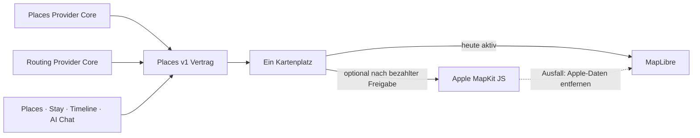

# P02 Apple MapKit Renderer Foundation

<!-- LUVIA-CURRENT-STATUS:START -->
## Aktueller Stand und nächster Schritt

**Stand 2026-09-09:** Integration **13.82.168.174**, Core **4.82.293**. P17/P19 aktiv und teilweise: App .174 / Core .293, Worker 1fa508e6-e9ba-4c8d-aff0-b363a12b5fcd ist öffentlich ausschließlich auf Integration und 22/22 byteidentisch. Der öffentliche Valencia-Neuversuch wurde vor der Places-Phase zweimal durch planning.dialogue nach 28 Sekunden beendet. Integration-Intelligence 4.42.1 ist lokal vollständig geprüft. Main, Production und produktive Intelligence bleiben unverändert.

**Zuletzt geliefert:** Valencia und andere große Ziele werden nicht mehr auf explizit genannte Interessen reduziert. Acht Zielort-Grundkategorien, kleinere verteilte Stadtsektoren und reisedauerabhängige Ziele liefern 42/84/126 echte Provider-Kandidaten für 7/14/21 Tage; die KI erhält nur 32/60/92 priorisierte Kandidaten. Der erste öffentliche Versuch machte zugleich den vorgelagerten Laufzeitblocker sichtbar. 4.42.1 hält dessen semantisches Schema bei, entfernt zusätzliches Luna-Reasoning, senkt das Ausgabelimit auf 2.800 und fordert knappe Structured-Output-Texte.

**Nächster Schritt (AKTIV): Integration-Intelligence 4.42.1 getrennt veröffentlichen und den Valencia-Ablauf bis zum breiten Place-Pool wiederholen.** App .174 ist öffentlich korrekt ausgeliefert, doch planning.dialogue stoppte den frischen Auftrag zweimal vor der Places-Recherche. Der kompaktere Luna-Vertrag muss den Reiseauftrag innerhalb der bestehenden 28-Sekunden-Grenze abschließen; danach wird erstmals der öffentliche 42er-Pool samt Meer/Strand, Kategorienmix und räumlicher Streuung vermessen.

**Abnahme dieses Schritts:**

- Nur luvia-intelligence-integration wird auf Version 4.42.1 veröffentlicht; produktive Intelligence, Main und Production bleiben unverändert.
- planning.dialogue verwendet Luna, das vollständige strikte Schema, höchstens 2.800 Ausgabetokens, reasoning none und low verbosity.
- Der frische Valencia-Auftrag erreicht innerhalb der bestehenden 28-Sekunden-Grenze die Places-Phase oder zeigt einen konkreten terminalen Fehler.
- Valencia recherchiert acht Zielort-Grundkategorien und priorisiert Meer/Strand, Shopping, Nachtleben und Restaurants.
- Der öffentliche Sieben-Tage-Lauf zeigt deutlich mehr als 21 echte Kandidaten oder benennt eine reale Provider-Unterdeckung ehrlich.
- Die Modellkomposition erhält höchstens 32 fachlich und räumlich priorisierte Kandidaten, während der vollständige Forschungspool erhalten bleibt.
- Der öffentliche Plan erreicht den ungespeicherten Review oder einen konkreten sichtbaren terminalen Fehler innerhalb des begrenzten Ablaufs.

**Danach:** Nach dem öffentlichen Valencia-Nachweis folgt die weitere Laufzeitverkürzung der Tageskomposition, danach autoritative Ferienfenster und Konfliktmoderation. Anschließend werden räumliche Streuung, Strandabdeckung und Kategorienmix fachlich abgenommen sowie P16-Ablehnungsdiagnose, P15/P17-Kontoübernahme, Timeline-/Owner-Receipts, Archiv/Wiederherstellung und physische Geräte geschlossen. M17 friert die gemeinsame Produktsprache und modulübergreifenden Intelligence-Verträge ein; M18 baut Collaboration, Attention, Wallet/Dokumente, Reviews, Admin, Social, Suche und Intelligence II aus.

**Weiter offen:** P17/P19: Integration-Intelligence 4.42.1 veröffentlichen und .174 mit einem frischen Valencia-Auftrag bis zum Review messen; Gesamtlaufzeit weiter verkürzen; automatische autoritativ belegte Ferienfenster, Konfliktvarianten, räumliche Streuung, Strandabdeckung und Kategorienmix fachlich abnehmen. Konto- und Timeline-Übernahme, physische Geräte sowie echte datierte Unterkunfts-, Routen-, Wetter-, Event-, Preis-, Öffnungs- und Buchbarkeitsbelege bleiben offen. P16: semantische Ablehnungsdiagnose. Kontextwellen, Reise-Schatten, Ziel-Zwillinge, Luvia Pulse und Gruppen-Sternbild bleiben offen.

Aktuelle Paketstände und nächste Abschlussnachweise: docs/planning/status-plan.v1.json. Nach jedem Arbeitsabschnitt Stand, Beleg, Restumfang und genau einen nächsten Schritt gemeinsam fortschreiben.
<!-- LUVIA-CURRENT-STATUS:END -->

Stand: 5. September 2026

## Ergebnis dieses Abschnitts

Luvia behält genau einen sichtbaren Kartenplatz. MapLibre bleibt für die kostenlose Providerstrategie der aktive und geplante Hauptrenderer. Apple MapKit JS ist ein optionaler kostenpflichtiger Kandidat, der erst nach einer ausdrücklichen Entscheidung für das Apple Developer Program, vollständiger Einrichtung, fachlicher Gleichwertigkeit und sichtbarer Desktop-/Mobilabnahme im selben Kartenplatz erprobt werden darf. MapLibre bleibt dabei der Rückfall; beide Renderer dürfen nie gleichzeitig sichtbar oder aktiv sein.

Die verbindliche Maschinenkonfiguration liegt in `config/luvia-map-renderers.v1.json`. Sie hält den aktuellen und den geplanten Renderer, die Aktivierungsgates und den atomaren Rückfall fest. Der Rückfall entfernt zuerst alle Apple-Kartendaten aus dem Arbeitsspeicher und lädt danach den für MapLibre zulässigen Providerbestand bei erhaltenem Kartenausschnitt und erhaltener Kategorie.

## Architektur

Apple wird nicht als zweites Kartenfenster ergänzt. Die Luvia-Navigation, Suche, Filter, Pins, Passend-Markierung, Detail-Sheet und Timeline-Aktionen bleiben Produktoberfläche; nur die Karte darunter wird über den gemeinsamen Renderer-Vertrag ausgewählt.

## Vorbereiteter Serveradapter

`supabase/functions/luvia-gateway/_shared/apple-maps.ts` bereitet Apple Maps Server API für Folgendes vor:

- Suche nach Orten innerhalb des Zielgebiets,
- Abruf eines konkreten Apple-Orts,
- Auto-, Fuß- und Fahrradrouten,
- serverseitig signierte ES256-Tokens aus Supabase-Secrets,
- zentrale Provider-Budgetreservierung vor jedem Apple-Aufruf,
- normalisierte Luvia-Orts- und Routenantworten mit Apple-Attribution.

Der Adapter ist absichtlich noch nicht in der automatischen Providerkaskade aktiv. Seine Policy `apple-maps-services` wird mit `enabled=false` und Nullbudget angelegt. Er akzeptiert Aufrufe nur mit `renderer=apple-mapkit` und `storage=transient`.

## Daten- und Darstellungsregeln

Apple-Ortsdaten dürfen in diesem Entwurf nur vorübergehend in der Apple-Kartenansicht gehalten werden. Sie werden nicht in den dauerhaften Luvia-Ortsbestand geschrieben, nicht mit MapLibre dargestellt und nicht zu einer abgeleiteten Ortsdatenbank zusammengeführt.

Apple-Ortsergebnisse liefern belastbar Name, Adresse, Koordinaten und Apple-POI-Kategorie. Sie liefern für Luvias fachliche Zusagen keine verlässliche Quelle für echte Place-Fotos, Bewertungen, Landesküche oder vegetarische beziehungsweise vegane Eignung. Deshalb gilt:

- kein Apple-Ort wird allein aufgrund eines allgemeinen Restauranttyps als `Passend` markiert,
- keine Landesküche wird aus Namen oder Vermutungen erfunden,
- Apple ist keine Lösung für den Anspruch „immer ein echtes Place-Bild“,
- fremde Providerdaten dürfen erst nach Prüfung ihrer Lizenzbedingungen auf Apple MapKit erscheinen.

## Apple-Kontingent

Apple dokumentiert für eine Apple-Developer-Program-Mitgliedschaft derzeit 250.000 Kartenaufrufe und 25.000 Serviceaufrufe pro Tag. Die Maps-ID und der private MapKit-Schlüssel stehen nur eingeschriebenen Mitgliedern oder berechtigten Mitgliedern eines eingeschriebenen Teams zur Verfügung. Das Apple Developer Program kostet derzeit 99 USD pro Mitgliedschaftsjahr beziehungsweise den regionalen Betrag. Maps Server API verwendet einen Maps-Identifier, Team-ID, Key-ID und privaten `.p8`-Schlüssel. Diese Werte fehlen; ohne sie meldet der Health-Endpunkt `configured=false` und kein Apple-Aufruf wird versucht. Für Luvias Free-first-Strategie bleibt Apple deshalb geparkt, bis die Mitgliedschaft ohnehin für eine native iOS-Veröffentlichung benötigt oder ausdrücklich separat beschlossen wird.

## Aktivierungsgates

Apple darf nur nach einer ausdrücklichen bezahlten Produktentscheidung als optionaler Renderer erprobt werden. Vor einer Aktivierung müssen alle Punkte erfüllt sein:

1. Eine aktive Apple-Developer-Program-Mitgliedschaft oder berechtigter Teamzugang ist belegt.
2. Maps-Identifier, Team-ID, Key-ID und privater Schlüssel liegen ausschließlich als Supabase-Secrets vor.
3. MapKit JS lädt auf Integration im Desktop-Browser und auf einem echten Mobilgerät.
4. Places und Stay zeigen dieselben Luvia-Pins, Filter, `Alle`/`Passend`, Detail-Sheets und Aktionen.
5. Timeline-Vorschläge und AI Chat konsumieren denselben `places.v1`-Bestand.
6. Attribution und Apple-Nutzungsbedingungen sind sichtbar eingehalten.
7. Die Anzeigeerlaubnis aller zusätzlich eingeblendeten Provider ist dokumentiert.
8. Der atomare Rückfall auf MapLibre ist sichtbar getestet, ohne zweite Karte und ohne verbliebene Apple-Daten.
9. Die vollständige Safe Regression ist grün.

## Offizielle Grundlagen

- Apple Maps Server API: https://developer.apple.com/documentation/applemapsserverapi
- Apple-Mitgliedschaften und Kosten: https://developer.apple.com/support/compare-memberships/
- Tokens für Maps Server API: https://developer.apple.com/documentation/applemapsserverapi/creating-and-using-tokens-with-maps-server-api
- Maps-Identifier und privater Schlüssel: https://developer.apple.com/help/account/capabilities/create-a-maps-identifier-and-private-key
- Apple-Ortssuche: https://developer.apple.com/documentation/applemapsserverapi/-v1-search
- Apple-Routen: https://developer.apple.com/documentation/applemapsserverapi/-v1-directions
- MapKit JS auf dem Web: https://developer.apple.com/maps/web/
- Apple Developer Program License Agreement, Attachment 6: https://developer.apple.com/support/terms/apple-developer-program-license-agreement/
