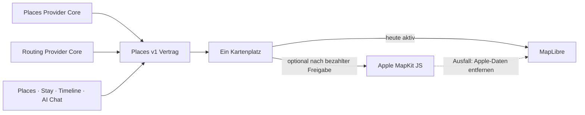

# P02 Apple MapKit Renderer Foundation

<!-- LUVIA-CURRENT-STATUS:START -->
## Aktueller Stand und nächster Schritt

**Stand 2026-09-09:** Integration **13.82.168.175**, Core **4.82.294**. P17/P19 aktiv und teilweise: App .175 / Core .294 ist lokal implementiert und mit 131 Composer-, 93/93 P19-, 240/240 Safe-Regression- sowie NFR-0 3/3-Prüfungen vollständig grün. Integration-Intelligence 4.42.1 ist öffentlich und führte den echten Valencia-Auftrag bis zu den Datumsvorschlägen; App .174 blieb danach mehr als 5:44 Minuten in der seriellen Places-Recherche. .175 begrenzt diese Recherche auf ein gemeinsames 44-Sekunden-Budget und beseitigt die künstliche Kappung am Zielwert. Main, Production und produktive Intelligence bleiben unverändert.

**Zuletzt geliefert:** Für Valencia und andere große Ziele sind 42/84/126 Kandidaten für 7/14/21 Tage nun Mindestziele. Liefert die Recherche mehr, bleiben bis zu 160 eindeutige Kandidaten in der Sitzung erhalten. Das ist eine technische Arbeitssicherheitsgrenze und keine Behauptung über den Gesamtbestand einer Stadt. Die kostenrelevante KI-Komposition bleibt getrennt auf 32/60/92 räumlich und fachlich priorisierte Kandidaten begrenzt. Im Review stehen die Zahl der eingeplanten Reisemomente und die Zahl der geprüften Places sichtbar nebeneinander. Die Places-Recherche arbeitet mit einer gemeinsamen 44-Sekunden-Frist, schneller Geoapify-Breite und Auto-Provider nur bei einer fehlenden ausdrücklich gewünschten Kategorie.

**Nächster Schritt (AKTIV): App .175 vollständig prüfen, nur auf Integration veröffentlichen und Valencia bis zum terminalen Ergebnis vermessen.** Der reale Auftrag erreicht mit Intelligence 4.42.1 die Places-Phase, blieb in App .174 dort aber länger als 5:44 Minuten. .175 muss öffentlich beweisen, dass der größere, nicht am Zielwert abgeschnittene Kandidatenpool innerhalb der gemeinsamen Recherchefrist in Komposition oder einen konkreten terminalen Fehler übergeht.

**Abnahme dieses Schritts:**

- App .175 / Core .294 besteht vollständige Safe Regression, NFR-0 und alle fokussierten Composer-/P19-Gates.
- Nur Integration wird veröffentlicht; Main, Production und produktive Intelligence bleiben unverändert.
- Stable und immutable Integration liefern die geprüften Release-Dateien byteidentisch aus.
- Der frische Valencia-Auftrag verlässt die Places-Recherche innerhalb des gemeinsamen 44-Sekunden-Budgets zuzüglich Abschluss-Checkpoint oder zeigt einen konkreten terminalen Fehler statt endlos weiterzulaufen.
- Der Sieben-Tage-Lauf recherchiert deutlich mehr als 21 eindeutige Kandidaten oder benennt eine echte Provider-Unterdeckung; ein ergiebiger Pool wird nicht bei 42 abgeschnitten.
- Meer/Strand, Shopping, Nachtleben und Essen werden als ausdrückliche Wünsche priorisiert; acht Grundkategorien und räumliche Sektoren bleiben im Recherchevertrag.
- Der Review unterscheidet sichtbar zwischen eingeplanten Reisemomenten und geprüften Places und erreicht den ungespeicherten Review oder einen konkreten sichtbaren terminalen Fehler.

**Danach:** Nach dem öffentlichen Valencia-Nachweis werden räumliche Streuung, Strandabdeckung und Kategorienmix fachlich abgenommen und der große Pool als gezielte Tausch-, Ergänzungs- und Spontanreserve nutzbar gemacht. Danach folgen autoritative Ferienfenster, Konfliktmoderation, P16-Ablehnungsdiagnose, Konto-/Timeline-Übernahme und physische Geräte. M17 friert die gemeinsame Produktsprache und modulübergreifenden Intelligence-Verträge ein; M18 baut Collaboration, Attention, Wallet/Dokumente, Reviews, Admin, Social, Suche und Intelligence II aus.

**Weiter offen:** P17/P19: .175 öffentlich bis zum Review oder konkreten terminalen Fehler vermessen; räumliche Streuung, Strandabdeckung und Kategorienmix fachlich abnehmen; den erhaltenen Kandidatenpool für Tausch- und Ergänzungsvorschläge öffnen; lange 14-/21-Tage-Pläne öffentlich prüfen. Automatische autoritativ belegte Ferienfenster, Konfliktvarianten, Konto- und Timeline-Übernahme, physische Geräte sowie echte datierte Unterkunfts-, Routen-, Wetter-, Event-, Preis-, Öffnungs- und Buchbarkeitsbelege bleiben offen. P16: semantische Ablehnungsdiagnose. Kontextwellen, Reise-Schatten, Ziel-Zwillinge, Luvia Pulse und Gruppen-Sternbild bleiben offen.

Aktuelle Paketstände und nächste Abschlussnachweise: docs/planning/status-plan.v1.json. Nach jedem Arbeitsabschnitt Stand, Beleg, Restumfang und genau einen nächsten Schritt gemeinsam fortschreiben.
<!-- LUVIA-CURRENT-STATUS:END -->

Stand: 5. September 2026

## Ergebnis dieses Abschnitts

Luvia behält genau einen sichtbaren Kartenplatz. MapLibre bleibt für die kostenlose Providerstrategie der aktive und geplante Hauptrenderer. Apple MapKit JS ist ein optionaler kostenpflichtiger Kandidat, der erst nach einer ausdrücklichen Entscheidung für das Apple Developer Program, vollständiger Einrichtung, fachlicher Gleichwertigkeit und sichtbarer Desktop-/Mobilabnahme im selben Kartenplatz erprobt werden darf. MapLibre bleibt dabei der Rückfall; beide Renderer dürfen nie gleichzeitig sichtbar oder aktiv sein.

Die verbindliche Maschinenkonfiguration liegt in `config/luvia-map-renderers.v1.json`. Sie hält den aktuellen und den geplanten Renderer, die Aktivierungsgates und den atomaren Rückfall fest. Der Rückfall entfernt zuerst alle Apple-Kartendaten aus dem Arbeitsspeicher und lädt danach den für MapLibre zulässigen Providerbestand bei erhaltenem Kartenausschnitt und erhaltener Kategorie.

## Architektur

Apple wird nicht als zweites Kartenfenster ergänzt. Die Luvia-Navigation, Suche, Filter, Pins, Passend-Markierung, Detail-Sheet und Timeline-Aktionen bleiben Produktoberfläche; nur die Karte darunter wird über den gemeinsamen Renderer-Vertrag ausgewählt.

## Vorbereiteter Serveradapter

`supabase/functions/luvia-gateway/_shared/apple-maps.ts` bereitet Apple Maps Server API für Folgendes vor:

- Suche nach Orten innerhalb des Zielgebiets,
- Abruf eines konkreten Apple-Orts,
- Auto-, Fuß- und Fahrradrouten,
- serverseitig signierte ES256-Tokens aus Supabase-Secrets,
- zentrale Provider-Budgetreservierung vor jedem Apple-Aufruf,
- normalisierte Luvia-Orts- und Routenantworten mit Apple-Attribution.

Der Adapter ist absichtlich noch nicht in der automatischen Providerkaskade aktiv. Seine Policy `apple-maps-services` wird mit `enabled=false` und Nullbudget angelegt. Er akzeptiert Aufrufe nur mit `renderer=apple-mapkit` und `storage=transient`.

## Daten- und Darstellungsregeln

Apple-Ortsdaten dürfen in diesem Entwurf nur vorübergehend in der Apple-Kartenansicht gehalten werden. Sie werden nicht in den dauerhaften Luvia-Ortsbestand geschrieben, nicht mit MapLibre dargestellt und nicht zu einer abgeleiteten Ortsdatenbank zusammengeführt.

Apple-Ortsergebnisse liefern belastbar Name, Adresse, Koordinaten und Apple-POI-Kategorie. Sie liefern für Luvias fachliche Zusagen keine verlässliche Quelle für echte Place-Fotos, Bewertungen, Landesküche oder vegetarische beziehungsweise vegane Eignung. Deshalb gilt:

- kein Apple-Ort wird allein aufgrund eines allgemeinen Restauranttyps als `Passend` markiert,
- keine Landesküche wird aus Namen oder Vermutungen erfunden,
- Apple ist keine Lösung für den Anspruch „immer ein echtes Place-Bild“,
- fremde Providerdaten dürfen erst nach Prüfung ihrer Lizenzbedingungen auf Apple MapKit erscheinen.

## Apple-Kontingent

Apple dokumentiert für eine Apple-Developer-Program-Mitgliedschaft derzeit 250.000 Kartenaufrufe und 25.000 Serviceaufrufe pro Tag. Die Maps-ID und der private MapKit-Schlüssel stehen nur eingeschriebenen Mitgliedern oder berechtigten Mitgliedern eines eingeschriebenen Teams zur Verfügung. Das Apple Developer Program kostet derzeit 99 USD pro Mitgliedschaftsjahr beziehungsweise den regionalen Betrag. Maps Server API verwendet einen Maps-Identifier, Team-ID, Key-ID und privaten `.p8`-Schlüssel. Diese Werte fehlen; ohne sie meldet der Health-Endpunkt `configured=false` und kein Apple-Aufruf wird versucht. Für Luvias Free-first-Strategie bleibt Apple deshalb geparkt, bis die Mitgliedschaft ohnehin für eine native iOS-Veröffentlichung benötigt oder ausdrücklich separat beschlossen wird.

## Aktivierungsgates

Apple darf nur nach einer ausdrücklichen bezahlten Produktentscheidung als optionaler Renderer erprobt werden. Vor einer Aktivierung müssen alle Punkte erfüllt sein:

1. Eine aktive Apple-Developer-Program-Mitgliedschaft oder berechtigter Teamzugang ist belegt.
2. Maps-Identifier, Team-ID, Key-ID und privater Schlüssel liegen ausschließlich als Supabase-Secrets vor.
3. MapKit JS lädt auf Integration im Desktop-Browser und auf einem echten Mobilgerät.
4. Places und Stay zeigen dieselben Luvia-Pins, Filter, `Alle`/`Passend`, Detail-Sheets und Aktionen.
5. Timeline-Vorschläge und AI Chat konsumieren denselben `places.v1`-Bestand.
6. Attribution und Apple-Nutzungsbedingungen sind sichtbar eingehalten.
7. Die Anzeigeerlaubnis aller zusätzlich eingeblendeten Provider ist dokumentiert.
8. Der atomare Rückfall auf MapLibre ist sichtbar getestet, ohne zweite Karte und ohne verbliebene Apple-Daten.
9. Die vollständige Safe Regression ist grün.

## Offizielle Grundlagen

- Apple Maps Server API: https://developer.apple.com/documentation/applemapsserverapi
- Apple-Mitgliedschaften und Kosten: https://developer.apple.com/support/compare-memberships/
- Tokens für Maps Server API: https://developer.apple.com/documentation/applemapsserverapi/creating-and-using-tokens-with-maps-server-api
- Maps-Identifier und privater Schlüssel: https://developer.apple.com/help/account/capabilities/create-a-maps-identifier-and-private-key
- Apple-Ortssuche: https://developer.apple.com/documentation/applemapsserverapi/-v1-search
- Apple-Routen: https://developer.apple.com/documentation/applemapsserverapi/-v1-directions
- MapKit JS auf dem Web: https://developer.apple.com/maps/web/
- Apple Developer Program License Agreement, Attachment 6: https://developer.apple.com/support/terms/apple-developer-program-license-agreement/
