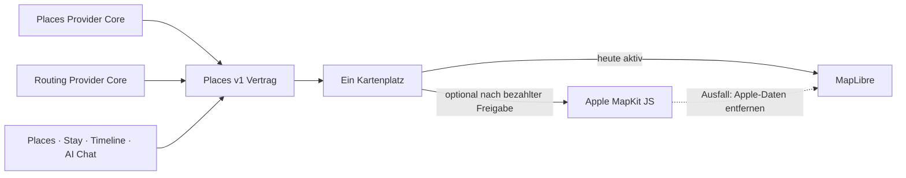

# P02 Apple MapKit Renderer Foundation

<!-- LUVIA-CURRENT-STATUS:START -->
## Aktueller Stand und nächster Schritt

**Stand 2026-09-07:** Integration **13.82.168.125**, Core **4.82.244**. P15/P17 aktiv und teilweise: Das Viererpaket Reisespur, Jahreszeitenstimmung, Ankunft und Tagesfilm ist in .125 ausgeliefert. Nächster Schwerpunkt ist die fachliche Tagesplangüte mit Wegen, Puffern und Budgetbelegen. Der echte KI-Einstieg meldet weiter das Kontingentproblem. Stable .104; Gateway v235 / Intelligence v37 unverändert.

**Zuletzt geliefert:** App .125 liefert das gemeinsame Viererpaket: Die geografische Reisespur wächst mit Kontinent/Land/Region/Ziel und verbindet im Tagesentwurf die eingeplanten Stationen pro Tag. Die Linie kennzeichnet geografische Verbindungen, keine berechneten Wege. Licht- und Landfarben reagieren auf Reisebeginn und Hemisphäre; tropische Breiten und offene Termine werden gesondert behandelt, keine Wettervorhersage behauptet. Der Ankunftsmoment fährt zum kanonischen Ziel und zeigt bis zu drei Places-Empfehlungen mit streng zugeordneter Bildübernahme und Quellenangabe. Im öffentlichen Scharbeutz-Lauf erschienen Strand Creperie, Kurhaus Scharbeutz und Augustuspark als passend; alle drei Bildquellen blieben offen und wurden als Platzhalter dargestellt. Der Tagesfilm besitzt Tag-/Stationswechsel, Start/Pause, Kartenfokus und dieselben bestehenden Auswahl-, Tausch- und Zeithandler. Eingriffe pausieren den Film; freie Tage und Wiederaufnahme sind geprüft. Öffentlich wurden zwei echte Orte über acht Tage gezeigt und beide auf Tag 1 verschoben; Karte und Reisespur aktualisierten sich. Die Kartenfläche passt sich auch beim Ein-/Ausklappen des Sheets an. 81 Composer-, 47 Geografie-/Gestenprüfungen, die erweiterte Kartenprojektion und 238/238 Safe Regression sind grün; NFR-0 3/3 und 45/45 öffentliche Byteidentität sind belegt. Der echte KI-Einstieg meldet weiter das API-Kontingentproblem und erhält den Wunsch. Vollständige KI-Plangüte, breite reale Bildversorgung, echte Kontoübernahme und physische Geräteabnahme bleiben offen.

**Nächster Schritt (AKTIV): Tagesplanung mit Wegen, Zeitpuffern und Budgetbelegen vervollständigen.** Die vier Erlebnisfunktionen sind als Consumer-Paket umgesetzt und abgenommen. Jetzt muss der darunterliegende Plan über jeden Reisetag belastbar werden; die UI-Abnahme allein schließt P15/P17 nicht. Die fachliche Arbeit kann mit vorhandenen Places fortgesetzt werden, der echte positive Modelllauf bleibt ein eigenes Gate.

**Abnahme dieses Schritts:**

- Bestehende Routing-Verträge für Fuß- und gegebenenfalls Fahrradwege zwischen gewählten Stationen verwenden; Reisezeit, Wegepuffer und Öffnungszeiten nur mit Belegen bewerten. Keine gezeichnete Reisespur als berechnete Route behandeln.
- Tagesabdeckung, Kategorienvielfalt, Profil-/Reisevorgaben und Freiraum über den gesamten Zeitraum prüfen. Für fehlende Kandidaten konkrete Alternativen oder offene Planung zeigen; zwei Orte über acht Tage sind kein vollständiger KI-Reiseplan.
- Budgetgefühl und tatsächlich belegte Preise getrennt darstellen; harte Budgetgrenzen nur zusagen, wenn die dafür notwendigen Daten vorliegen.
- Saison, Feiertage, Events und Wetter über die gemeinsamen Intelligence-Kontexte einbeziehen. Die neue saisonale Lichtstimmung ersetzt keine datierte Wetter- oder Eventquelle.
- Nach wiederhergestelltem Modellzugang einen echten vollständigen Wunsch-/KI-Plan-Lauf durchführen. Keine Zahlung, Plan- oder Secret-Änderung ohne Nutzerauftrag und keine kontrollierten Antworten als echten KI-Erfolg ausgeben.
- Vor P15/P17-Gesamtabschluss bestätigte Kontoübernahme, Wiederaufnahme, dauerhafte Identity-Übergabe, Trip-Lifecycle und physische iOS-/Android-Bedienung nachweisen. Alle betroffenen Fahrpläne aus derselben Statusquelle aktualisieren.

**Danach:** Danach den vollständigen echten KI-Reiseentwurf bei verfügbarem Modellzugang und die weiteren P15/P17-Produktgates abnehmen: Tagesvielfalt, Wege/Puffer, Kontext/Budget, echte Kontoübernahme, Identity-Übergabe, Lifecycle und physische Geräte. M18–M22 behalten Mitreisendenverwaltung, Administration, Social und Intelligence II; die 17 Karten-USPs bleiben verbindlich.

**Weiter offen:** P02/P03: Google-Berechtigung, breite echte Ortsbilder und physischer Mobil-Kaltstart. P07/P08: echte Booking-Provider. P09/P10/P11/P12: begrenzte interne Belege, physische Abnahme und echte Context-Signale fehlen. P15/P17: echter KI-Positivlauf wegen HTTP 429 credit_balance_exhausted, vollständige Kontextplanung, breite echte Bildversorgung und globale Städtestufen, echte Kontoübernahme, dauerhafte Identity-Übergabe und Trip-Lifecycle offen. Die 17 Karten-USPs bleiben verbindlich; kein weiterer P-Block wird aufgrund des Teilnachweises als vollständig abgeschlossen markiert. Zusätzlich zeigte Supabase am 06.09. eine Fair-Use-Warnung wegen Egress im vorigen Abrechnungszyklus, Schonfrist bis 07.09.; im damaligen Snapshot waren 2,517 von 5 GB genutzt. Keine Zahlung oder Planänderung vorgenommen.

Aktuelle Paketstände und nächste Abschlussnachweise: docs/planning/status-plan.v1.json. Nach jedem Arbeitsabschnitt Stand, Beleg, Restumfang und genau einen nächsten Schritt gemeinsam fortschreiben.
<!-- LUVIA-CURRENT-STATUS:END -->

Stand: 5. September 2026

## Ergebnis dieses Abschnitts

Luvia behält genau einen sichtbaren Kartenplatz. MapLibre bleibt für die kostenlose Providerstrategie der aktive und geplante Hauptrenderer. Apple MapKit JS ist ein optionaler kostenpflichtiger Kandidat, der erst nach einer ausdrücklichen Entscheidung für das Apple Developer Program, vollständiger Einrichtung, fachlicher Gleichwertigkeit und sichtbarer Desktop-/Mobilabnahme im selben Kartenplatz erprobt werden darf. MapLibre bleibt dabei der Rückfall; beide Renderer dürfen nie gleichzeitig sichtbar oder aktiv sein.

Die verbindliche Maschinenkonfiguration liegt in `config/luvia-map-renderers.v1.json`. Sie hält den aktuellen und den geplanten Renderer, die Aktivierungsgates und den atomaren Rückfall fest. Der Rückfall entfernt zuerst alle Apple-Kartendaten aus dem Arbeitsspeicher und lädt danach den für MapLibre zulässigen Providerbestand bei erhaltenem Kartenausschnitt und erhaltener Kategorie.

## Architektur

Apple wird nicht als zweites Kartenfenster ergänzt. Die Luvia-Navigation, Suche, Filter, Pins, Passend-Markierung, Detail-Sheet und Timeline-Aktionen bleiben Produktoberfläche; nur die Karte darunter wird über den gemeinsamen Renderer-Vertrag ausgewählt.

## Vorbereiteter Serveradapter

`supabase/functions/luvia-gateway/_shared/apple-maps.ts` bereitet Apple Maps Server API für Folgendes vor:

- Suche nach Orten innerhalb des Zielgebiets,
- Abruf eines konkreten Apple-Orts,
- Auto-, Fuß- und Fahrradrouten,
- serverseitig signierte ES256-Tokens aus Supabase-Secrets,
- zentrale Provider-Budgetreservierung vor jedem Apple-Aufruf,
- normalisierte Luvia-Orts- und Routenantworten mit Apple-Attribution.

Der Adapter ist absichtlich noch nicht in der automatischen Providerkaskade aktiv. Seine Policy `apple-maps-services` wird mit `enabled=false` und Nullbudget angelegt. Er akzeptiert Aufrufe nur mit `renderer=apple-mapkit` und `storage=transient`.

## Daten- und Darstellungsregeln

Apple-Ortsdaten dürfen in diesem Entwurf nur vorübergehend in der Apple-Kartenansicht gehalten werden. Sie werden nicht in den dauerhaften Luvia-Ortsbestand geschrieben, nicht mit MapLibre dargestellt und nicht zu einer abgeleiteten Ortsdatenbank zusammengeführt.

Apple-Ortsergebnisse liefern belastbar Name, Adresse, Koordinaten und Apple-POI-Kategorie. Sie liefern für Luvias fachliche Zusagen keine verlässliche Quelle für echte Place-Fotos, Bewertungen, Landesküche oder vegetarische beziehungsweise vegane Eignung. Deshalb gilt:

- kein Apple-Ort wird allein aufgrund eines allgemeinen Restauranttyps als `Passend` markiert,
- keine Landesküche wird aus Namen oder Vermutungen erfunden,
- Apple ist keine Lösung für den Anspruch „immer ein echtes Place-Bild“,
- fremde Providerdaten dürfen erst nach Prüfung ihrer Lizenzbedingungen auf Apple MapKit erscheinen.

## Apple-Kontingent

Apple dokumentiert für eine Apple-Developer-Program-Mitgliedschaft derzeit 250.000 Kartenaufrufe und 25.000 Serviceaufrufe pro Tag. Die Maps-ID und der private MapKit-Schlüssel stehen nur eingeschriebenen Mitgliedern oder berechtigten Mitgliedern eines eingeschriebenen Teams zur Verfügung. Das Apple Developer Program kostet derzeit 99 USD pro Mitgliedschaftsjahr beziehungsweise den regionalen Betrag. Maps Server API verwendet einen Maps-Identifier, Team-ID, Key-ID und privaten `.p8`-Schlüssel. Diese Werte fehlen; ohne sie meldet der Health-Endpunkt `configured=false` und kein Apple-Aufruf wird versucht. Für Luvias Free-first-Strategie bleibt Apple deshalb geparkt, bis die Mitgliedschaft ohnehin für eine native iOS-Veröffentlichung benötigt oder ausdrücklich separat beschlossen wird.

## Aktivierungsgates

Apple darf nur nach einer ausdrücklichen bezahlten Produktentscheidung als optionaler Renderer erprobt werden. Vor einer Aktivierung müssen alle Punkte erfüllt sein:

1. Eine aktive Apple-Developer-Program-Mitgliedschaft oder berechtigter Teamzugang ist belegt.
2. Maps-Identifier, Team-ID, Key-ID und privater Schlüssel liegen ausschließlich als Supabase-Secrets vor.
3. MapKit JS lädt auf Integration im Desktop-Browser und auf einem echten Mobilgerät.
4. Places und Stay zeigen dieselben Luvia-Pins, Filter, `Alle`/`Passend`, Detail-Sheets und Aktionen.
5. Timeline-Vorschläge und AI Chat konsumieren denselben `places.v1`-Bestand.
6. Attribution und Apple-Nutzungsbedingungen sind sichtbar eingehalten.
7. Die Anzeigeerlaubnis aller zusätzlich eingeblendeten Provider ist dokumentiert.
8. Der atomare Rückfall auf MapLibre ist sichtbar getestet, ohne zweite Karte und ohne verbliebene Apple-Daten.
9. Die vollständige Safe Regression ist grün.

## Offizielle Grundlagen

- Apple Maps Server API: https://developer.apple.com/documentation/applemapsserverapi
- Apple-Mitgliedschaften und Kosten: https://developer.apple.com/support/compare-memberships/
- Tokens für Maps Server API: https://developer.apple.com/documentation/applemapsserverapi/creating-and-using-tokens-with-maps-server-api
- Maps-Identifier und privater Schlüssel: https://developer.apple.com/help/account/capabilities/create-a-maps-identifier-and-private-key
- Apple-Ortssuche: https://developer.apple.com/documentation/applemapsserverapi/-v1-search
- Apple-Routen: https://developer.apple.com/documentation/applemapsserverapi/-v1-directions
- MapKit JS auf dem Web: https://developer.apple.com/maps/web/
- Apple Developer Program License Agreement, Attachment 6: https://developer.apple.com/support/terms/apple-developer-program-license-agreement/
