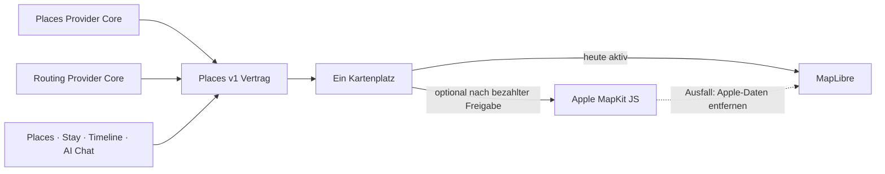

# P02 Apple MapKit Renderer Foundation

<!-- LUVIA-CURRENT-STATUS:START -->
## Aktueller Stand und nächster Schritt

**Stand 2026-09-07:** Integration **13.82.168.127**, Core **4.82.246**. P15/P17 aktiv und teilweise: .128 trägt die funktionalen Korrekturen für drei Composer-Wege, stabile Geografie, breitere präferenzgesteuerte Places, vollständigere Tage und sichere Ledger-Wiederaufnahme. Seine Eröffnungsoptik ist verworfen. Die lokale Nachfolgestudie nutzt nun den identischen kanonischen Natural-Earth-/D3-Globus in Einstieg und Zielwahl, den originalen Luvia-Compass, eine mittige Überschrift auf einer gezeichneten asymmetrischen Lichtlinse sowie einen zunächst eingeklappten Zielwahl-Sheet mit stabiler animierter Griff-Einladung. Alle drei bewegten Verbindungen beginnen geometrisch am Compassrand und enden an ihrer jeweiligen Auswahl. Sie ist lokal browsergeprüft, aber noch kein freigegebener Release. Stable .104; Gateway v235 / Intelligence v37 unverändert.

**Zuletzt geliefert:** Funktional geliefert sind neutrale Geografie ohne Kontinentvorauswahl, drei fachlich getrennte Reiseergebnisse, einzelne kurze Reisefragen, wirksame Reise- plus Profilpräferenzen, bis zu vier Place-Momente pro aktivem Tag von morgens bis abends sowie Owner-Readback und idempotente Wiederaufnahme ohne illegale Ledger-Rücktransition. Lokal belegt sind außerdem derselbe Globe-Renderer vor und nach der Moduswahl, die drei funktionierenden Einstiege und der geschlossen/öffnend bedienbare Zielwahl-Sheet; Modusnummern, künstlicher Ersatzkompass und dekorative Mittellinie sind entfernt. Die sieben Ideen Zeitreise, Kontextwellen, Gruppen-Sternbild, Reise-Schatten, Ziel-Zwillinge, Luvia Pulse und Reise-DNA sind verbindlich aufgenommen, aber nicht als umgesetzt behauptet. Die .128-Illustration ist Gegenbeleg, kein visueller Abschluss.

**Nächster Schritt (AKTIV): Professionelle Composer-Motion und vollständigen KI-Mehrtagesentwurf gemeinsam schließen.** Die funktionale Basis ist belastbar, die Eröffnungsoptik jedoch ausdrücklich nicht freigegeben. Der nächste Kandidat muss die räumliche Drei-Wege-Fassung professionell ausarbeiten und anschließend denselben Weg mit einem ausreichend vollständigen echten KI-Entwurf bis Timeline und Reload belegen. P15/P17 bleiben bis zu beiden Produktgates teilweise.

**Abnahme dieses Schritts:**

- Die räumliche Auswahlfassung als professionelle Motion-Bühne fertig ausarbeiten: drei klar verschiedene Wege, warme moderne Tiefe, präzise mittige Typografie auf einer eigenständig gezeichneten Lichtfläche, originaler Luvia-Compass und exakt derselbe kanonische Globus wie in der Zielwahl. Jede bewegte Linie beginnt sichtbar am Compass und führt eindeutig zu genau einer Auswahl. Keine Modusnummern, dekorative Mittellinie, generierten Bildassets, Pfeilkästen, Messinstrument-Anmutung oder Kollision auf 390-Pixel- und Desktopbreite. Die geografische Zielwahl startet mit stabilem, eingeklapptem Sheet und animiert nur den Griff. Erst sichtbare lokale Freigabe, dann immutable Kandidat.
- Einen echten vollständigen Wunsch-/KI-Plan über mehrere Tage mit ausreichend unterschiedlichen, belegten places.v1-Kandidaten erzeugen; Kategorien, Wiederholungen, Reise-/Profilvorgaben und freie Zeit prüfen. Keine gelockerten Sachfilter, erfundenen Places oder verdeckte Kontingentvervielfachung.
- Den vollständigen öffentlichen Weg zwischen mindestens zwei echten Entwurfsstationen per UI abnehmen; berechnete Wegegeometrie mit eindeutiger Darstellung und Quellenbeleg in die Tageskarte übernehmen. Zeitpuffer und Konflikte weiterhin durch journey.v1, einschließlich gemischter Fortbewegung und veralteter Quellen.
- Öffnungen, Saison, Feiertage, Events und Wetter über gemeinsame datierte Owner-/Intelligence-Kontexte einbeziehen. Budgetgefühl, Preisbelege und harte Budgetgrenzen getrennt behandeln; Lichtstimmung bleibt Atmosphäre.
- Den zuletzt dokumentierten Modell-Kontingentblocker erneut prüfen und den positiven Modelllauf erst bei tatsächlichem Zugang als bestanden markieren; keine Zahlung oder Konfigurationsänderung ohne Auftrag.
- Vor P15/P17-Gesamtabschluss bestätigte Kontoübernahme, dauerhafte Identity-Übergabe, Trip-Lifecycle und Wiederaufnahme auf physischen iOS-/Android-Geräten nachweisen. Gemeinsamen Status und alle aktiven Fahrpläne synchronisieren.

**Danach:** Nach professioneller Motion-Freigabe, vollständigem KI-Plan und Trip-Lifecycle die P15-Identity-Übernahme und physischen Gerätegates schließen; danach M18–M22 mit Mitreisendenverwaltung, Administration, Social und Intelligence II. Die Karten-, Composer- und sieben neu aufgenommenen USP-Ideen bleiben verbindlich.

**Weiter offen:** P02/P03: breite exakte Ortsbilder, Google-Berechtigung und physischer Mobil-Kaltstart. P07/P08: echte Booking-Provider. P09–P12: physische Abnahme und echte Context-Signale. P15/P17: professionelle visuelle Composer-Freigabe, echter vollständiger KI-Positivlauf, datierte Kontext-/Budgetqualität, Kontoübernahme, dauerhafte Identity-Übergabe, Lifecycle und physische Geräte. Die sieben neuen Composer-USPs sind geplant, noch nicht ausgeliefert. Die Geografie ist eine Übersicht, keine Zusage sämtlicher aktuellen Untergliederungen. Kein zusätzlicher P-Block wird als vollständig abgeschlossen markiert.

Aktuelle Paketstände und nächste Abschlussnachweise: docs/planning/status-plan.v1.json. Nach jedem Arbeitsabschnitt Stand, Beleg, Restumfang und genau einen nächsten Schritt gemeinsam fortschreiben.
<!-- LUVIA-CURRENT-STATUS:END -->

Stand: 5. September 2026

## Ergebnis dieses Abschnitts

Luvia behält genau einen sichtbaren Kartenplatz. MapLibre bleibt für die kostenlose Providerstrategie der aktive und geplante Hauptrenderer. Apple MapKit JS ist ein optionaler kostenpflichtiger Kandidat, der erst nach einer ausdrücklichen Entscheidung für das Apple Developer Program, vollständiger Einrichtung, fachlicher Gleichwertigkeit und sichtbarer Desktop-/Mobilabnahme im selben Kartenplatz erprobt werden darf. MapLibre bleibt dabei der Rückfall; beide Renderer dürfen nie gleichzeitig sichtbar oder aktiv sein.

Die verbindliche Maschinenkonfiguration liegt in `config/luvia-map-renderers.v1.json`. Sie hält den aktuellen und den geplanten Renderer, die Aktivierungsgates und den atomaren Rückfall fest. Der Rückfall entfernt zuerst alle Apple-Kartendaten aus dem Arbeitsspeicher und lädt danach den für MapLibre zulässigen Providerbestand bei erhaltenem Kartenausschnitt und erhaltener Kategorie.

## Architektur

Apple wird nicht als zweites Kartenfenster ergänzt. Die Luvia-Navigation, Suche, Filter, Pins, Passend-Markierung, Detail-Sheet und Timeline-Aktionen bleiben Produktoberfläche; nur die Karte darunter wird über den gemeinsamen Renderer-Vertrag ausgewählt.

## Vorbereiteter Serveradapter

`supabase/functions/luvia-gateway/_shared/apple-maps.ts` bereitet Apple Maps Server API für Folgendes vor:

- Suche nach Orten innerhalb des Zielgebiets,
- Abruf eines konkreten Apple-Orts,
- Auto-, Fuß- und Fahrradrouten,
- serverseitig signierte ES256-Tokens aus Supabase-Secrets,
- zentrale Provider-Budgetreservierung vor jedem Apple-Aufruf,
- normalisierte Luvia-Orts- und Routenantworten mit Apple-Attribution.

Der Adapter ist absichtlich noch nicht in der automatischen Providerkaskade aktiv. Seine Policy `apple-maps-services` wird mit `enabled=false` und Nullbudget angelegt. Er akzeptiert Aufrufe nur mit `renderer=apple-mapkit` und `storage=transient`.

## Daten- und Darstellungsregeln

Apple-Ortsdaten dürfen in diesem Entwurf nur vorübergehend in der Apple-Kartenansicht gehalten werden. Sie werden nicht in den dauerhaften Luvia-Ortsbestand geschrieben, nicht mit MapLibre dargestellt und nicht zu einer abgeleiteten Ortsdatenbank zusammengeführt.

Apple-Ortsergebnisse liefern belastbar Name, Adresse, Koordinaten und Apple-POI-Kategorie. Sie liefern für Luvias fachliche Zusagen keine verlässliche Quelle für echte Place-Fotos, Bewertungen, Landesküche oder vegetarische beziehungsweise vegane Eignung. Deshalb gilt:

- kein Apple-Ort wird allein aufgrund eines allgemeinen Restauranttyps als `Passend` markiert,
- keine Landesküche wird aus Namen oder Vermutungen erfunden,
- Apple ist keine Lösung für den Anspruch „immer ein echtes Place-Bild“,
- fremde Providerdaten dürfen erst nach Prüfung ihrer Lizenzbedingungen auf Apple MapKit erscheinen.

## Apple-Kontingent

Apple dokumentiert für eine Apple-Developer-Program-Mitgliedschaft derzeit 250.000 Kartenaufrufe und 25.000 Serviceaufrufe pro Tag. Die Maps-ID und der private MapKit-Schlüssel stehen nur eingeschriebenen Mitgliedern oder berechtigten Mitgliedern eines eingeschriebenen Teams zur Verfügung. Das Apple Developer Program kostet derzeit 99 USD pro Mitgliedschaftsjahr beziehungsweise den regionalen Betrag. Maps Server API verwendet einen Maps-Identifier, Team-ID, Key-ID und privaten `.p8`-Schlüssel. Diese Werte fehlen; ohne sie meldet der Health-Endpunkt `configured=false` und kein Apple-Aufruf wird versucht. Für Luvias Free-first-Strategie bleibt Apple deshalb geparkt, bis die Mitgliedschaft ohnehin für eine native iOS-Veröffentlichung benötigt oder ausdrücklich separat beschlossen wird.

## Aktivierungsgates

Apple darf nur nach einer ausdrücklichen bezahlten Produktentscheidung als optionaler Renderer erprobt werden. Vor einer Aktivierung müssen alle Punkte erfüllt sein:

1. Eine aktive Apple-Developer-Program-Mitgliedschaft oder berechtigter Teamzugang ist belegt.
2. Maps-Identifier, Team-ID, Key-ID und privater Schlüssel liegen ausschließlich als Supabase-Secrets vor.
3. MapKit JS lädt auf Integration im Desktop-Browser und auf einem echten Mobilgerät.
4. Places und Stay zeigen dieselben Luvia-Pins, Filter, `Alle`/`Passend`, Detail-Sheets und Aktionen.
5. Timeline-Vorschläge und AI Chat konsumieren denselben `places.v1`-Bestand.
6. Attribution und Apple-Nutzungsbedingungen sind sichtbar eingehalten.
7. Die Anzeigeerlaubnis aller zusätzlich eingeblendeten Provider ist dokumentiert.
8. Der atomare Rückfall auf MapLibre ist sichtbar getestet, ohne zweite Karte und ohne verbliebene Apple-Daten.
9. Die vollständige Safe Regression ist grün.

## Offizielle Grundlagen

- Apple Maps Server API: https://developer.apple.com/documentation/applemapsserverapi
- Apple-Mitgliedschaften und Kosten: https://developer.apple.com/support/compare-memberships/
- Tokens für Maps Server API: https://developer.apple.com/documentation/applemapsserverapi/creating-and-using-tokens-with-maps-server-api
- Maps-Identifier und privater Schlüssel: https://developer.apple.com/help/account/capabilities/create-a-maps-identifier-and-private-key
- Apple-Ortssuche: https://developer.apple.com/documentation/applemapsserverapi/-v1-search
- Apple-Routen: https://developer.apple.com/documentation/applemapsserverapi/-v1-directions
- MapKit JS auf dem Web: https://developer.apple.com/maps/web/
- Apple Developer Program License Agreement, Attachment 6: https://developer.apple.com/support/terms/apple-developer-program-license-agreement/
