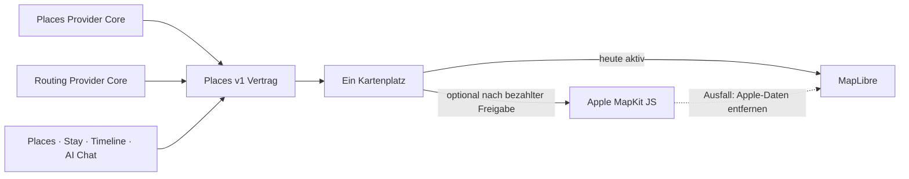

# P02 Apple MapKit Renderer Foundation

<!-- LUVIA-CURRENT-STATUS:START -->
## Aktueller Stand und nächster Schritt

**Stand 2026-09-07:** Integration **13.82.168.123**, Core **4.82.242**. P15/P17 aktiv und teilweise: .123 mit fester Kartenbühne, Bottom Sheets, Wunschpipeline und automatischer Ortszeit ist ausgeliefert. Nächstes gebündeltes Paket sind Reisespur, Jahreszeitenstimmung, Ankunft und Tagesfilm. Diese Umsetzung wartet nicht auf KI-Guthaben; nur der echte KI-Positivlauf bleibt dadurch blockiert. Stable .104; Gateway v235 aktiv.

**Zuletzt geliefert:** App .123 setzt den Composer als feste Kartenbühne mit ein-/ausklappbarem Bottom Sheet um. Freitext-Reisewünsche stehen vor den drei Reisearten; KI-Zielhypothesen werden ausschließlich nach kanonischer Places-Geokodierung angezeigt. Die Pipeline und der automatische Flug über Kontinent/Land/Region sind mit kontrollierten Modellantworten geprüft. Öffentlich ist der echte Modellzugang weiter mit HTTP 429 credit_balance_exhausted blockiert; die Meldung ist jetzt korrekt, Angaben bleiben erhalten, der manuelle Weg bleibt nutzbar. Kein falscher KI-Erfolg. Geografische Ebenen überblenden mit 900 ms; erste Auswahl und zweiter Klick behalten die neun Compass-Farben. Herauszoomen geht genau eine Ebene zurück. Die aktive Zielsuche, Reisezeit und gruppierten Reisebedürfnisse liegen im Sheet. Datumseingaben sind bei 390 px nur 46 px hoch. Ernährung, Mobilität und Zugang gelangen in die kanonische Empfehlung; strengere Reiseangaben verwenden keine zuvor nur fürs Profil geprüfte Ergebnismenge. Die Zielzeitzone wird aus derselben Geoapify-Antwort übernommen und alte Entwürfe werden nur bei passender Ortsidentität ergänzt. Scharbeutz, Rom und Lissabon sind live mit korrekter IANA-Zone bestätigt. Quoten-/Payloadfehler sind getrennt, neue Reisewünsche erben keinen aktiven Reise-Kontext. 59 Composer-Verhaltensprüfungen, 42 Geografie-/Gestenprüfungen, 40 Origin-/Fehler-/Zeitzonenprüfungen und 238/238 Gesamtregression bestanden. 45/45 öffentliche Dateihashes stimmen mit dem sauberen Deployment überein. Echter KI-Positivlauf, vollständige Tagesplangüte, Kontoübernahme und physische Geräteabnahme bleiben offen.

**Nächster Schritt (AKTIV): Reisespur, Jahreszeitenstimmung, Ankunft und Tagesfilm als gemeinsames Composer-Paket umsetzen.** Die vier vom Nutzer bestätigten Erlebnisfunktionen bauen auf der ausgelieferten .123-Bühne auf. Ihre Darstellung und Bedienung können unabhängig vom Modellguthaben umgesetzt werden. Der reale KI-Gesamtplan bleibt ein gesondertes offenes Abnahmegate.

**Abnahme dieses Schritts:**

- Mitwachsende Reisespur: Geografische Auswahl zeichnet einen feinen Faden; nach der Ortsauswahl verbindet er die tatsächlich gewählten Stationen und Reisetage. Rückschritte und Alternativen aktualisieren dieselbe Spur. Geografische Verbindungen und providerberechnete Wege sind eindeutig unterscheidbar; Animation erzeugt keine zusätzlichen Routing-Anfragen.
- Jahreszeitenstimmung: Zielkoordinaten und Reisezeit steuern eine weiche atmosphärische Licht-/Farbstimmung mit passender Hemisphäre. Offene Daten bleiben neutral. Die Gestaltung behauptet weder aktuelles Wetter noch Schneelage; echte Vorhersagen benötigen eigene datierte Quellen.
- Ankunftsmoment: Die Kamerafahrt endet am kanonisch bestätigten Ziel. Wenige Bilder erscheinen ausschließlich bei belegter Zuordnung zum Ziel oder benannten Place. Erste passende Möglichkeiten kommen aus derselben places.v1-Empfehlung. Fehlende Bilder oder Belege führen zu einer bewusst gestalteten Ankunft ohne erfundene Medien oder Passend-Zusage.
- Interaktiver Tagesfilm: Der vorhandene Entwurf wird mit Tag vor/zurück, Wiedergabe/Pause, Kartenfokus und verständlichen Stationen präsentiert. Tauschen, Tag/Uhrzeit ändern und Details greifen auf die bestehenden Composer-/Trip-/Places-/Journey-Verträge zu. Interaktion pausiert den Ablauf; leere Tage bleiben erkennbar; nur bestätigte Übernahmen schreiben Domain-Daten.
- Ein gemeinsamer Zustand für Welt, Sheet, Spur und Entwurf; Eingaben, Wiederaufnahme, Zurücknavigation und Moduswechsel erhalten die Auswahl. Keine zweite Planungslogik neben den kanonischen Domain-Ownern.
- Mobile Gesten, erreichbare Sheets und Tastatur, Reduced Motion sowie begrenzte Render-/Netzlast prüfen. Bewegung darf eine Entscheidung erklären, aber keine Eingabe verzögern oder erzwingen.
- Bedienung des Tagesfilms mit bestehenden bzw. kontrollierten Entwürfen prüfen und als solchen Nachweis kennzeichnen. Ein vollständig erfolgreicher realer KI-Entwurf über alle Reisetage, Kontoübernahme und physische Geräteabnahme bleiben ausdrücklich offen; kein P15/P17-Gesamtabschluss durch diese Teilabnahme.

**Danach:** Danach den vollständigen echten KI-Reiseentwurf bei verfügbarem Modellzugang und die weiteren P15/P17-Produktgates abnehmen: Tagesvielfalt, Wege/Puffer, Kontext/Budget, echte Kontoübernahme, Identity-Übergabe, Lifecycle und physische Geräte. M18–M22 behalten Mitreisendenverwaltung, Administration, Social und Intelligence II; die 17 Karten-USPs bleiben verbindlich.

**Weiter offen:** P02/P03: Google-Berechtigung, breite echte Ortsbilder und physischer Mobil-Kaltstart. P07/P08: echte Booking-Provider. P09/P10/P11/P12: begrenzte interne Belege, physische Abnahme und echte Context-Signale fehlen. P15/P17: echter KI-Positivlauf wegen HTTP 429 credit_balance_exhausted, vollständige Kontextplanung, weitere interaktive Ausarbeitung und globale Städtestufen, echte Kontoübernahme, dauerhafte Identity-Übergabe und Trip-Lifecycle offen. Die 17 Karten-USPs bleiben verbindlich; kein weiterer P-Block wird aufgrund des Teilnachweises als vollständig abgeschlossen markiert. Zusätzlich zeigte Supabase am 06.09. eine Fair-Use-Warnung wegen Egress im vorigen Abrechnungszyklus, Schonfrist bis 07.09.; im damaligen Snapshot waren 2,517 von 5 GB genutzt. Keine Zahlung oder Planänderung vorgenommen.

Aktuelle Paketstände und nächste Abschlussnachweise: docs/planning/status-plan.v1.json. Nach jedem Arbeitsabschnitt Stand, Beleg, Restumfang und genau einen nächsten Schritt gemeinsam fortschreiben.
<!-- LUVIA-CURRENT-STATUS:END -->

Stand: 5. September 2026

## Ergebnis dieses Abschnitts

Luvia behält genau einen sichtbaren Kartenplatz. MapLibre bleibt für die kostenlose Providerstrategie der aktive und geplante Hauptrenderer. Apple MapKit JS ist ein optionaler kostenpflichtiger Kandidat, der erst nach einer ausdrücklichen Entscheidung für das Apple Developer Program, vollständiger Einrichtung, fachlicher Gleichwertigkeit und sichtbarer Desktop-/Mobilabnahme im selben Kartenplatz erprobt werden darf. MapLibre bleibt dabei der Rückfall; beide Renderer dürfen nie gleichzeitig sichtbar oder aktiv sein.

Die verbindliche Maschinenkonfiguration liegt in `config/luvia-map-renderers.v1.json`. Sie hält den aktuellen und den geplanten Renderer, die Aktivierungsgates und den atomaren Rückfall fest. Der Rückfall entfernt zuerst alle Apple-Kartendaten aus dem Arbeitsspeicher und lädt danach den für MapLibre zulässigen Providerbestand bei erhaltenem Kartenausschnitt und erhaltener Kategorie.

## Architektur

Apple wird nicht als zweites Kartenfenster ergänzt. Die Luvia-Navigation, Suche, Filter, Pins, Passend-Markierung, Detail-Sheet und Timeline-Aktionen bleiben Produktoberfläche; nur die Karte darunter wird über den gemeinsamen Renderer-Vertrag ausgewählt.

## Vorbereiteter Serveradapter

`supabase/functions/luvia-gateway/_shared/apple-maps.ts` bereitet Apple Maps Server API für Folgendes vor:

- Suche nach Orten innerhalb des Zielgebiets,
- Abruf eines konkreten Apple-Orts,
- Auto-, Fuß- und Fahrradrouten,
- serverseitig signierte ES256-Tokens aus Supabase-Secrets,
- zentrale Provider-Budgetreservierung vor jedem Apple-Aufruf,
- normalisierte Luvia-Orts- und Routenantworten mit Apple-Attribution.

Der Adapter ist absichtlich noch nicht in der automatischen Providerkaskade aktiv. Seine Policy `apple-maps-services` wird mit `enabled=false` und Nullbudget angelegt. Er akzeptiert Aufrufe nur mit `renderer=apple-mapkit` und `storage=transient`.

## Daten- und Darstellungsregeln

Apple-Ortsdaten dürfen in diesem Entwurf nur vorübergehend in der Apple-Kartenansicht gehalten werden. Sie werden nicht in den dauerhaften Luvia-Ortsbestand geschrieben, nicht mit MapLibre dargestellt und nicht zu einer abgeleiteten Ortsdatenbank zusammengeführt.

Apple-Ortsergebnisse liefern belastbar Name, Adresse, Koordinaten und Apple-POI-Kategorie. Sie liefern für Luvias fachliche Zusagen keine verlässliche Quelle für echte Place-Fotos, Bewertungen, Landesküche oder vegetarische beziehungsweise vegane Eignung. Deshalb gilt:

- kein Apple-Ort wird allein aufgrund eines allgemeinen Restauranttyps als `Passend` markiert,
- keine Landesküche wird aus Namen oder Vermutungen erfunden,
- Apple ist keine Lösung für den Anspruch „immer ein echtes Place-Bild“,
- fremde Providerdaten dürfen erst nach Prüfung ihrer Lizenzbedingungen auf Apple MapKit erscheinen.

## Apple-Kontingent

Apple dokumentiert für eine Apple-Developer-Program-Mitgliedschaft derzeit 250.000 Kartenaufrufe und 25.000 Serviceaufrufe pro Tag. Die Maps-ID und der private MapKit-Schlüssel stehen nur eingeschriebenen Mitgliedern oder berechtigten Mitgliedern eines eingeschriebenen Teams zur Verfügung. Das Apple Developer Program kostet derzeit 99 USD pro Mitgliedschaftsjahr beziehungsweise den regionalen Betrag. Maps Server API verwendet einen Maps-Identifier, Team-ID, Key-ID und privaten `.p8`-Schlüssel. Diese Werte fehlen; ohne sie meldet der Health-Endpunkt `configured=false` und kein Apple-Aufruf wird versucht. Für Luvias Free-first-Strategie bleibt Apple deshalb geparkt, bis die Mitgliedschaft ohnehin für eine native iOS-Veröffentlichung benötigt oder ausdrücklich separat beschlossen wird.

## Aktivierungsgates

Apple darf nur nach einer ausdrücklichen bezahlten Produktentscheidung als optionaler Renderer erprobt werden. Vor einer Aktivierung müssen alle Punkte erfüllt sein:

1. Eine aktive Apple-Developer-Program-Mitgliedschaft oder berechtigter Teamzugang ist belegt.
2. Maps-Identifier, Team-ID, Key-ID und privater Schlüssel liegen ausschließlich als Supabase-Secrets vor.
3. MapKit JS lädt auf Integration im Desktop-Browser und auf einem echten Mobilgerät.
4. Places und Stay zeigen dieselben Luvia-Pins, Filter, `Alle`/`Passend`, Detail-Sheets und Aktionen.
5. Timeline-Vorschläge und AI Chat konsumieren denselben `places.v1`-Bestand.
6. Attribution und Apple-Nutzungsbedingungen sind sichtbar eingehalten.
7. Die Anzeigeerlaubnis aller zusätzlich eingeblendeten Provider ist dokumentiert.
8. Der atomare Rückfall auf MapLibre ist sichtbar getestet, ohne zweite Karte und ohne verbliebene Apple-Daten.
9. Die vollständige Safe Regression ist grün.

## Offizielle Grundlagen

- Apple Maps Server API: https://developer.apple.com/documentation/applemapsserverapi
- Apple-Mitgliedschaften und Kosten: https://developer.apple.com/support/compare-memberships/
- Tokens für Maps Server API: https://developer.apple.com/documentation/applemapsserverapi/creating-and-using-tokens-with-maps-server-api
- Maps-Identifier und privater Schlüssel: https://developer.apple.com/help/account/capabilities/create-a-maps-identifier-and-private-key
- Apple-Ortssuche: https://developer.apple.com/documentation/applemapsserverapi/-v1-search
- Apple-Routen: https://developer.apple.com/documentation/applemapsserverapi/-v1-directions
- MapKit JS auf dem Web: https://developer.apple.com/maps/web/
- Apple Developer Program License Agreement, Attachment 6: https://developer.apple.com/support/terms/apple-developer-program-license-agreement/
