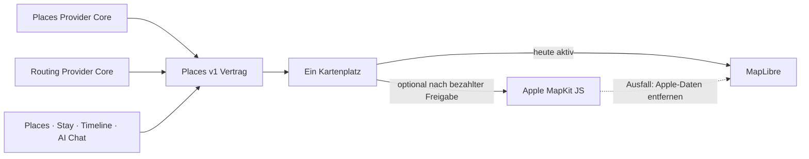

# P02 Apple MapKit Renderer Foundation

<!-- LUVIA-CURRENT-STATUS:START -->
## Aktueller Stand und nächster Schritt

**Stand 2026-09-06:** Integration **13.82.168.119**, Core **4.82.238**. M16.5 Schritte 15–18: P15/P17 bleibt aktiv und teilweise. App .119 enthält den neuen interaktiven Auftakt, volle Zeitraumdarstellung, Zielsuche für neue Orte und KI-Fehlerwiederaufnahme. Die echte Freitext-KI ist öffentlich mit HTTP 429 blockiert. P09/P10/P11/P12 behalten ihre begrenzten Belege. Stable Integration bleibt auf App .104; .119 ist ein unveränderlicher Prüfkandidat. Main und Production bleiben unverändert.

**Zuletzt geliefert:** App .118/.119 liefert eine große wischbare Reisegefühl-Szene, einen bestätigungspflichtigen Intelligence-Reiseauftrag, alle gewählten Reisetage (bis 366), eine gemeinsame Places-Karte und bearbeitbare Tageszuordnung. Die neue Zielsuche verwendet den vorhandenen Geoapify-Gateway-Read ohne Google-Abhängigkeit; Rom und Lissabon wurden öffentlich gefunden und bestätigt. Der öffentliche Kategoriepfad zeigte fünf reale Lissabon-Orte über acht Reisetage. Yuki Ramen wurde vom ersten auf den achten Tag verschoben. Der echte KI-Aufruf antwortete dagegen wiederholt mit HTTP 429 / credit_balance_exhausted; ein erfolgreicher öffentlicher Modelllauf ist nicht belegt. .119 zeigt dafür eine lesbare Meldung und verwirft einen alten Fehler bei geänderten Wünschen ohne automatische Wiederholungsschleife. 45 gezielte Verhaltensprüfungen, 236/236 Safe Regression, NFR-0 3/3 und 36/36 öffentliche Byteidentität sind grün. Die kontrollierte lokale KI-Antwort und sechs simulierte Schreibaktionen ersetzen keine echte KI-/Kontoabnahme.

**Nächster Schritt (AKTIV): P15/P17: den echten KI-Reiseauftrag als interaktive Tagesgeschichte abschließen.** Die Erzählweise und Dynamik des Luvia-Einstiegs sind das Vorbild. Der Nutzer verlangt ausdrücklich keinen übernommenen Kompass und kein zusätzliches Pflicht-Rätsel. Der neue Auftakt ist der Anfang; alle weiteren Schritte brauchen dieselbe mobile Qualität. Vor dem Produktabschluss muss die serverseitige KI-Ablehnung geklärt und die tatsächliche Planung positiv belegt werden.

**Abnahme dieses Schritts:**

- Nach Wiederherstellung des KI-API-Guthabens einen echten strukturierten Modellauftrag mit Profilrestriktionen, Freitext, Rückfrage und ausdrücklicher Bestätigung erfolgreich im öffentlichen Browser belegen. Keine ungeprüfte Erhöhung von Kostenlimits und kein als KI ausgegebener Regelfallback.
- Ziel, Zeitraum, Wünsche und tageweise Reisevorschau zu einer zusammenhängenden mobilen Szene ausarbeiten: Wischen, direkte Auswahlreaktionen, gemeinsame Places-Karte, nachvollziehbare Übergänge, Reisefarbe und Reduced Motion. Die Gestaltung wird auf Desktop und anschließend physischem iOS/Android abgenommen.
- Vorhandene P19/P20/P22/P23/P26 und P33/P34/P35-Kontextbelege für Wege, Öffnungen, Budget, Saison und Wetter in den bestätigten Reiseauftrag und die Tagesprobe einbinden; unbekannte Faktoren ausdrücklich offen lassen.
- Einen echten Konto-End-to-End-Lauf für Trip-Erstellung und genau ausgewählte Place-/Journey-Aktionen samt Datum, Dauer, Reload und Teilfehler-Wiederaufnahme belegen; danach die getrennte dauerhafte Profilbestätigung und den Trip-Lifecycle schließen.

**Danach:** Innerhalb P15/P17 bleiben separat bestätigte dauerhafte Identity-Übergabe und Archivieren/Löschen/Wiederherstellen der Reise verbindlich. Die übrige Context Matrix und AI-Parität bleiben in ihren P-Paketen; M18–M22 behalten Mitreisendenverwaltung, Administration, Social und Intelligence II.

**Weiter offen:** P02/P03: Google-Berechtigung, breite echte Ortsbilder und physischer Mobil-Kaltstart. P07/P08: echte Booking-Provider. P09/P10/P11/P12: begrenzte interne Belege, physische Abnahme und echte Context-Signale fehlen. P15/P17: öffentlicher KI-Positivlauf wegen HTTP 429, vollständige Kontextplanung, finale interaktive Gestaltung, echte Kontoübernahme, dauerhafte Identity-Übergabe und Trip-Lifecycle offen. Die 17 Karten-USPs bleiben verbindlich; kein weiterer P-Block wird aufgrund des Teilnachweises als vollständig abgeschlossen markiert. Zusätzlich zeigte Supabase am 06.09. eine Fair-Use-Warnung wegen Egress im vorigen Abrechnungszyklus, Schonfrist bis 07.09.; im aktuellen Zyklus sind 2,517 von 5 GB genutzt. Keine Zahlung oder Planänderung vorgenommen.

Aktuelle Paketstände und nächste Abschlussnachweise: docs/planning/status-plan.v1.json. Nach jedem Arbeitsabschnitt Stand, Beleg, Restumfang und genau einen nächsten Schritt gemeinsam fortschreiben.
<!-- LUVIA-CURRENT-STATUS:END -->

Stand: 5. September 2026

## Ergebnis dieses Abschnitts

Luvia behält genau einen sichtbaren Kartenplatz. MapLibre bleibt für die kostenlose Providerstrategie der aktive und geplante Hauptrenderer. Apple MapKit JS ist ein optionaler kostenpflichtiger Kandidat, der erst nach einer ausdrücklichen Entscheidung für das Apple Developer Program, vollständiger Einrichtung, fachlicher Gleichwertigkeit und sichtbarer Desktop-/Mobilabnahme im selben Kartenplatz erprobt werden darf. MapLibre bleibt dabei der Rückfall; beide Renderer dürfen nie gleichzeitig sichtbar oder aktiv sein.

Die verbindliche Maschinenkonfiguration liegt in `config/luvia-map-renderers.v1.json`. Sie hält den aktuellen und den geplanten Renderer, die Aktivierungsgates und den atomaren Rückfall fest. Der Rückfall entfernt zuerst alle Apple-Kartendaten aus dem Arbeitsspeicher und lädt danach den für MapLibre zulässigen Providerbestand bei erhaltenem Kartenausschnitt und erhaltener Kategorie.

## Architektur

Apple wird nicht als zweites Kartenfenster ergänzt. Die Luvia-Navigation, Suche, Filter, Pins, Passend-Markierung, Detail-Sheet und Timeline-Aktionen bleiben Produktoberfläche; nur die Karte darunter wird über den gemeinsamen Renderer-Vertrag ausgewählt.

## Vorbereiteter Serveradapter

`supabase/functions/luvia-gateway/_shared/apple-maps.ts` bereitet Apple Maps Server API für Folgendes vor:

- Suche nach Orten innerhalb des Zielgebiets,
- Abruf eines konkreten Apple-Orts,
- Auto-, Fuß- und Fahrradrouten,
- serverseitig signierte ES256-Tokens aus Supabase-Secrets,
- zentrale Provider-Budgetreservierung vor jedem Apple-Aufruf,
- normalisierte Luvia-Orts- und Routenantworten mit Apple-Attribution.

Der Adapter ist absichtlich noch nicht in der automatischen Providerkaskade aktiv. Seine Policy `apple-maps-services` wird mit `enabled=false` und Nullbudget angelegt. Er akzeptiert Aufrufe nur mit `renderer=apple-mapkit` und `storage=transient`.

## Daten- und Darstellungsregeln

Apple-Ortsdaten dürfen in diesem Entwurf nur vorübergehend in der Apple-Kartenansicht gehalten werden. Sie werden nicht in den dauerhaften Luvia-Ortsbestand geschrieben, nicht mit MapLibre dargestellt und nicht zu einer abgeleiteten Ortsdatenbank zusammengeführt.

Apple-Ortsergebnisse liefern belastbar Name, Adresse, Koordinaten und Apple-POI-Kategorie. Sie liefern für Luvias fachliche Zusagen keine verlässliche Quelle für echte Place-Fotos, Bewertungen, Landesküche oder vegetarische beziehungsweise vegane Eignung. Deshalb gilt:

- kein Apple-Ort wird allein aufgrund eines allgemeinen Restauranttyps als `Passend` markiert,
- keine Landesküche wird aus Namen oder Vermutungen erfunden,
- Apple ist keine Lösung für den Anspruch „immer ein echtes Place-Bild“,
- fremde Providerdaten dürfen erst nach Prüfung ihrer Lizenzbedingungen auf Apple MapKit erscheinen.

## Apple-Kontingent

Apple dokumentiert für eine Apple-Developer-Program-Mitgliedschaft derzeit 250.000 Kartenaufrufe und 25.000 Serviceaufrufe pro Tag. Die Maps-ID und der private MapKit-Schlüssel stehen nur eingeschriebenen Mitgliedern oder berechtigten Mitgliedern eines eingeschriebenen Teams zur Verfügung. Das Apple Developer Program kostet derzeit 99 USD pro Mitgliedschaftsjahr beziehungsweise den regionalen Betrag. Maps Server API verwendet einen Maps-Identifier, Team-ID, Key-ID und privaten `.p8`-Schlüssel. Diese Werte fehlen; ohne sie meldet der Health-Endpunkt `configured=false` und kein Apple-Aufruf wird versucht. Für Luvias Free-first-Strategie bleibt Apple deshalb geparkt, bis die Mitgliedschaft ohnehin für eine native iOS-Veröffentlichung benötigt oder ausdrücklich separat beschlossen wird.

## Aktivierungsgates

Apple darf nur nach einer ausdrücklichen bezahlten Produktentscheidung als optionaler Renderer erprobt werden. Vor einer Aktivierung müssen alle Punkte erfüllt sein:

1. Eine aktive Apple-Developer-Program-Mitgliedschaft oder berechtigter Teamzugang ist belegt.
2. Maps-Identifier, Team-ID, Key-ID und privater Schlüssel liegen ausschließlich als Supabase-Secrets vor.
3. MapKit JS lädt auf Integration im Desktop-Browser und auf einem echten Mobilgerät.
4. Places und Stay zeigen dieselben Luvia-Pins, Filter, `Alle`/`Passend`, Detail-Sheets und Aktionen.
5. Timeline-Vorschläge und AI Chat konsumieren denselben `places.v1`-Bestand.
6. Attribution und Apple-Nutzungsbedingungen sind sichtbar eingehalten.
7. Die Anzeigeerlaubnis aller zusätzlich eingeblendeten Provider ist dokumentiert.
8. Der atomare Rückfall auf MapLibre ist sichtbar getestet, ohne zweite Karte und ohne verbliebene Apple-Daten.
9. Die vollständige Safe Regression ist grün.

## Offizielle Grundlagen

- Apple Maps Server API: https://developer.apple.com/documentation/applemapsserverapi
- Apple-Mitgliedschaften und Kosten: https://developer.apple.com/support/compare-memberships/
- Tokens für Maps Server API: https://developer.apple.com/documentation/applemapsserverapi/creating-and-using-tokens-with-maps-server-api
- Maps-Identifier und privater Schlüssel: https://developer.apple.com/help/account/capabilities/create-a-maps-identifier-and-private-key
- Apple-Ortssuche: https://developer.apple.com/documentation/applemapsserverapi/-v1-search
- Apple-Routen: https://developer.apple.com/documentation/applemapsserverapi/-v1-directions
- MapKit JS auf dem Web: https://developer.apple.com/maps/web/
- Apple Developer Program License Agreement, Attachment 6: https://developer.apple.com/support/terms/apple-developer-program-license-agreement/
