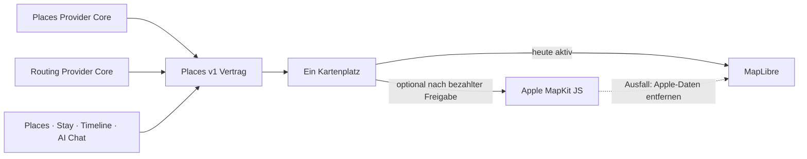

# P02 Apple MapKit Renderer Foundation

<!-- LUVIA-CURRENT-STATUS:START -->
## Aktueller Stand und nächster Schritt

**Stand 2026-09-08:** Integration **13.82.168.143**, Core **4.82.262**. P17/P19 aktiv und teilweise: App .143 / Core .262 und Intelligence 4.38.5 sind der geprüfte Integration-Kandidat. Der echte Valencia-Fall mit Meer, Juni 2027, Ausland, kurzen Flügen, Shopping, Nachtleben, Restaurants, sieben Tagen und Abflug Münster wird semantisch korrekt bis zur Gesamtplanung geführt. Falsche Dauer-, Budget-, Rollen-, Duplikat-, JSON-, Schema- und Auditblocker sind beseitigt. Der zuvor zu dünne Tag 2 wird nun als datierter Vertragsfehler isoliert und durch Terra allein neu geplant; alle gültigen Tage und ihre Places bleiben erhalten. Der Composer ist daher noch nicht final abnahmefähig. Gateway v235, Main und Production bleiben unverändert.

**Zuletzt geliefert:** Auf Integration belegt sind fünf individuell begründete Ziele, drei passende konkrete Zeitfenster bei grobem Monatswunsch, direkte Gesamtplanung nach Zeitwahl, ein kompakter semantischer Reisevertrag, Reiseversprechen, geplante Freiräume, reiseweite Tagesbalance, Unsicherheitskarte, Buchungsreihenfolge, modellierter Unterkunftsradius, kanonische Tagesrollen, fortgesetzte Duplikatreparatur und ein Audit, der nur echte Blocker sperrt. Die Qualitätskaskade nutzt Luna, Terra und nur als letzte Stufe Sol. Reise-DNA und Zeitreise bleiben sichtbar. Die Unit-Economics-Grundlage enthält vorläufige Free-, Plus-, Premium- und Reisepass-Pakete sowie eine konservative Break-even-Rechnung. Der neue gezielte Tagesreparaturpfad ersetzt bei einem datierten Blocker nur den betroffenen Tag und sperrt die bereits in gültigen Tagen verwendeten Places.

**Nächster Schritt (AKTIV): Die vollständige KI-Reise als fortsetzbaren serverseitigen Auftrag mit tageweiser Vollständigkeitsgarantie bauen.** Der letzte echte Lauf scheiterte nicht mehr an Schema, JSON oder falscher Semantik, sondern an der Zuverlässigkeit eines langen Mehrtagesoutputs. Ein einzelner schwacher Tag darf weder den ganzen Plan verwerfen noch einen vollständigen teuren Neulauf erzwingen.

**Abnahme dieses Schritts:**

- Wunschdeutung, Kandidatenrecherche, tageweise KI-Komposition, reiseweite Balance, Audit und gezielte Reparatur als fortsetzbaren serverseitigen Auftrag mit persistiertem Fortschritt ausführen.
- Jeden Ankunfts-, vollen und Abreisetag vor dem globalen Audit gegen seine rollenabhängige Mindestdichte prüfen; ausschließlich fehlende oder blockierte Tage erneut von der KI planen.
- Browser-Reload, App-Wechsel und längere Modelllaufzeit ohne verlorenen Auftrag überstehen; Status und verständliche Fortschrittsphase im Composer anzeigen.
- Den Valencia-Fall und einen deutlich anderen Familien-/Ferienfall authentifiziert vollständig durchlaufen lassen und Kosten, Token, Latenz, Auditquote und Reparaturpfad messen.
- Erst nach zwei vollständigen Positivläufen P17/P19 weiter schließen; keine kontrollierte Fixture als Ersatz für den echten Modellbeleg verwenden.

**Danach:** Nach dem fortsetzbaren P19-Kompositionsauftrag folgen Konfliktmoderator, semantische Ablehnungsdiagnose und gezielte Teilreparatur sowie die P15/P17-Kontoübernahme-, Reload-, Timeline-, Archiv-/Wiederherstellungs- und physischen Gerätegates. M17 ist anschließend der globale Rollout und Freeze von Sprache, Design, Zuständen, Motion und Komponenten. M18 baut Collaboration, Attention, Wallet/Dokumente, Reviews, Admin, Social, Suche und Intelligence Product Evolution II aus.

**Weiter offen:** P02/P03: breite exakte Ortsbilder, Google-Berechtigung und physischer Mobil-Kaltstart. P07/P08: echte Booking-Provider. P09–P12: physische Abnahme und echte Context-Signale. P15/P17: professionelles visuelles Endgate, Kontoübernahme, dauerhafte Identity-Übergabe, Lifecycle und physische Geräte. P16: Konfliktmoderator, semantische Ablehnungsdiagnose und gezielte Teilreparatur. P19: fortsetzbare serverseitige Mehrtageskomposition, zwei echte Positivläufe sowie produktive datierte Unterkunfts-, Routen-, Wetter-, Event-, Preis-, Öffnungs- und Buchbarkeitsbelege. Von den sieben Composer-USPs sind Reise-DNA und Zeitreise umgesetzt; Reise-Schatten, Kontextwellen, Luvia Pulse, Ziel-Zwillinge und Gruppen-Sternbild bleiben in ihrer Owner-Reihenfolge offen. Kein zusätzlicher P-Block wird als vollständig abgeschlossen markiert.

Aktuelle Paketstände und nächste Abschlussnachweise: docs/planning/status-plan.v1.json. Nach jedem Arbeitsabschnitt Stand, Beleg, Restumfang und genau einen nächsten Schritt gemeinsam fortschreiben.
<!-- LUVIA-CURRENT-STATUS:END -->

Stand: 5. September 2026

## Ergebnis dieses Abschnitts

Luvia behält genau einen sichtbaren Kartenplatz. MapLibre bleibt für die kostenlose Providerstrategie der aktive und geplante Hauptrenderer. Apple MapKit JS ist ein optionaler kostenpflichtiger Kandidat, der erst nach einer ausdrücklichen Entscheidung für das Apple Developer Program, vollständiger Einrichtung, fachlicher Gleichwertigkeit und sichtbarer Desktop-/Mobilabnahme im selben Kartenplatz erprobt werden darf. MapLibre bleibt dabei der Rückfall; beide Renderer dürfen nie gleichzeitig sichtbar oder aktiv sein.

Die verbindliche Maschinenkonfiguration liegt in `config/luvia-map-renderers.v1.json`. Sie hält den aktuellen und den geplanten Renderer, die Aktivierungsgates und den atomaren Rückfall fest. Der Rückfall entfernt zuerst alle Apple-Kartendaten aus dem Arbeitsspeicher und lädt danach den für MapLibre zulässigen Providerbestand bei erhaltenem Kartenausschnitt und erhaltener Kategorie.

## Architektur

Apple wird nicht als zweites Kartenfenster ergänzt. Die Luvia-Navigation, Suche, Filter, Pins, Passend-Markierung, Detail-Sheet und Timeline-Aktionen bleiben Produktoberfläche; nur die Karte darunter wird über den gemeinsamen Renderer-Vertrag ausgewählt.

## Vorbereiteter Serveradapter

`supabase/functions/luvia-gateway/_shared/apple-maps.ts` bereitet Apple Maps Server API für Folgendes vor:

- Suche nach Orten innerhalb des Zielgebiets,
- Abruf eines konkreten Apple-Orts,
- Auto-, Fuß- und Fahrradrouten,
- serverseitig signierte ES256-Tokens aus Supabase-Secrets,
- zentrale Provider-Budgetreservierung vor jedem Apple-Aufruf,
- normalisierte Luvia-Orts- und Routenantworten mit Apple-Attribution.

Der Adapter ist absichtlich noch nicht in der automatischen Providerkaskade aktiv. Seine Policy `apple-maps-services` wird mit `enabled=false` und Nullbudget angelegt. Er akzeptiert Aufrufe nur mit `renderer=apple-mapkit` und `storage=transient`.

## Daten- und Darstellungsregeln

Apple-Ortsdaten dürfen in diesem Entwurf nur vorübergehend in der Apple-Kartenansicht gehalten werden. Sie werden nicht in den dauerhaften Luvia-Ortsbestand geschrieben, nicht mit MapLibre dargestellt und nicht zu einer abgeleiteten Ortsdatenbank zusammengeführt.

Apple-Ortsergebnisse liefern belastbar Name, Adresse, Koordinaten und Apple-POI-Kategorie. Sie liefern für Luvias fachliche Zusagen keine verlässliche Quelle für echte Place-Fotos, Bewertungen, Landesküche oder vegetarische beziehungsweise vegane Eignung. Deshalb gilt:

- kein Apple-Ort wird allein aufgrund eines allgemeinen Restauranttyps als `Passend` markiert,
- keine Landesküche wird aus Namen oder Vermutungen erfunden,
- Apple ist keine Lösung für den Anspruch „immer ein echtes Place-Bild“,
- fremde Providerdaten dürfen erst nach Prüfung ihrer Lizenzbedingungen auf Apple MapKit erscheinen.

## Apple-Kontingent

Apple dokumentiert für eine Apple-Developer-Program-Mitgliedschaft derzeit 250.000 Kartenaufrufe und 25.000 Serviceaufrufe pro Tag. Die Maps-ID und der private MapKit-Schlüssel stehen nur eingeschriebenen Mitgliedern oder berechtigten Mitgliedern eines eingeschriebenen Teams zur Verfügung. Das Apple Developer Program kostet derzeit 99 USD pro Mitgliedschaftsjahr beziehungsweise den regionalen Betrag. Maps Server API verwendet einen Maps-Identifier, Team-ID, Key-ID und privaten `.p8`-Schlüssel. Diese Werte fehlen; ohne sie meldet der Health-Endpunkt `configured=false` und kein Apple-Aufruf wird versucht. Für Luvias Free-first-Strategie bleibt Apple deshalb geparkt, bis die Mitgliedschaft ohnehin für eine native iOS-Veröffentlichung benötigt oder ausdrücklich separat beschlossen wird.

## Aktivierungsgates

Apple darf nur nach einer ausdrücklichen bezahlten Produktentscheidung als optionaler Renderer erprobt werden. Vor einer Aktivierung müssen alle Punkte erfüllt sein:

1. Eine aktive Apple-Developer-Program-Mitgliedschaft oder berechtigter Teamzugang ist belegt.
2. Maps-Identifier, Team-ID, Key-ID und privater Schlüssel liegen ausschließlich als Supabase-Secrets vor.
3. MapKit JS lädt auf Integration im Desktop-Browser und auf einem echten Mobilgerät.
4. Places und Stay zeigen dieselben Luvia-Pins, Filter, `Alle`/`Passend`, Detail-Sheets und Aktionen.
5. Timeline-Vorschläge und AI Chat konsumieren denselben `places.v1`-Bestand.
6. Attribution und Apple-Nutzungsbedingungen sind sichtbar eingehalten.
7. Die Anzeigeerlaubnis aller zusätzlich eingeblendeten Provider ist dokumentiert.
8. Der atomare Rückfall auf MapLibre ist sichtbar getestet, ohne zweite Karte und ohne verbliebene Apple-Daten.
9. Die vollständige Safe Regression ist grün.

## Offizielle Grundlagen

- Apple Maps Server API: https://developer.apple.com/documentation/applemapsserverapi
- Apple-Mitgliedschaften und Kosten: https://developer.apple.com/support/compare-memberships/
- Tokens für Maps Server API: https://developer.apple.com/documentation/applemapsserverapi/creating-and-using-tokens-with-maps-server-api
- Maps-Identifier und privater Schlüssel: https://developer.apple.com/help/account/capabilities/create-a-maps-identifier-and-private-key
- Apple-Ortssuche: https://developer.apple.com/documentation/applemapsserverapi/-v1-search
- Apple-Routen: https://developer.apple.com/documentation/applemapsserverapi/-v1-directions
- MapKit JS auf dem Web: https://developer.apple.com/maps/web/
- Apple Developer Program License Agreement, Attachment 6: https://developer.apple.com/support/terms/apple-developer-program-license-agreement/
