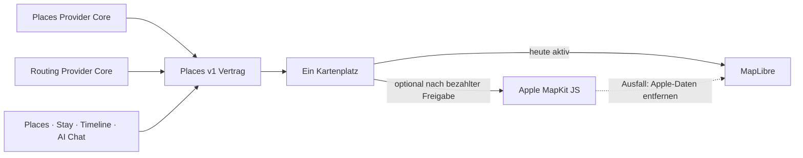

# P02 Apple MapKit Renderer Foundation

<!-- LUVIA-CURRENT-STATUS:START -->
## Aktueller Stand und nächster Schritt

**Stand 2026-09-09:** Integration **13.82.168.195**, Core **4.82.314**. P17/P19: A2 auf Integration .195 ausgeliefert; echte Reisequalität wegen nachgewiesener Recherche-/Interpretationslücken weiter offen.

**Zuletzt geliefert:** Integration .195 / Core 4.82.314 aus 025f098b veröffentlicht; 242/242 kontrollierte Regression und 25/25 öffentliche Dateivergleiche PASS. A2 mit echter Places-Karte öffentlich bedient: genau ein Bearbeitungspanel, synchroner Pin und Spektrumrahmen, bei 1440 Pixeln getrennte Karte/Route ohne horizontalen Überlauf. Neuer realer Valencia-Hauptworkflow dca81147-2f1b-4127-801e-137f985568d2 erreicht nach 132,48 Sekunden ready_for_review: 7 Tage, 18 Orte, 77 Kandidaten, 6 Modellaufrufe / 70.007 Tokens im Hauptworkflow. Vorgelagerte Wunsch-/Zielinterpretation ist in dieser Summe nicht enthalten. Der formale Audit 88 ist KEINE inhaltliche Vollabnahme: keine Nachtleben-Kategorie, überwiegend Parks im Aktivitätspool und zu viele generische Kleinststopps. Keine bestätigte Trip-/Timeline-Übernahme.

**Nächster Schritt (AKTIV): Konkrete Erlebnisse und benannte Ziele als passende Providerquellen erschließen.** Der echte .195-Lauf liefert fast nur Parks unter Aktivitäten. Die Lonja-Suche liefert zwölf andere Sehenswürdigkeiten: Geoapify verwirft Namensfilter bei mehr als drei Wörtern und kann einen leeren Namenslauf zu allgemeiner Kategoriesuche erweitern. Diese Treffer wurden als spezifische Recherche gewertet. Der Wunsch nach lebendigen Abenden fehlt im Kategorienauftrag.

**Abnahme dieses Schritts:**

- Aktivitäten dürfen nicht allein durch generische leisure-/sport-Elternkategorien oder Parks als abgedeckt gelten.
- Benannte Zielsuche bleibt von generischer Kategoriesuche unterscheidbar; unpassende Treffer erfüllen keinen konkreten Rechercheauftrag.
- Wünsche einschließlich Abendgefühl und selbst ausprobieren erreichen Recherche und unabhängigen Audit vollständig.
- Erst die reproduzierten lokalen Quelle-/Kategoriefehler beheben, danach einen begrenzten echten Folgebeleg ohne wiederholte Gesamtplan-Schleifen.

**Danach:** Nach qualitativer Rechercheabnahme den Familien-/Konfliktfall und die übrigen P17/P19-Gates schließen. M16.5 insgesamt offen; M17 ist Design-/Produktsprache, Intelligence II folgt in M18.8.

**Weiter offen:** P17/P19 bleiben TEILWEISE: Erlebnisrecherche, benannte Ortsidentität, gebietsferne Reserve, Interpretation lebendiger Abende, Familien-/Konfliktfall, breite Kaltstarts, endgültige Konto-/Timeline-Übernahme, Mehrnutzer-Beitritt und physische Geräte.

Aktuelle Paketstände und nächste Abschlussnachweise: docs/planning/status-plan.v1.json. Nach jedem Arbeitsabschnitt Stand, Beleg, Restumfang und genau einen nächsten Schritt gemeinsam fortschreiben.
<!-- LUVIA-CURRENT-STATUS:END -->

Stand: 5. September 2026

## Ergebnis dieses Abschnitts

Luvia behält genau einen sichtbaren Kartenplatz. MapLibre bleibt für die kostenlose Providerstrategie der aktive und geplante Hauptrenderer. Apple MapKit JS ist ein optionaler kostenpflichtiger Kandidat, der erst nach einer ausdrücklichen Entscheidung für das Apple Developer Program, vollständiger Einrichtung, fachlicher Gleichwertigkeit und sichtbarer Desktop-/Mobilabnahme im selben Kartenplatz erprobt werden darf. MapLibre bleibt dabei der Rückfall; beide Renderer dürfen nie gleichzeitig sichtbar oder aktiv sein.

Die verbindliche Maschinenkonfiguration liegt in `config/luvia-map-renderers.v1.json`. Sie hält den aktuellen und den geplanten Renderer, die Aktivierungsgates und den atomaren Rückfall fest. Der Rückfall entfernt zuerst alle Apple-Kartendaten aus dem Arbeitsspeicher und lädt danach den für MapLibre zulässigen Providerbestand bei erhaltenem Kartenausschnitt und erhaltener Kategorie.

## Architektur

Apple wird nicht als zweites Kartenfenster ergänzt. Die Luvia-Navigation, Suche, Filter, Pins, Passend-Markierung, Detail-Sheet und Timeline-Aktionen bleiben Produktoberfläche; nur die Karte darunter wird über den gemeinsamen Renderer-Vertrag ausgewählt.

## Vorbereiteter Serveradapter

`supabase/functions/luvia-gateway/_shared/apple-maps.ts` bereitet Apple Maps Server API für Folgendes vor:

- Suche nach Orten innerhalb des Zielgebiets,
- Abruf eines konkreten Apple-Orts,
- Auto-, Fuß- und Fahrradrouten,
- serverseitig signierte ES256-Tokens aus Supabase-Secrets,
- zentrale Provider-Budgetreservierung vor jedem Apple-Aufruf,
- normalisierte Luvia-Orts- und Routenantworten mit Apple-Attribution.

Der Adapter ist absichtlich noch nicht in der automatischen Providerkaskade aktiv. Seine Policy `apple-maps-services` wird mit `enabled=false` und Nullbudget angelegt. Er akzeptiert Aufrufe nur mit `renderer=apple-mapkit` und `storage=transient`.

## Daten- und Darstellungsregeln

Apple-Ortsdaten dürfen in diesem Entwurf nur vorübergehend in der Apple-Kartenansicht gehalten werden. Sie werden nicht in den dauerhaften Luvia-Ortsbestand geschrieben, nicht mit MapLibre dargestellt und nicht zu einer abgeleiteten Ortsdatenbank zusammengeführt.

Apple-Ortsergebnisse liefern belastbar Name, Adresse, Koordinaten und Apple-POI-Kategorie. Sie liefern für Luvias fachliche Zusagen keine verlässliche Quelle für echte Place-Fotos, Bewertungen, Landesküche oder vegetarische beziehungsweise vegane Eignung. Deshalb gilt:

- kein Apple-Ort wird allein aufgrund eines allgemeinen Restauranttyps als `Passend` markiert,
- keine Landesküche wird aus Namen oder Vermutungen erfunden,
- Apple ist keine Lösung für den Anspruch „immer ein echtes Place-Bild“,
- fremde Providerdaten dürfen erst nach Prüfung ihrer Lizenzbedingungen auf Apple MapKit erscheinen.

## Apple-Kontingent

Apple dokumentiert für eine Apple-Developer-Program-Mitgliedschaft derzeit 250.000 Kartenaufrufe und 25.000 Serviceaufrufe pro Tag. Die Maps-ID und der private MapKit-Schlüssel stehen nur eingeschriebenen Mitgliedern oder berechtigten Mitgliedern eines eingeschriebenen Teams zur Verfügung. Das Apple Developer Program kostet derzeit 99 USD pro Mitgliedschaftsjahr beziehungsweise den regionalen Betrag. Maps Server API verwendet einen Maps-Identifier, Team-ID, Key-ID und privaten `.p8`-Schlüssel. Diese Werte fehlen; ohne sie meldet der Health-Endpunkt `configured=false` und kein Apple-Aufruf wird versucht. Für Luvias Free-first-Strategie bleibt Apple deshalb geparkt, bis die Mitgliedschaft ohnehin für eine native iOS-Veröffentlichung benötigt oder ausdrücklich separat beschlossen wird.

## Aktivierungsgates

Apple darf nur nach einer ausdrücklichen bezahlten Produktentscheidung als optionaler Renderer erprobt werden. Vor einer Aktivierung müssen alle Punkte erfüllt sein:

1. Eine aktive Apple-Developer-Program-Mitgliedschaft oder berechtigter Teamzugang ist belegt.
2. Maps-Identifier, Team-ID, Key-ID und privater Schlüssel liegen ausschließlich als Supabase-Secrets vor.
3. MapKit JS lädt auf Integration im Desktop-Browser und auf einem echten Mobilgerät.
4. Places und Stay zeigen dieselben Luvia-Pins, Filter, `Alle`/`Passend`, Detail-Sheets und Aktionen.
5. Timeline-Vorschläge und AI Chat konsumieren denselben `places.v1`-Bestand.
6. Attribution und Apple-Nutzungsbedingungen sind sichtbar eingehalten.
7. Die Anzeigeerlaubnis aller zusätzlich eingeblendeten Provider ist dokumentiert.
8. Der atomare Rückfall auf MapLibre ist sichtbar getestet, ohne zweite Karte und ohne verbliebene Apple-Daten.
9. Die vollständige Safe Regression ist grün.

## Offizielle Grundlagen

- Apple Maps Server API: https://developer.apple.com/documentation/applemapsserverapi
- Apple-Mitgliedschaften und Kosten: https://developer.apple.com/support/compare-memberships/
- Tokens für Maps Server API: https://developer.apple.com/documentation/applemapsserverapi/creating-and-using-tokens-with-maps-server-api
- Maps-Identifier und privater Schlüssel: https://developer.apple.com/help/account/capabilities/create-a-maps-identifier-and-private-key
- Apple-Ortssuche: https://developer.apple.com/documentation/applemapsserverapi/-v1-search
- Apple-Routen: https://developer.apple.com/documentation/applemapsserverapi/-v1-directions
- MapKit JS auf dem Web: https://developer.apple.com/maps/web/
- Apple Developer Program License Agreement, Attachment 6: https://developer.apple.com/support/terms/apple-developer-program-license-agreement/
