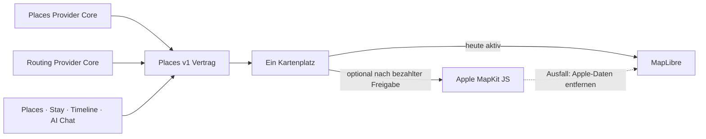

# P02 Apple MapKit Renderer Foundation

<!-- LUVIA-CURRENT-STATUS:START -->
## Aktueller Stand und nächster Schritt

**Stand 2026-09-08:** Integration **13.82.168.168**, Core **4.82.287**. P17/P19 aktiv und teilweise: App .167 / Core .286 ist öffentlich auf Integration; Intelligence v52 / 4.40.2 bleibt aktiv. Die gewählte Richtung A ist dort als kompakte Tagesroute mit echter Places-Karte, Kategorie-Farben und beidseitigem Pin-Fokus ausgeliefert. Der reale Familien-/Ferienlauf erzeugte fünf echte Richtungen und erreichte nach Ziel- und Datumswahl die Reparaturphase, überschritt dort aber den sicheren Rechenrahmen. App .168 / Core .287 ist der lokale Kandidat, der mehrere offene Tage in einem ganzheitlichen Reparaturlauf ausbalanciert. Gateway v235, Main und Production bleiben unverändert.

**Zuletzt geliefert:** Der semantische Reiseauftrag trennt Entscheidungen vor dem Plan, sichtbare änderbare Luvia-Annahmen und erst nach dem Entwurf zu belegende Livefakten. .164 priorisiert ausdrückliche Place-Wünsche und parallele Kategorien, .166 bewahrt beim manuellen Neustart bestätigten Reiseauftrag, echte Places, gültige Tage und exakte Reparaturdaten. .167 liefert Richtung A produktiv: kompakte Tagesroute, bewusster Freiraum, gegenseitiger Tagespunkt-/Pin-Fokus, fokussierte Kamerafahrt und feste Kategorienfarben aus dem zwölfstufigen Luvia-Kompass; der aktive Ort besitzt einen dezenten vollständigen Spektrumrahmen. Gründe, Bearbeitung und Plan B liegen am Ort auf Abruf, Reiseauftrag, Audit und technische Planungsdiagnosen wurden aus der Tagesroute entfernt. .168 ersetzt die teure Folge aus mehreren Ein-Tages-Reparaturen: Genau ein fehlerhafter Tag bleibt isoliert, mehrere beanstandete Tage werden in einem einzigen vollständigen KI-Lauf mit demselben Reiseauftrag und Kandidatenkatalog neu komponiert und anschließend unabhängig auditiert.

**Nächster Schritt (AKTIV): Mehrtagreparatur veröffentlichen und Familien-/Ferienplan bis zum ungespeicherten Review abschließen.** Der echte Den-Haag-Lauf hat Inspiration, Zielwahl, Zeitraum und Places-Recherche erfolgreich durchlaufen, aber in der Mehrtagreparatur das Workflowbudget ausgeschöpft. Der begrenzte Reparaturpfad ist lokal korrigiert und muss jetzt auf Integration beweisen, dass derselbe anspruchsvolle Auftrag den vollständigen Review erreicht.

**Abnahme dieses Schritts:**

- App .168 / Core .287 wird aus einem sauberen Commit ausschließlich auf Integration veröffentlicht; releasekritische Dateien sind byteidentisch.
- Der freie deutsche Reiseauftrag enthält Kinder mit Altersangaben, Schleswig-Holstein als Schulregion, einen groben Zeitraum, widersprüchliche Wünsche, gewünschten Strand-/Meeresanteil und mehrere Place-Kategorien.
- Mehrere Auditblocker lösen genau einen gemeinsamen Reparaturentwurf aus; ein einzelner Auditblocker repariert weiterhin nur seinen Tag. Kein automatischer kostenpflichtiger Lauf überschreitet den festen Workflowrahmen.
- Der gewählte Zeitraum erzeugt einen vollständigen Plan für alle Tage über mehrere sinnvolle Stadt-/Küstengebiete; Meer/Strand und bestätigte Kategorien sind abgedeckt, höchstens zwei intensive Tage folgen aufeinander und Freiraum ist bewusst benannt.
- Tagespunkt und echter Places-Pin fokussieren sich gegenseitig; Kategorien behalten ihre Compass-Farbe und der aktive Eintrag zeigt den vollständigen Luvia-Spektrumrahmen.
- Fehlende automatische, autoritativ belegte Ferienfenster werden als eigener verbleibender P17-Datumsbaustein ausgewiesen und nicht als bereits gelöst behauptet.

**Danach:** Nach dem positiven ungespeicherten Gesamtplan folgen die autoritativen Ferienfenster und semantische Konfliktmoderation vor der Planung, dann räumliche Streuung, Strandabdeckung und Kategorienmix im Plan. Anschließend werden P16-Ablehnungsdiagnose, P15/P17-Kontoübernahme, Timeline-/Owner-Receipts, Archiv/Wiederherstellung und physische Geräte geschlossen. M17 friert die gemeinsame Produktsprache sowie die modulübergreifenden Intelligence-Verträge ein; M18 baut Collaboration, Attention, Wallet/Dokumente, Reviews, Admin, Social, Suche und Intelligence II aus.

**Weiter offen:** P17/P19: .168 öffentlich beweisen und den Familien-/Ferien-/Konfliktlauf bis zum ungespeicherten Review abschließen; automatische autoritativ belegte Ferienfenster, Konfliktvarianten, räumliche Streuung, Strandabdeckung, Kategorienmix, Latenz und Kosten messen. Konto- und Timeline-Übernahme, physische Geräte sowie echte datierte Unterkunfts-, Routen-, Wetter-, Event-, Preis-, Öffnungs- und Buchbarkeitsbelege bleiben offen. P16: semantische Ablehnungsdiagnose. Kontextwellen, Reise-Schatten, Ziel-Zwillinge, Luvia Pulse und Gruppen-Sternbild bleiben offen.

Aktuelle Paketstände und nächste Abschlussnachweise: docs/planning/status-plan.v1.json. Nach jedem Arbeitsabschnitt Stand, Beleg, Restumfang und genau einen nächsten Schritt gemeinsam fortschreiben.
<!-- LUVIA-CURRENT-STATUS:END -->

Stand: 5. September 2026

## Ergebnis dieses Abschnitts

Luvia behält genau einen sichtbaren Kartenplatz. MapLibre bleibt für die kostenlose Providerstrategie der aktive und geplante Hauptrenderer. Apple MapKit JS ist ein optionaler kostenpflichtiger Kandidat, der erst nach einer ausdrücklichen Entscheidung für das Apple Developer Program, vollständiger Einrichtung, fachlicher Gleichwertigkeit und sichtbarer Desktop-/Mobilabnahme im selben Kartenplatz erprobt werden darf. MapLibre bleibt dabei der Rückfall; beide Renderer dürfen nie gleichzeitig sichtbar oder aktiv sein.

Die verbindliche Maschinenkonfiguration liegt in `config/luvia-map-renderers.v1.json`. Sie hält den aktuellen und den geplanten Renderer, die Aktivierungsgates und den atomaren Rückfall fest. Der Rückfall entfernt zuerst alle Apple-Kartendaten aus dem Arbeitsspeicher und lädt danach den für MapLibre zulässigen Providerbestand bei erhaltenem Kartenausschnitt und erhaltener Kategorie.

## Architektur

Apple wird nicht als zweites Kartenfenster ergänzt. Die Luvia-Navigation, Suche, Filter, Pins, Passend-Markierung, Detail-Sheet und Timeline-Aktionen bleiben Produktoberfläche; nur die Karte darunter wird über den gemeinsamen Renderer-Vertrag ausgewählt.

## Vorbereiteter Serveradapter

`supabase/functions/luvia-gateway/_shared/apple-maps.ts` bereitet Apple Maps Server API für Folgendes vor:

- Suche nach Orten innerhalb des Zielgebiets,
- Abruf eines konkreten Apple-Orts,
- Auto-, Fuß- und Fahrradrouten,
- serverseitig signierte ES256-Tokens aus Supabase-Secrets,
- zentrale Provider-Budgetreservierung vor jedem Apple-Aufruf,
- normalisierte Luvia-Orts- und Routenantworten mit Apple-Attribution.

Der Adapter ist absichtlich noch nicht in der automatischen Providerkaskade aktiv. Seine Policy `apple-maps-services` wird mit `enabled=false` und Nullbudget angelegt. Er akzeptiert Aufrufe nur mit `renderer=apple-mapkit` und `storage=transient`.

## Daten- und Darstellungsregeln

Apple-Ortsdaten dürfen in diesem Entwurf nur vorübergehend in der Apple-Kartenansicht gehalten werden. Sie werden nicht in den dauerhaften Luvia-Ortsbestand geschrieben, nicht mit MapLibre dargestellt und nicht zu einer abgeleiteten Ortsdatenbank zusammengeführt.

Apple-Ortsergebnisse liefern belastbar Name, Adresse, Koordinaten und Apple-POI-Kategorie. Sie liefern für Luvias fachliche Zusagen keine verlässliche Quelle für echte Place-Fotos, Bewertungen, Landesküche oder vegetarische beziehungsweise vegane Eignung. Deshalb gilt:

- kein Apple-Ort wird allein aufgrund eines allgemeinen Restauranttyps als `Passend` markiert,
- keine Landesküche wird aus Namen oder Vermutungen erfunden,
- Apple ist keine Lösung für den Anspruch „immer ein echtes Place-Bild“,
- fremde Providerdaten dürfen erst nach Prüfung ihrer Lizenzbedingungen auf Apple MapKit erscheinen.

## Apple-Kontingent

Apple dokumentiert für eine Apple-Developer-Program-Mitgliedschaft derzeit 250.000 Kartenaufrufe und 25.000 Serviceaufrufe pro Tag. Die Maps-ID und der private MapKit-Schlüssel stehen nur eingeschriebenen Mitgliedern oder berechtigten Mitgliedern eines eingeschriebenen Teams zur Verfügung. Das Apple Developer Program kostet derzeit 99 USD pro Mitgliedschaftsjahr beziehungsweise den regionalen Betrag. Maps Server API verwendet einen Maps-Identifier, Team-ID, Key-ID und privaten `.p8`-Schlüssel. Diese Werte fehlen; ohne sie meldet der Health-Endpunkt `configured=false` und kein Apple-Aufruf wird versucht. Für Luvias Free-first-Strategie bleibt Apple deshalb geparkt, bis die Mitgliedschaft ohnehin für eine native iOS-Veröffentlichung benötigt oder ausdrücklich separat beschlossen wird.

## Aktivierungsgates

Apple darf nur nach einer ausdrücklichen bezahlten Produktentscheidung als optionaler Renderer erprobt werden. Vor einer Aktivierung müssen alle Punkte erfüllt sein:

1. Eine aktive Apple-Developer-Program-Mitgliedschaft oder berechtigter Teamzugang ist belegt.
2. Maps-Identifier, Team-ID, Key-ID und privater Schlüssel liegen ausschließlich als Supabase-Secrets vor.
3. MapKit JS lädt auf Integration im Desktop-Browser und auf einem echten Mobilgerät.
4. Places und Stay zeigen dieselben Luvia-Pins, Filter, `Alle`/`Passend`, Detail-Sheets und Aktionen.
5. Timeline-Vorschläge und AI Chat konsumieren denselben `places.v1`-Bestand.
6. Attribution und Apple-Nutzungsbedingungen sind sichtbar eingehalten.
7. Die Anzeigeerlaubnis aller zusätzlich eingeblendeten Provider ist dokumentiert.
8. Der atomare Rückfall auf MapLibre ist sichtbar getestet, ohne zweite Karte und ohne verbliebene Apple-Daten.
9. Die vollständige Safe Regression ist grün.

## Offizielle Grundlagen

- Apple Maps Server API: https://developer.apple.com/documentation/applemapsserverapi
- Apple-Mitgliedschaften und Kosten: https://developer.apple.com/support/compare-memberships/
- Tokens für Maps Server API: https://developer.apple.com/documentation/applemapsserverapi/creating-and-using-tokens-with-maps-server-api
- Maps-Identifier und privater Schlüssel: https://developer.apple.com/help/account/capabilities/create-a-maps-identifier-and-private-key
- Apple-Ortssuche: https://developer.apple.com/documentation/applemapsserverapi/-v1-search
- Apple-Routen: https://developer.apple.com/documentation/applemapsserverapi/-v1-directions
- MapKit JS auf dem Web: https://developer.apple.com/maps/web/
- Apple Developer Program License Agreement, Attachment 6: https://developer.apple.com/support/terms/apple-developer-program-license-agreement/
