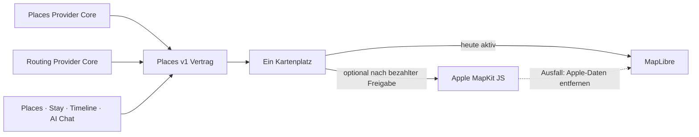

# P02 Apple MapKit Renderer Foundation

<!-- LUVIA-CURRENT-STATUS:START -->
## Aktueller Stand und nächster Schritt

**Stand 2026-09-07:** Integration **13.82.168.131**, Core **4.82.250**. P15/P17 aktiv und teilweise: App .131 / Core .250 und Intelligence 4.37.0 sind auf Integration veröffentlicht. Der Composer verbindet drei Reisewege, kanonischen Globus, originalen Luvia-Compass, frei geführte Flugpfade, fünf Zielideen, semantische Zeitfenster und vollständige KI-Tagesplanung. Reise-DNA und Zeitreise sind integriert. trip.audit prüft jeden Entwurf unabhängig über Terra und erlaubt genau eine gezielte Reparatur; Sol bleibt dem Gesamtentwurf vorbehalten. 239/239 Regression, Intelligence-Health, Workerstatus, 8/8 öffentliche Dateihashes und der sichtbare mobile Einstieg sind belegt. Der authentifizierte vollständige Modell-Positivlauf bleibt offen. Gateway v235, Main und Production bleiben unverändert.

**Zuletzt geliefert:** Funktional geliefert sind neutrale Geografie mit dezenten Namen pro Ebene, drei fachlich getrennte Reiseergebnisse, fünf erneuerbare Zielideen, kanonische Zielidentitätsprüfung und semantische Reise- plus Profilpräferenzen. Ein grober Monatswunsch erzeugt drei konkrete Zeitfenster mit der erkannten Dauer; nach Auswahl beginnt ohne wiederholte Wunschabfrage direkt der vollständige rollenabhängige Entwurf. Das Structured-Output-Schema ist streng rekursiv geprüft, unvollständige Modellantworten werden vor der JSON-Auswertung erkannt und die Ladeanzeige erklärt die aktuelle Phase. trip.audit prüft Vollständigkeit, Zeit, Kategorien, Wiederholungen, Geografie, Gruppenbedarf, Budgetbelege, Reservierungen und Alternativen über Terra. Reise-DNA zeigt Herkunft und Wirkung der Merkmale; Zeitreise stellt frühere Entscheidungen ohne Domain-Mutation wieder her. Flugpfade starten am Compassrand, variieren und können eine Schleife fliegen. Kontextwellen, Gruppen-Sternbild, Reise-Schatten, Ziel-Zwillinge und Luvia Pulse bleiben offen.

**Nächster Schritt (AKTIV): Reiseversprechen, Unsicherheit und Buchungsabhängigkeiten in den vollständigen KI-Entwurf binden.** Zeitfenster, Kalenderbelege, vollständige Komposition und unabhängiger Audit besitzen jetzt einen gemeinsamen semantischen Vertrag. Als nächster zusammenhängender Qualitätsschritt muss die KI vor dem Entwurf ihr Reiseversprechen formulieren und danach Unsicherheiten sowie blockierende Buchungsentscheidungen sichtbar auf genau dieses Versprechen beziehen.

**Abnahme dieses Schritts:**

- Vor dem Plan ein kurzes, aus dem gesamten freien Wunsch abgeleitetes Reiseversprechen erzeugen; Ziel, Zeit, Gruppe, Kategorien, Rhythmus, Freiraum und Ausschlüsse müssen prüfbar enthalten sein.
- Jeden Planabschnitt als belastbar, modellierte Annahme oder offen kennzeichnen und Wetter, Preis, Öffnung, Route, Verfügbarkeit sowie Buchungsdaten nur mit Quelle und Abrufzeit als Fakt zeigen.
- Zeitkritische Fähren, Flüge, Veranstaltungen oder andere Blocker in einem erklärbaren Abhängigkeitsgraphen vor nachgelagerten Tageszeiten und Reservierungen anordnen.
- Mindestens zwei sehr unterschiedliche freie Reiseaufträge mit dem produktiven Modell bis zum vollständigen Entwurf und Audit positiv prüfen; Tokenkosten, Latenz, Reparaturbedarf und Providerzugriffe je Fähigkeit messen.

**Danach:** Nach professioneller Motion-Freigabe, vollständigem KI-Plan und Trip-Lifecycle die P15-Identity-Übernahme und physischen Gerätegates schließen; danach M18–M22 mit Mitreisendenverwaltung, Administration, Social und Intelligence II. Die Karten-, Composer- und sieben neu aufgenommenen USP-Ideen bleiben verbindlich.

**Weiter offen:** P02/P03: breite exakte Ortsbilder, Google-Berechtigung und physischer Mobil-Kaltstart. P07/P08: echte Booking-Provider. P09–P12: physische Abnahme und echte Context-Signale. P15/P17: professionelle visuelle Composer-Freigabe, echter vollständiger KI-Positivlauf, datierte Kontext-/Budgetqualität, Kontoübernahme, dauerhafte Identity-Übergabe, Lifecycle und physische Geräte. Von den sieben neuen Composer-USPs sind Reise-DNA und Zeitreise lokal umgesetzt; Kontextwellen, Gruppen-Sternbild, Reise-Schatten, Ziel-Zwillinge und Luvia Pulse bleiben offen. Die Geografie ist eine Übersicht, keine Zusage sämtlicher aktuellen Untergliederungen. Kein zusätzlicher P-Block wird als vollständig abgeschlossen markiert.

Aktuelle Paketstände und nächste Abschlussnachweise: docs/planning/status-plan.v1.json. Nach jedem Arbeitsabschnitt Stand, Beleg, Restumfang und genau einen nächsten Schritt gemeinsam fortschreiben.
<!-- LUVIA-CURRENT-STATUS:END -->

Stand: 5. September 2026

## Ergebnis dieses Abschnitts

Luvia behält genau einen sichtbaren Kartenplatz. MapLibre bleibt für die kostenlose Providerstrategie der aktive und geplante Hauptrenderer. Apple MapKit JS ist ein optionaler kostenpflichtiger Kandidat, der erst nach einer ausdrücklichen Entscheidung für das Apple Developer Program, vollständiger Einrichtung, fachlicher Gleichwertigkeit und sichtbarer Desktop-/Mobilabnahme im selben Kartenplatz erprobt werden darf. MapLibre bleibt dabei der Rückfall; beide Renderer dürfen nie gleichzeitig sichtbar oder aktiv sein.

Die verbindliche Maschinenkonfiguration liegt in `config/luvia-map-renderers.v1.json`. Sie hält den aktuellen und den geplanten Renderer, die Aktivierungsgates und den atomaren Rückfall fest. Der Rückfall entfernt zuerst alle Apple-Kartendaten aus dem Arbeitsspeicher und lädt danach den für MapLibre zulässigen Providerbestand bei erhaltenem Kartenausschnitt und erhaltener Kategorie.

## Architektur

Apple wird nicht als zweites Kartenfenster ergänzt. Die Luvia-Navigation, Suche, Filter, Pins, Passend-Markierung, Detail-Sheet und Timeline-Aktionen bleiben Produktoberfläche; nur die Karte darunter wird über den gemeinsamen Renderer-Vertrag ausgewählt.

## Vorbereiteter Serveradapter

`supabase/functions/luvia-gateway/_shared/apple-maps.ts` bereitet Apple Maps Server API für Folgendes vor:

- Suche nach Orten innerhalb des Zielgebiets,
- Abruf eines konkreten Apple-Orts,
- Auto-, Fuß- und Fahrradrouten,
- serverseitig signierte ES256-Tokens aus Supabase-Secrets,
- zentrale Provider-Budgetreservierung vor jedem Apple-Aufruf,
- normalisierte Luvia-Orts- und Routenantworten mit Apple-Attribution.

Der Adapter ist absichtlich noch nicht in der automatischen Providerkaskade aktiv. Seine Policy `apple-maps-services` wird mit `enabled=false` und Nullbudget angelegt. Er akzeptiert Aufrufe nur mit `renderer=apple-mapkit` und `storage=transient`.

## Daten- und Darstellungsregeln

Apple-Ortsdaten dürfen in diesem Entwurf nur vorübergehend in der Apple-Kartenansicht gehalten werden. Sie werden nicht in den dauerhaften Luvia-Ortsbestand geschrieben, nicht mit MapLibre dargestellt und nicht zu einer abgeleiteten Ortsdatenbank zusammengeführt.

Apple-Ortsergebnisse liefern belastbar Name, Adresse, Koordinaten und Apple-POI-Kategorie. Sie liefern für Luvias fachliche Zusagen keine verlässliche Quelle für echte Place-Fotos, Bewertungen, Landesküche oder vegetarische beziehungsweise vegane Eignung. Deshalb gilt:

- kein Apple-Ort wird allein aufgrund eines allgemeinen Restauranttyps als `Passend` markiert,
- keine Landesküche wird aus Namen oder Vermutungen erfunden,
- Apple ist keine Lösung für den Anspruch „immer ein echtes Place-Bild“,
- fremde Providerdaten dürfen erst nach Prüfung ihrer Lizenzbedingungen auf Apple MapKit erscheinen.

## Apple-Kontingent

Apple dokumentiert für eine Apple-Developer-Program-Mitgliedschaft derzeit 250.000 Kartenaufrufe und 25.000 Serviceaufrufe pro Tag. Die Maps-ID und der private MapKit-Schlüssel stehen nur eingeschriebenen Mitgliedern oder berechtigten Mitgliedern eines eingeschriebenen Teams zur Verfügung. Das Apple Developer Program kostet derzeit 99 USD pro Mitgliedschaftsjahr beziehungsweise den regionalen Betrag. Maps Server API verwendet einen Maps-Identifier, Team-ID, Key-ID und privaten `.p8`-Schlüssel. Diese Werte fehlen; ohne sie meldet der Health-Endpunkt `configured=false` und kein Apple-Aufruf wird versucht. Für Luvias Free-first-Strategie bleibt Apple deshalb geparkt, bis die Mitgliedschaft ohnehin für eine native iOS-Veröffentlichung benötigt oder ausdrücklich separat beschlossen wird.

## Aktivierungsgates

Apple darf nur nach einer ausdrücklichen bezahlten Produktentscheidung als optionaler Renderer erprobt werden. Vor einer Aktivierung müssen alle Punkte erfüllt sein:

1. Eine aktive Apple-Developer-Program-Mitgliedschaft oder berechtigter Teamzugang ist belegt.
2. Maps-Identifier, Team-ID, Key-ID und privater Schlüssel liegen ausschließlich als Supabase-Secrets vor.
3. MapKit JS lädt auf Integration im Desktop-Browser und auf einem echten Mobilgerät.
4. Places und Stay zeigen dieselben Luvia-Pins, Filter, `Alle`/`Passend`, Detail-Sheets und Aktionen.
5. Timeline-Vorschläge und AI Chat konsumieren denselben `places.v1`-Bestand.
6. Attribution und Apple-Nutzungsbedingungen sind sichtbar eingehalten.
7. Die Anzeigeerlaubnis aller zusätzlich eingeblendeten Provider ist dokumentiert.
8. Der atomare Rückfall auf MapLibre ist sichtbar getestet, ohne zweite Karte und ohne verbliebene Apple-Daten.
9. Die vollständige Safe Regression ist grün.

## Offizielle Grundlagen

- Apple Maps Server API: https://developer.apple.com/documentation/applemapsserverapi
- Apple-Mitgliedschaften und Kosten: https://developer.apple.com/support/compare-memberships/
- Tokens für Maps Server API: https://developer.apple.com/documentation/applemapsserverapi/creating-and-using-tokens-with-maps-server-api
- Maps-Identifier und privater Schlüssel: https://developer.apple.com/help/account/capabilities/create-a-maps-identifier-and-private-key
- Apple-Ortssuche: https://developer.apple.com/documentation/applemapsserverapi/-v1-search
- Apple-Routen: https://developer.apple.com/documentation/applemapsserverapi/-v1-directions
- MapKit JS auf dem Web: https://developer.apple.com/maps/web/
- Apple Developer Program License Agreement, Attachment 6: https://developer.apple.com/support/terms/apple-developer-program-license-agreement/
