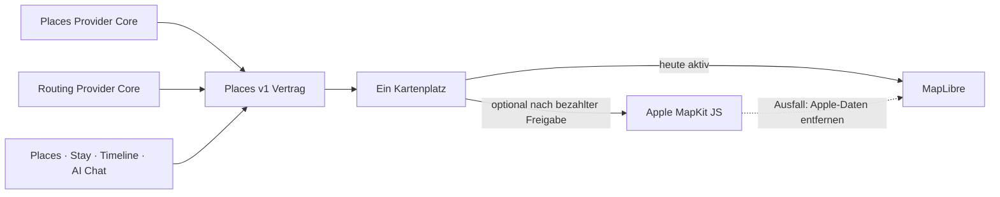

# P02 Apple MapKit Renderer Foundation

<!-- LUVIA-CURRENT-STATUS:START -->
## Aktueller Stand und nächster Schritt

**Stand 2026-09-08:** Integration **13.82.168.167**, Core **4.82.286**. P17/P19 aktiv und teilweise: App .166 / Core .285 und Intelligence v52 / 4.40.2 sind öffentlich auf Integration. Die evidenzerhaltende Fortsetzung repariert bekannte fehlerhafte Tage einzeln, ohne Reiseauftrag, echte Places oder gültige Tage neu zu berechnen. App .167 / Core .286 ist der lokal sichtgeprüfte Kandidat für die gewählte Richtung A – Tagesroute. Gateway v235, Main und Production bleiben unverändert.

**Zuletzt geliefert:** Der semantische Reiseauftrag trennt Entscheidungen vor dem Plan, sichtbare änderbare Luvia-Annahmen und erst nach dem Entwurf zu belegende Livefakten. .164 priorisiert ausdrückliche Place-Wünsche und parallele Kategorien, .165 isoliert mehrere fehlerhafte Tage in je einen fortsetzbaren Ein-Tages-Auftrag und .166 bewahrt beim manuellen Neustart bestätigten Reiseauftrag, echte Places, gültige Tage und exakte Reparaturdaten. .167 setzt die ausdrücklich gewählte Richtung A produktiv auf die bestehende Places-Karte: kompakte Tagesroute, sichtbarer bewusster Freiraum, beidseitiger Tagespunkt-/Pin-Fokus, fokussierte Kamerafahrt und reduzierte Bewegung. Kategorien erhalten feste Farben aus dem zwölfstufigen Luvia-Kompass; nur der aktive Ort bekommt den vollständigen bewegten Spektrumrahmen. Die Hauptkarten zeigen nur Kategorie, Ort, Zeit beziehungsweise Dauer und einen knappen Kartenhinweis. Gründe, Bearbeitung und Plan B liegen am Ort auf Abruf; Reiseauftrag, Audit und technische Planungsdiagnosen wurden aus der Tagesroute entfernt. Die Desktop-Karte bleibt vollflächig hinter einem schmaleren Sheet; Zielzeile, Kartenhöhe und Hintergrund sind nicht mehr gegeneinander abgeschnitten.

**Nächster Schritt (AKTIV): Familien-, Ferien-, Mobilitäts- und Wunschkonflikte im zweiten realen Gesamtplan prüfen.** Der erste reale Gesamtplan funktioniert technisch, bündelt seine Places aber zu stark im Zentrum und deckt einen ausdrücklich gewünschten Meeresmoment nicht ab. Der zweite Positivlauf muss deshalb zugleich semantische Konfliktmoderation, autoritative Schulferien, räumliche Vielfalt, Mobilitätsradius und ausgewogenen Kategorienmix beweisen.

**Abnahme dieses Schritts:**

- Ein freier deutscher Reiseauftrag enthält Kinder mit Altersangaben, Schleswig-Holstein als Schulregion, einen groben Zeitraum, widersprüchliche Wünsche, gewünschten Strand-/Meeresanteil und mehrere Place-Kategorien.
- Vor der Planung stoppt Luvia ausschließlich für echte Zielkonflikte, einen fehlenden Bewegungsradius, feste Termine sowie harte gesundheitliche oder finanzielle Grenzen und schlägt ausschließlich autoritativ belegte Zeitfenster innerhalb der zuständigen Schulferien vor.
- Der echte Konfliktmoderator benennt die Spannung und bietet mindestens zwei sinnvoll priorisierte Varianten mit Folgen an, statt einen stillen Mittelwert oder ein Keyword-Schema zu verwenden.
- Der Reiseauftrag belegt sichtbar einen ausgewogenen Tagesrhythmus, 20 bis 25 Prozent Freiraum, eine Unterkunftsbasis und höchstens zwei intensive Tage in Folge vor; jede Annahme ist vor der Generierung mit einem Klick änderbar.
- Der gewählte Zeitraum erzeugt einen vollständigen Plan für alle Tage über mehrere sinnvolle Stadt-/Küstengebiete; Meer/Strand und bestätigte Kategorien sind als überprüfbare Abdeckung enthalten, fünf anstrengende Tage in Folge sind ausgeschlossen und Freiraum ist bewusst benannt.
- Unterkunftsradius und Nachbarschaft folgen aus dem fertigen Tagesnetz und Mobilitätswunsch. Öffnungen, Wetter, Preise, Buchbarkeit, Events, Einreise und aktuelle Verbindungen werden erst nach der Generierung mit echten Quellen geprüft und ehrlich in Unsicherheitskarte und Buchungsreihenfolge getrennt; Modell, Tokens, Latenz, Kosten und Reparaturen werden je Phase gemessen.

**Danach:** App .167 wird aus einem sauberen Commit ausschließlich auf Integration veröffentlicht. Anschließend wird ein frischer Familien-/Ferien-/Konfliktauftrag bis zum ungespeicherten Review durchlaufen und dabei räumliche Streuung, Strandabdeckung, Kategorienmix, Latenz, Kosten und die echte Kartenkopplung gemessen. Danach folgen semantische Ablehnungsdiagnose, P15/P17 Kontoübernahme, Timeline, Archiv/Wiederherstellung und physische Geräte. M17 friert die gemeinsame Produktsprache und Intelligence-Verträge ein; M18 baut Collaboration, Attention, Wallet/Dokumente, Reviews, Admin, Social, Suche und Intelligence II aus.

**Weiter offen:** P17/P19: .167 öffentlich auf Integration zeigen und den zweiten Familien-/Ferien-/Konfliktlauf bis zum ungespeicherten Review abschließen; räumliche Streuung, Strandabdeckung, Kategorienmix, Latenz und Kosten messen. Konto- und Timeline-Übernahme, physische Geräte sowie echte datierte Unterkunfts-, Routen-, Wetter-, Event-, Preis-, Öffnungs- und Buchbarkeitsbelege bleiben offen. P16: semantische Ablehnungsdiagnose. Kontextwellen, Reise-Schatten, Ziel-Zwillinge, Luvia Pulse und Gruppen-Sternbild bleiben offen.

Aktuelle Paketstände und nächste Abschlussnachweise: docs/planning/status-plan.v1.json. Nach jedem Arbeitsabschnitt Stand, Beleg, Restumfang und genau einen nächsten Schritt gemeinsam fortschreiben.
<!-- LUVIA-CURRENT-STATUS:END -->

Stand: 5. September 2026

## Ergebnis dieses Abschnitts

Luvia behält genau einen sichtbaren Kartenplatz. MapLibre bleibt für die kostenlose Providerstrategie der aktive und geplante Hauptrenderer. Apple MapKit JS ist ein optionaler kostenpflichtiger Kandidat, der erst nach einer ausdrücklichen Entscheidung für das Apple Developer Program, vollständiger Einrichtung, fachlicher Gleichwertigkeit und sichtbarer Desktop-/Mobilabnahme im selben Kartenplatz erprobt werden darf. MapLibre bleibt dabei der Rückfall; beide Renderer dürfen nie gleichzeitig sichtbar oder aktiv sein.

Die verbindliche Maschinenkonfiguration liegt in `config/luvia-map-renderers.v1.json`. Sie hält den aktuellen und den geplanten Renderer, die Aktivierungsgates und den atomaren Rückfall fest. Der Rückfall entfernt zuerst alle Apple-Kartendaten aus dem Arbeitsspeicher und lädt danach den für MapLibre zulässigen Providerbestand bei erhaltenem Kartenausschnitt und erhaltener Kategorie.

## Architektur

Apple wird nicht als zweites Kartenfenster ergänzt. Die Luvia-Navigation, Suche, Filter, Pins, Passend-Markierung, Detail-Sheet und Timeline-Aktionen bleiben Produktoberfläche; nur die Karte darunter wird über den gemeinsamen Renderer-Vertrag ausgewählt.

## Vorbereiteter Serveradapter

`supabase/functions/luvia-gateway/_shared/apple-maps.ts` bereitet Apple Maps Server API für Folgendes vor:

- Suche nach Orten innerhalb des Zielgebiets,
- Abruf eines konkreten Apple-Orts,
- Auto-, Fuß- und Fahrradrouten,
- serverseitig signierte ES256-Tokens aus Supabase-Secrets,
- zentrale Provider-Budgetreservierung vor jedem Apple-Aufruf,
- normalisierte Luvia-Orts- und Routenantworten mit Apple-Attribution.

Der Adapter ist absichtlich noch nicht in der automatischen Providerkaskade aktiv. Seine Policy `apple-maps-services` wird mit `enabled=false` und Nullbudget angelegt. Er akzeptiert Aufrufe nur mit `renderer=apple-mapkit` und `storage=transient`.

## Daten- und Darstellungsregeln

Apple-Ortsdaten dürfen in diesem Entwurf nur vorübergehend in der Apple-Kartenansicht gehalten werden. Sie werden nicht in den dauerhaften Luvia-Ortsbestand geschrieben, nicht mit MapLibre dargestellt und nicht zu einer abgeleiteten Ortsdatenbank zusammengeführt.

Apple-Ortsergebnisse liefern belastbar Name, Adresse, Koordinaten und Apple-POI-Kategorie. Sie liefern für Luvias fachliche Zusagen keine verlässliche Quelle für echte Place-Fotos, Bewertungen, Landesküche oder vegetarische beziehungsweise vegane Eignung. Deshalb gilt:

- kein Apple-Ort wird allein aufgrund eines allgemeinen Restauranttyps als `Passend` markiert,
- keine Landesküche wird aus Namen oder Vermutungen erfunden,
- Apple ist keine Lösung für den Anspruch „immer ein echtes Place-Bild“,
- fremde Providerdaten dürfen erst nach Prüfung ihrer Lizenzbedingungen auf Apple MapKit erscheinen.

## Apple-Kontingent

Apple dokumentiert für eine Apple-Developer-Program-Mitgliedschaft derzeit 250.000 Kartenaufrufe und 25.000 Serviceaufrufe pro Tag. Die Maps-ID und der private MapKit-Schlüssel stehen nur eingeschriebenen Mitgliedern oder berechtigten Mitgliedern eines eingeschriebenen Teams zur Verfügung. Das Apple Developer Program kostet derzeit 99 USD pro Mitgliedschaftsjahr beziehungsweise den regionalen Betrag. Maps Server API verwendet einen Maps-Identifier, Team-ID, Key-ID und privaten `.p8`-Schlüssel. Diese Werte fehlen; ohne sie meldet der Health-Endpunkt `configured=false` und kein Apple-Aufruf wird versucht. Für Luvias Free-first-Strategie bleibt Apple deshalb geparkt, bis die Mitgliedschaft ohnehin für eine native iOS-Veröffentlichung benötigt oder ausdrücklich separat beschlossen wird.

## Aktivierungsgates

Apple darf nur nach einer ausdrücklichen bezahlten Produktentscheidung als optionaler Renderer erprobt werden. Vor einer Aktivierung müssen alle Punkte erfüllt sein:

1. Eine aktive Apple-Developer-Program-Mitgliedschaft oder berechtigter Teamzugang ist belegt.
2. Maps-Identifier, Team-ID, Key-ID und privater Schlüssel liegen ausschließlich als Supabase-Secrets vor.
3. MapKit JS lädt auf Integration im Desktop-Browser und auf einem echten Mobilgerät.
4. Places und Stay zeigen dieselben Luvia-Pins, Filter, `Alle`/`Passend`, Detail-Sheets und Aktionen.
5. Timeline-Vorschläge und AI Chat konsumieren denselben `places.v1`-Bestand.
6. Attribution und Apple-Nutzungsbedingungen sind sichtbar eingehalten.
7. Die Anzeigeerlaubnis aller zusätzlich eingeblendeten Provider ist dokumentiert.
8. Der atomare Rückfall auf MapLibre ist sichtbar getestet, ohne zweite Karte und ohne verbliebene Apple-Daten.
9. Die vollständige Safe Regression ist grün.

## Offizielle Grundlagen

- Apple Maps Server API: https://developer.apple.com/documentation/applemapsserverapi
- Apple-Mitgliedschaften und Kosten: https://developer.apple.com/support/compare-memberships/
- Tokens für Maps Server API: https://developer.apple.com/documentation/applemapsserverapi/creating-and-using-tokens-with-maps-server-api
- Maps-Identifier und privater Schlüssel: https://developer.apple.com/help/account/capabilities/create-a-maps-identifier-and-private-key
- Apple-Ortssuche: https://developer.apple.com/documentation/applemapsserverapi/-v1-search
- Apple-Routen: https://developer.apple.com/documentation/applemapsserverapi/-v1-directions
- MapKit JS auf dem Web: https://developer.apple.com/maps/web/
- Apple Developer Program License Agreement, Attachment 6: https://developer.apple.com/support/terms/apple-developer-program-license-agreement/
