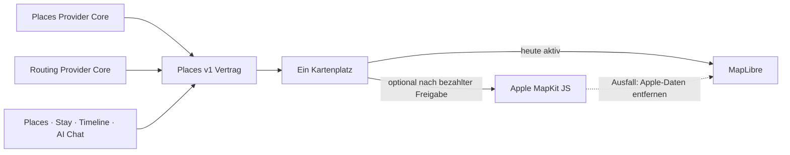

# P02 Apple MapKit Renderer Foundation

<!-- LUVIA-CURRENT-STATUS:START -->
## Aktueller Stand und nächster Schritt

**Stand 2026-09-07:** Integration **13.82.168.126**, Core **4.82.245**. P15/P17 aktiv und teilweise: .126 liefert globale Geografie- und Auswahlkorrekturen sowie Tageswege-/Pufferprüfung. Die nächste Abschlusslücke ist ausreichend vielfältige Tagesabdeckung; kein vollständiger KI-Reiseplan belegt. Stable .104; Gateway v235 / Intelligence v37 unverändert.

**Zuletzt geliefert:** App .126 korrigiert sieben falsch orientierte Inselringe in vier Regionspaketen; Hawaii übermalt keine anderen US-Staaten mehr. Die US-Übersicht zeigt 50 Staaten plus Washington, D.C., mit Alaska/Hawaii als Nebenkarte. Die Länderbasis wächst von 177 auf 258 geografische Einheiten des Natural-Earth-Datensatzes, alle über sieben Kontinente erreichbar; kleine Inselstaaten und Kleinstaaten bleiben auswählbar. 10.197 Ringe und 4.589 Regionen in 251 Paketen werden mit der echten D3-Projektion geprüft. Nach einer Regionswahl öffnet die vorhandene kanonische Zielsuche automatisch; öffentlich wurde Hawaii, lokal Schleswig-Holstein inklusive korrekter Ebene und Überschrift abgenommen. Keine neue flächendeckende Kreis-/Stadtgeometrie. Ernährung, Mobilität und Barrierefreiheit sind getrennt. Mehrfachauswahl aktualisiert bestehende Chips ohne Sheet-Neuaufbau; sechsmaliges Umschalten, Profileigentum und Wiederaufnahme sind geprüft. Die missverständliche Mittelpunktlinie auf der geografischen Bühne ist entfernt; ein Compass-Faden begleitet die Auswahlfolge. Der Tagesfilm bleibt nach den Vorschlägen erreichbar und folgt der zeitlichen Reihenfolge. Neu: explizite Fuß-/Radwegeprüfung für bis zu acht Verbindungen des sichtbaren Tages über places.v1, Weitergabe belegter Wegezeiten an journey.v1 und verständliche Puffer-/Budget-/Abdeckungshinweise. Keine künstliche Blockade aus unbelegten Wegezeiten; belegte Konflikte bleiben auch bei teilweiser Routenabdeckung blockierend. Öffentlich lieferte OpenRouteService auf einer Scharbeutz-Teststrecke 6 Minuten zu Fuß und 3 Minuten per Rad. Die kombinierte Route-UI ist kontrolliert geprüft; der öffentliche Vorschlagslauf lieferte nur Strand Creperie über drei Tage. Filmstart, manuelle Pause und freier Tag mit null Pins sind öffentlich belegt. Damit ist noch kein vollständiger Reiseplan abgenommen.

**Nächster Schritt (AKTIV): Tagesabdeckung und Vielfalt zu einem vollständigen Reiseentwurf ausbauen.** Die Geografie-/Bedienkorrekturen und die erste explizite Tageswegeprüfung sind geliefert. Der öffentliche Lauf mit nur einem Place über drei Tage zeigt die nächste fachliche Lücke konkret. P15/P17 bleiben bis zu ihren vollständigen Produktgates teilweise.

**Abnahme dieses Schritts:**

- Über places.v1 ausreichend unterschiedliche, belegte Kandidaten für alle Reisetage finden; Kategorieabdeckung, Wiederholungen, Reise-/Profilvorgaben und freie Zeit prüfen. Keine gelockerten Sachfilter, erfundenen Places oder verdeckte Kontingentvervielfachung, um einen vollen Plan vorzutäuschen.
- Den vollständigen öffentlichen Weg zwischen mindestens zwei echten Entwurfsstationen per UI abnehmen; berechnete Wegegeometrie mit eindeutiger Darstellung und Quellenbeleg in die Tageskarte übernehmen. Zeitpuffer und Konflikte weiterhin durch journey.v1, einschließlich gemischter Fortbewegung und veralteter Quellen.
- Öffnungen, Saison, Feiertage, Events und Wetter über gemeinsame datierte Owner-/Intelligence-Kontexte einbeziehen. Budgetgefühl, Preisbelege und harte Budgetgrenzen getrennt behandeln; Lichtstimmung bleibt Atmosphäre.
- Nach verfügbarem Modellzugang einen echten vollständigen Wunsch-/KI-Plan-Lauf positiv abnehmen. Der zuletzt dokumentierte Kontingentblocker bleibt offen; keine Zahlung oder Konfigurationsänderung ohne Auftrag.
- Vor P15/P17-Gesamtabschluss bestätigte Kontoübernahme, dauerhafte Identity-Übergabe, Trip-Lifecycle und Wiederaufnahme auf physischen iOS-/Android-Geräten nachweisen. Gemeinsamen Status und alle aktiven Fahrpläne synchronisieren.

**Danach:** Nach belastbarer vollständiger Tagesplanung die verbleibenden P15/P17-Konto-/Lifecycle-/Gerätegates abschließen; danach M18–M22 mit Mitreisendenverwaltung, Administration, Social und Intelligence II. Die 17 Karten-USPs bleiben verbindlich.

**Weiter offen:** P02/P03: breite exakte Ortsbilder, Google-Berechtigung und physischer Mobil-Kaltstart. P07/P08: echte Booking-Provider. P09–P12: physische Abnahme und echte Context-Signale. P15/P17: vollständige Tagesvielfalt, Kontext/Budget, kombiniertes öffentliches Route-UI-Gate, echter KI-Positivlauf (zuletzt Kontingentblocker), Kontoübernahme, dauerhafte Identity-Übergabe, Lifecycle und physische Geräte. Die Geografie ist eine Übersicht, keine Zusage sämtlicher aktuellen Untergliederungen. Kein zusätzlicher P-Block wird als vollständig abgeschlossen markiert.

Aktuelle Paketstände und nächste Abschlussnachweise: docs/planning/status-plan.v1.json. Nach jedem Arbeitsabschnitt Stand, Beleg, Restumfang und genau einen nächsten Schritt gemeinsam fortschreiben.
<!-- LUVIA-CURRENT-STATUS:END -->

Stand: 5. September 2026

## Ergebnis dieses Abschnitts

Luvia behält genau einen sichtbaren Kartenplatz. MapLibre bleibt für die kostenlose Providerstrategie der aktive und geplante Hauptrenderer. Apple MapKit JS ist ein optionaler kostenpflichtiger Kandidat, der erst nach einer ausdrücklichen Entscheidung für das Apple Developer Program, vollständiger Einrichtung, fachlicher Gleichwertigkeit und sichtbarer Desktop-/Mobilabnahme im selben Kartenplatz erprobt werden darf. MapLibre bleibt dabei der Rückfall; beide Renderer dürfen nie gleichzeitig sichtbar oder aktiv sein.

Die verbindliche Maschinenkonfiguration liegt in `config/luvia-map-renderers.v1.json`. Sie hält den aktuellen und den geplanten Renderer, die Aktivierungsgates und den atomaren Rückfall fest. Der Rückfall entfernt zuerst alle Apple-Kartendaten aus dem Arbeitsspeicher und lädt danach den für MapLibre zulässigen Providerbestand bei erhaltenem Kartenausschnitt und erhaltener Kategorie.

## Architektur

Apple wird nicht als zweites Kartenfenster ergänzt. Die Luvia-Navigation, Suche, Filter, Pins, Passend-Markierung, Detail-Sheet und Timeline-Aktionen bleiben Produktoberfläche; nur die Karte darunter wird über den gemeinsamen Renderer-Vertrag ausgewählt.

## Vorbereiteter Serveradapter

`supabase/functions/luvia-gateway/_shared/apple-maps.ts` bereitet Apple Maps Server API für Folgendes vor:

- Suche nach Orten innerhalb des Zielgebiets,
- Abruf eines konkreten Apple-Orts,
- Auto-, Fuß- und Fahrradrouten,
- serverseitig signierte ES256-Tokens aus Supabase-Secrets,
- zentrale Provider-Budgetreservierung vor jedem Apple-Aufruf,
- normalisierte Luvia-Orts- und Routenantworten mit Apple-Attribution.

Der Adapter ist absichtlich noch nicht in der automatischen Providerkaskade aktiv. Seine Policy `apple-maps-services` wird mit `enabled=false` und Nullbudget angelegt. Er akzeptiert Aufrufe nur mit `renderer=apple-mapkit` und `storage=transient`.

## Daten- und Darstellungsregeln

Apple-Ortsdaten dürfen in diesem Entwurf nur vorübergehend in der Apple-Kartenansicht gehalten werden. Sie werden nicht in den dauerhaften Luvia-Ortsbestand geschrieben, nicht mit MapLibre dargestellt und nicht zu einer abgeleiteten Ortsdatenbank zusammengeführt.

Apple-Ortsergebnisse liefern belastbar Name, Adresse, Koordinaten und Apple-POI-Kategorie. Sie liefern für Luvias fachliche Zusagen keine verlässliche Quelle für echte Place-Fotos, Bewertungen, Landesküche oder vegetarische beziehungsweise vegane Eignung. Deshalb gilt:

- kein Apple-Ort wird allein aufgrund eines allgemeinen Restauranttyps als `Passend` markiert,
- keine Landesküche wird aus Namen oder Vermutungen erfunden,
- Apple ist keine Lösung für den Anspruch „immer ein echtes Place-Bild“,
- fremde Providerdaten dürfen erst nach Prüfung ihrer Lizenzbedingungen auf Apple MapKit erscheinen.

## Apple-Kontingent

Apple dokumentiert für eine Apple-Developer-Program-Mitgliedschaft derzeit 250.000 Kartenaufrufe und 25.000 Serviceaufrufe pro Tag. Die Maps-ID und der private MapKit-Schlüssel stehen nur eingeschriebenen Mitgliedern oder berechtigten Mitgliedern eines eingeschriebenen Teams zur Verfügung. Das Apple Developer Program kostet derzeit 99 USD pro Mitgliedschaftsjahr beziehungsweise den regionalen Betrag. Maps Server API verwendet einen Maps-Identifier, Team-ID, Key-ID und privaten `.p8`-Schlüssel. Diese Werte fehlen; ohne sie meldet der Health-Endpunkt `configured=false` und kein Apple-Aufruf wird versucht. Für Luvias Free-first-Strategie bleibt Apple deshalb geparkt, bis die Mitgliedschaft ohnehin für eine native iOS-Veröffentlichung benötigt oder ausdrücklich separat beschlossen wird.

## Aktivierungsgates

Apple darf nur nach einer ausdrücklichen bezahlten Produktentscheidung als optionaler Renderer erprobt werden. Vor einer Aktivierung müssen alle Punkte erfüllt sein:

1. Eine aktive Apple-Developer-Program-Mitgliedschaft oder berechtigter Teamzugang ist belegt.
2. Maps-Identifier, Team-ID, Key-ID und privater Schlüssel liegen ausschließlich als Supabase-Secrets vor.
3. MapKit JS lädt auf Integration im Desktop-Browser und auf einem echten Mobilgerät.
4. Places und Stay zeigen dieselben Luvia-Pins, Filter, `Alle`/`Passend`, Detail-Sheets und Aktionen.
5. Timeline-Vorschläge und AI Chat konsumieren denselben `places.v1`-Bestand.
6. Attribution und Apple-Nutzungsbedingungen sind sichtbar eingehalten.
7. Die Anzeigeerlaubnis aller zusätzlich eingeblendeten Provider ist dokumentiert.
8. Der atomare Rückfall auf MapLibre ist sichtbar getestet, ohne zweite Karte und ohne verbliebene Apple-Daten.
9. Die vollständige Safe Regression ist grün.

## Offizielle Grundlagen

- Apple Maps Server API: https://developer.apple.com/documentation/applemapsserverapi
- Apple-Mitgliedschaften und Kosten: https://developer.apple.com/support/compare-memberships/
- Tokens für Maps Server API: https://developer.apple.com/documentation/applemapsserverapi/creating-and-using-tokens-with-maps-server-api
- Maps-Identifier und privater Schlüssel: https://developer.apple.com/help/account/capabilities/create-a-maps-identifier-and-private-key
- Apple-Ortssuche: https://developer.apple.com/documentation/applemapsserverapi/-v1-search
- Apple-Routen: https://developer.apple.com/documentation/applemapsserverapi/-v1-directions
- MapKit JS auf dem Web: https://developer.apple.com/maps/web/
- Apple Developer Program License Agreement, Attachment 6: https://developer.apple.com/support/terms/apple-developer-program-license-agreement/
