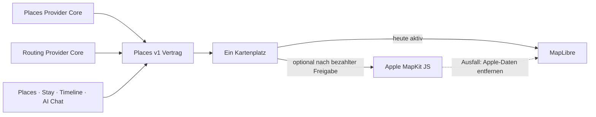

# P02 Apple MapKit Renderer Foundation

<!-- LUVIA-CURRENT-STATUS:START -->
## Aktueller Stand und nächster Schritt

**Stand 2026-09-06:** Integration **13.82.168.121**, Core **4.82.240**. M16.5 Schritte 15–18: P15/P17 aktiv und teilweise. Der konkrete Globus-Scrollfehler ist in Kandidat .121 öffentlich geprüft behoben. Die neue Kartenhierarchie, durchgehende räumliche Gestaltung und drei fachlichen Reisearten sind verbindlich dokumentiert und als Konzept durchspielbar, noch nicht vollständig implementiert. Vollständiger KI-Plan, Kontext-/Kontoabschluss und physische Mobilabnahme bleiben offen. Stable bleibt .104.

**Zuletzt geliefert:** App .121 korrigiert die Globus-Gestenfläche: Canvas und Ortsbeschriftungen teilen Ziehen/Pinch, Trackpadbewegungen drehen die Welt und scrollen den Composer nicht. Ein Marker-Drag wählt keinen Ort, Antippen öffnet weiterhin die bestehende Zielsuche. Im angemeldeten öffentlichen Browser bei 390 Pixeln blieb ScrollTop während Trackpadrotation bei 0 und beim Marker-Drag bei 100; außerhalb änderte Scrollen den Wert von 0 auf 100. Toskana wurde danach per Antippen an die Ortsuche übergeben. 33/33 Geometrie-/Gestenprüfungen, 50 Composer-Prüfungen, 238/238 Regression, NFR-0 3/3 und 38/38 öffentliche Byteidentität sind grün. Physische Touchabnahme bleibt offen. Die neue Produktvorgabe ist im kanonischen Konzept und einer durchspielbaren Bewegungsstudie festgehalten: Welt → Kontinent → Land → Region → Ort, danach dieselbe Bühne für Reisezeit, Wünsche und Tage; drei unterschiedliche Ergebnisse Nur anlegen / Mit Vorschlägen / Luvia plant. Diese Hierarchie und vollständige KI-Planung sind noch keine ausgelieferten Laufzeitfunktionen.

**Nächster Schritt (AKTIV): Kartenhierarchie und drei fachliche Reisearten im gemeinsamen Composer umsetzen.** Der Nutzer bestätigt das Weltprinzip, lehnt aber die Formularfortsetzung und die geringe Planvielfalt ab. Navigationsstufen und fachliche Ergebnisse müssen zusammenhängend auf dem kanonischen Auftrag aufbauen.

**Abnahme dieses Schritts:**

- Globus, Kontinent, Land, Region und Ort mit angemessener belegbarer Geometrie, Rückweg und Wiederaufnahme umsetzen. Gebietsauswahl bleibt Suchabsicht bis zur kanonischen Destination-Bestätigung; direkte Suche und Regionen als Ziele bleiben möglich. Kamerabewegung löst keine Provideranfragen aus.
- Die drei Produktwege im bestehenden Trip-Auftrag unterscheiden: Nur anlegen erzeugt null Places-/Timeline-/Vormerkungsaktionen; Mit Vorschlägen übernimmt ausschließlich explizite Auswahl; Luvia plant liefert einen getrennt prüfbaren strukturierten Gesamtentwurf. Alte guided/quick/ai-Einstiegslabels reichen nicht als Beleg.
- Reisezeit, Wünsche, Mitreisende, Tempo und Budget auf derselben räumlichen Bühne fortführen. Präzise Werte bleiben zugänglich, Bewegung unterstützt Orientierung, Reduced Motion sowie Tastatur-/Antippbedienung bleiben vollständig.
- KI-Vollständigkeit an gesamten Reisetagen, belegten Restriktionen, Interessenvielfalt, Wegen/Puffern, Pausen, Zeit-/Budgetrahmen und Quellenkontext prüfen. Der frühere Lauf fünf Orte/acht Tage und die Bewegungsstudie gelten nicht als vollständiger Plan oder positiver realer KI-Nachweis.
- Reale Modellantwort und bestätigte idempotente Übernahme über Trip/Places/Journey getrennt positiv belegen; Identity-Änderungen bleiben eigenständig bestätigt. Fehlende Modellverfügbarkeit oder Fakten dürfen keinen vollständigen KI-Erfolg ergeben.
- Rückkehr, Wiederaufnahme, mobile Gesten auf physischem iOS/Android, öffentliches Verhalten und Releasegates am tatsächlich ausgegebenen Versionslink prüfen. P15/P17 bleiben bis zum vollständigen Abschluss ihrer Produktgates teilweise.

**Danach:** Danach die offenen P15/P17-Produktgates und erforderlichen Kontext-/Intelligence-Abhängigkeiten schließen. M18–M22 behalten Mitreisendenverwaltung, Administration, Social und Intelligence II; die 17 Karten-USPs bleiben verbindlich.

**Weiter offen:** P02/P03: Google-Berechtigung, breite echte Ortsbilder und physischer Mobil-Kaltstart. P07/P08: echte Booking-Provider. P09/P10/P11/P12: begrenzte interne Belege, physische Abnahme und echte Context-Signale fehlen. P15/P17: öffentlicher KI-Positivlauf wegen HTTP 429, vollständige Kontextplanung, finale interaktive Gestaltung, echte Kontoübernahme, dauerhafte Identity-Übergabe und Trip-Lifecycle offen. Die 17 Karten-USPs bleiben verbindlich; kein weiterer P-Block wird aufgrund des Teilnachweises als vollständig abgeschlossen markiert. Zusätzlich zeigte Supabase am 06.09. eine Fair-Use-Warnung wegen Egress im vorigen Abrechnungszyklus, Schonfrist bis 07.09.; im aktuellen Zyklus sind 2,517 von 5 GB genutzt. Keine Zahlung oder Planänderung vorgenommen.

Aktuelle Paketstände und nächste Abschlussnachweise: docs/planning/status-plan.v1.json. Nach jedem Arbeitsabschnitt Stand, Beleg, Restumfang und genau einen nächsten Schritt gemeinsam fortschreiben.
<!-- LUVIA-CURRENT-STATUS:END -->

Stand: 5. September 2026

## Ergebnis dieses Abschnitts

Luvia behält genau einen sichtbaren Kartenplatz. MapLibre bleibt für die kostenlose Providerstrategie der aktive und geplante Hauptrenderer. Apple MapKit JS ist ein optionaler kostenpflichtiger Kandidat, der erst nach einer ausdrücklichen Entscheidung für das Apple Developer Program, vollständiger Einrichtung, fachlicher Gleichwertigkeit und sichtbarer Desktop-/Mobilabnahme im selben Kartenplatz erprobt werden darf. MapLibre bleibt dabei der Rückfall; beide Renderer dürfen nie gleichzeitig sichtbar oder aktiv sein.

Die verbindliche Maschinenkonfiguration liegt in `config/luvia-map-renderers.v1.json`. Sie hält den aktuellen und den geplanten Renderer, die Aktivierungsgates und den atomaren Rückfall fest. Der Rückfall entfernt zuerst alle Apple-Kartendaten aus dem Arbeitsspeicher und lädt danach den für MapLibre zulässigen Providerbestand bei erhaltenem Kartenausschnitt und erhaltener Kategorie.

## Architektur

Apple wird nicht als zweites Kartenfenster ergänzt. Die Luvia-Navigation, Suche, Filter, Pins, Passend-Markierung, Detail-Sheet und Timeline-Aktionen bleiben Produktoberfläche; nur die Karte darunter wird über den gemeinsamen Renderer-Vertrag ausgewählt.

## Vorbereiteter Serveradapter

`supabase/functions/luvia-gateway/_shared/apple-maps.ts` bereitet Apple Maps Server API für Folgendes vor:

- Suche nach Orten innerhalb des Zielgebiets,
- Abruf eines konkreten Apple-Orts,
- Auto-, Fuß- und Fahrradrouten,
- serverseitig signierte ES256-Tokens aus Supabase-Secrets,
- zentrale Provider-Budgetreservierung vor jedem Apple-Aufruf,
- normalisierte Luvia-Orts- und Routenantworten mit Apple-Attribution.

Der Adapter ist absichtlich noch nicht in der automatischen Providerkaskade aktiv. Seine Policy `apple-maps-services` wird mit `enabled=false` und Nullbudget angelegt. Er akzeptiert Aufrufe nur mit `renderer=apple-mapkit` und `storage=transient`.

## Daten- und Darstellungsregeln

Apple-Ortsdaten dürfen in diesem Entwurf nur vorübergehend in der Apple-Kartenansicht gehalten werden. Sie werden nicht in den dauerhaften Luvia-Ortsbestand geschrieben, nicht mit MapLibre dargestellt und nicht zu einer abgeleiteten Ortsdatenbank zusammengeführt.

Apple-Ortsergebnisse liefern belastbar Name, Adresse, Koordinaten und Apple-POI-Kategorie. Sie liefern für Luvias fachliche Zusagen keine verlässliche Quelle für echte Place-Fotos, Bewertungen, Landesküche oder vegetarische beziehungsweise vegane Eignung. Deshalb gilt:

- kein Apple-Ort wird allein aufgrund eines allgemeinen Restauranttyps als `Passend` markiert,
- keine Landesküche wird aus Namen oder Vermutungen erfunden,
- Apple ist keine Lösung für den Anspruch „immer ein echtes Place-Bild“,
- fremde Providerdaten dürfen erst nach Prüfung ihrer Lizenzbedingungen auf Apple MapKit erscheinen.

## Apple-Kontingent

Apple dokumentiert für eine Apple-Developer-Program-Mitgliedschaft derzeit 250.000 Kartenaufrufe und 25.000 Serviceaufrufe pro Tag. Die Maps-ID und der private MapKit-Schlüssel stehen nur eingeschriebenen Mitgliedern oder berechtigten Mitgliedern eines eingeschriebenen Teams zur Verfügung. Das Apple Developer Program kostet derzeit 99 USD pro Mitgliedschaftsjahr beziehungsweise den regionalen Betrag. Maps Server API verwendet einen Maps-Identifier, Team-ID, Key-ID und privaten `.p8`-Schlüssel. Diese Werte fehlen; ohne sie meldet der Health-Endpunkt `configured=false` und kein Apple-Aufruf wird versucht. Für Luvias Free-first-Strategie bleibt Apple deshalb geparkt, bis die Mitgliedschaft ohnehin für eine native iOS-Veröffentlichung benötigt oder ausdrücklich separat beschlossen wird.

## Aktivierungsgates

Apple darf nur nach einer ausdrücklichen bezahlten Produktentscheidung als optionaler Renderer erprobt werden. Vor einer Aktivierung müssen alle Punkte erfüllt sein:

1. Eine aktive Apple-Developer-Program-Mitgliedschaft oder berechtigter Teamzugang ist belegt.
2. Maps-Identifier, Team-ID, Key-ID und privater Schlüssel liegen ausschließlich als Supabase-Secrets vor.
3. MapKit JS lädt auf Integration im Desktop-Browser und auf einem echten Mobilgerät.
4. Places und Stay zeigen dieselben Luvia-Pins, Filter, `Alle`/`Passend`, Detail-Sheets und Aktionen.
5. Timeline-Vorschläge und AI Chat konsumieren denselben `places.v1`-Bestand.
6. Attribution und Apple-Nutzungsbedingungen sind sichtbar eingehalten.
7. Die Anzeigeerlaubnis aller zusätzlich eingeblendeten Provider ist dokumentiert.
8. Der atomare Rückfall auf MapLibre ist sichtbar getestet, ohne zweite Karte und ohne verbliebene Apple-Daten.
9. Die vollständige Safe Regression ist grün.

## Offizielle Grundlagen

- Apple Maps Server API: https://developer.apple.com/documentation/applemapsserverapi
- Apple-Mitgliedschaften und Kosten: https://developer.apple.com/support/compare-memberships/
- Tokens für Maps Server API: https://developer.apple.com/documentation/applemapsserverapi/creating-and-using-tokens-with-maps-server-api
- Maps-Identifier und privater Schlüssel: https://developer.apple.com/help/account/capabilities/create-a-maps-identifier-and-private-key
- Apple-Ortssuche: https://developer.apple.com/documentation/applemapsserverapi/-v1-search
- Apple-Routen: https://developer.apple.com/documentation/applemapsserverapi/-v1-directions
- MapKit JS auf dem Web: https://developer.apple.com/maps/web/
- Apple Developer Program License Agreement, Attachment 6: https://developer.apple.com/support/terms/apple-developer-program-license-agreement/
