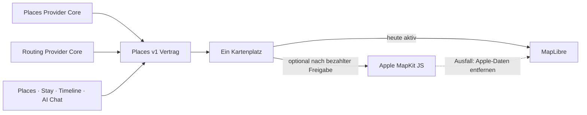

# P02 Apple MapKit Renderer Foundation

<!-- LUVIA-CURRENT-STATUS:START -->
## Aktueller Stand und nächster Schritt

**Stand 2026-09-06:** Integration **13.82.168.113**, Core **4.82.232**. M16.5 Schritte 15–18: P09, P10, P11 und P12 sind intern abgeschlossen und als unveränderliche Integrationskandidaten sichtbar sowie reproduzierbar belegt. App .113 / Core .232 verbindet echte Timeline-Daten, P11-Routenfenster und eine nicht mutierende günstige, erwartete und ungünstige Tagesprobe in Timeline und Luvia AI. Stable Integration läuft wieder auf dem akzeptierten App-.104-Worker; Main und Production blieben unverändert. Nur die physische iOS-/Android-Abnahme und später reale zeitgestempelte Context-Signale bleiben als Gates. P15/P17 ist jetzt AKTIV.

**Zuletzt geliefert:** P12: Der echte Reisetag 12.06.2027 wird aus derselben Journey- und Places-Wahrheit in drei nachvollziehbaren Verläufen gezeigt. Wetter, Verkehr/Störungen, Öffnungszeiten und Auslastung bleiben ohne Beleg unbekannt; Luvia behauptet keine Erfolgswahrscheinlichkeit und schreibt nichts automatisch. Timeline und AI Chat zeigen dieselben Momente, Szenarien und Bestätigungsgrenzen. Sichtbar wurden die drei Verläufe, die ausdrücklich unbekannten Einflüsse und der Reload mit unveränderten zwei Momenten sowie zehn Minuten Puffer geprüft. Safe Regression 235/235, NFR-0 3/3 und Byteidentität 30/30 sind grün.

**Nächster Schritt (AKTIV): Gemeinsamen Trip Composer für Geführt, Schnellstart und KI-Entwurf liefern.** P09 bis P12 liefern jetzt bestätigte Places-/Journey-Änderungen, Recovery, Quellenfenster und eine ehrliche Tagesprobe. P15 und P17 bündeln diese Fähigkeiten in einem einzigen Trip-Entwurf, ohne Vorlieben, Reiseentwurf oder Timeline-Wahrheit zu duplizieren.

**Abnahme dieses Schritts:**

- Account-ohne-Reise und bestehende Reise verwenden denselben Trip Composer mit den Einstiegen Geführt, Schnellstart und KI-Entwurf; Trip bleibt der einzige Owner des Entwurfs und der bestätigten Reise.
- Ziel, Zeitraum, Reisefarbe und Symbol sowie Anfrage-, reisebezogene und dauerhafte Vorlieben werden klar getrennt; eine dauerhafte Profiländerung verlangt eine eigene verständliche Bestätigung und bleibt korrigier- und löschbar.
- Der KI-Entwurf wird tageweise mit echten Place-/Stay-Identitäten, Karte, P12-Tagesprobe, Begründungen, Alternativen, Budget- und Context-Hinweisen präsentiert; unbelegte Angaben bleiben unbekannt.
- Vormerken, Einplanen, Tauschen, Weglassen und Teilübernahme erscheinen jeweils als eigene Vorher/Neu-Vorschau und schreiben erst nach Bestätigung idempotent über Trip, Journey oder Places Owner.
- Ein gebündelter sichtbarer Integrationslauf prüft Geführt, Schnellstart, KI-Entwurf, Abbruch ohne Mutation, bestätigte Teilübernahme, Reload-Readback, bestehende Reise, Account-ohne-Reise, Desktop, mobiles Browserformat, Safe Regression und NFR-0.

**Danach:** Danach folgen P19/P20/P22/P23/P26 als gemeinsame Context Matrix für Zeit, Wetter, Saison, Ereignisse, Budget, Energie, Mobilität und Gruppenkontext; anschließend P33/P34/P35 für vollständige AI-Orchestrierung und nachvollziehbare Entscheidungen.

**Weiter offen:** P02/P03 bleiben teilweise für Google-Berechtigung, breite exakte Fotoabdeckung und physischen Mobil-Kaltstart. P07/P08 bleiben von echten Booking-Providern abhängig. P09/P10/P11/P12 sind intern belegt und für physische iOS-/Android-Abnahme begrenzt; P12 wartet zusätzlich auf echte zeitgestempelte Context-Signale. Jetzt folgen P15/P17 Trip Composer; danach P19/P20/P22/P23/P26 Context Matrix und P33/P34/P35 AI-Parität. M18 bis M22 behalten Mitreisendenverwaltung, Administration, Social und Intelligence II. Alle 17 Karten-USPs bleiben verbindlich inventarisiert.

Aktuelle Paketstände und nächste Abschlussnachweise: docs/planning/status-plan.v1.json. Nach jedem Arbeitsabschnitt Stand, Beleg, Restumfang und genau einen nächsten Schritt gemeinsam fortschreiben.
<!-- LUVIA-CURRENT-STATUS:END -->

Stand: 5. September 2026

## Ergebnis dieses Abschnitts

Luvia behält genau einen sichtbaren Kartenplatz. MapLibre bleibt für die kostenlose Providerstrategie der aktive und geplante Hauptrenderer. Apple MapKit JS ist ein optionaler kostenpflichtiger Kandidat, der erst nach einer ausdrücklichen Entscheidung für das Apple Developer Program, vollständiger Einrichtung, fachlicher Gleichwertigkeit und sichtbarer Desktop-/Mobilabnahme im selben Kartenplatz erprobt werden darf. MapLibre bleibt dabei der Rückfall; beide Renderer dürfen nie gleichzeitig sichtbar oder aktiv sein.

Die verbindliche Maschinenkonfiguration liegt in `config/luvia-map-renderers.v1.json`. Sie hält den aktuellen und den geplanten Renderer, die Aktivierungsgates und den atomaren Rückfall fest. Der Rückfall entfernt zuerst alle Apple-Kartendaten aus dem Arbeitsspeicher und lädt danach den für MapLibre zulässigen Providerbestand bei erhaltenem Kartenausschnitt und erhaltener Kategorie.

## Architektur

Apple wird nicht als zweites Kartenfenster ergänzt. Die Luvia-Navigation, Suche, Filter, Pins, Passend-Markierung, Detail-Sheet und Timeline-Aktionen bleiben Produktoberfläche; nur die Karte darunter wird über den gemeinsamen Renderer-Vertrag ausgewählt.

## Vorbereiteter Serveradapter

`supabase/functions/luvia-gateway/_shared/apple-maps.ts` bereitet Apple Maps Server API für Folgendes vor:

- Suche nach Orten innerhalb des Zielgebiets,
- Abruf eines konkreten Apple-Orts,
- Auto-, Fuß- und Fahrradrouten,
- serverseitig signierte ES256-Tokens aus Supabase-Secrets,
- zentrale Provider-Budgetreservierung vor jedem Apple-Aufruf,
- normalisierte Luvia-Orts- und Routenantworten mit Apple-Attribution.

Der Adapter ist absichtlich noch nicht in der automatischen Providerkaskade aktiv. Seine Policy `apple-maps-services` wird mit `enabled=false` und Nullbudget angelegt. Er akzeptiert Aufrufe nur mit `renderer=apple-mapkit` und `storage=transient`.

## Daten- und Darstellungsregeln

Apple-Ortsdaten dürfen in diesem Entwurf nur vorübergehend in der Apple-Kartenansicht gehalten werden. Sie werden nicht in den dauerhaften Luvia-Ortsbestand geschrieben, nicht mit MapLibre dargestellt und nicht zu einer abgeleiteten Ortsdatenbank zusammengeführt.

Apple-Ortsergebnisse liefern belastbar Name, Adresse, Koordinaten und Apple-POI-Kategorie. Sie liefern für Luvias fachliche Zusagen keine verlässliche Quelle für echte Place-Fotos, Bewertungen, Landesküche oder vegetarische beziehungsweise vegane Eignung. Deshalb gilt:

- kein Apple-Ort wird allein aufgrund eines allgemeinen Restauranttyps als `Passend` markiert,
- keine Landesküche wird aus Namen oder Vermutungen erfunden,
- Apple ist keine Lösung für den Anspruch „immer ein echtes Place-Bild“,
- fremde Providerdaten dürfen erst nach Prüfung ihrer Lizenzbedingungen auf Apple MapKit erscheinen.

## Apple-Kontingent

Apple dokumentiert für eine Apple-Developer-Program-Mitgliedschaft derzeit 250.000 Kartenaufrufe und 25.000 Serviceaufrufe pro Tag. Die Maps-ID und der private MapKit-Schlüssel stehen nur eingeschriebenen Mitgliedern oder berechtigten Mitgliedern eines eingeschriebenen Teams zur Verfügung. Das Apple Developer Program kostet derzeit 99 USD pro Mitgliedschaftsjahr beziehungsweise den regionalen Betrag. Maps Server API verwendet einen Maps-Identifier, Team-ID, Key-ID und privaten `.p8`-Schlüssel. Diese Werte fehlen; ohne sie meldet der Health-Endpunkt `configured=false` und kein Apple-Aufruf wird versucht. Für Luvias Free-first-Strategie bleibt Apple deshalb geparkt, bis die Mitgliedschaft ohnehin für eine native iOS-Veröffentlichung benötigt oder ausdrücklich separat beschlossen wird.

## Aktivierungsgates

Apple darf nur nach einer ausdrücklichen bezahlten Produktentscheidung als optionaler Renderer erprobt werden. Vor einer Aktivierung müssen alle Punkte erfüllt sein:

1. Eine aktive Apple-Developer-Program-Mitgliedschaft oder berechtigter Teamzugang ist belegt.
2. Maps-Identifier, Team-ID, Key-ID und privater Schlüssel liegen ausschließlich als Supabase-Secrets vor.
3. MapKit JS lädt auf Integration im Desktop-Browser und auf einem echten Mobilgerät.
4. Places und Stay zeigen dieselben Luvia-Pins, Filter, `Alle`/`Passend`, Detail-Sheets und Aktionen.
5. Timeline-Vorschläge und AI Chat konsumieren denselben `places.v1`-Bestand.
6. Attribution und Apple-Nutzungsbedingungen sind sichtbar eingehalten.
7. Die Anzeigeerlaubnis aller zusätzlich eingeblendeten Provider ist dokumentiert.
8. Der atomare Rückfall auf MapLibre ist sichtbar getestet, ohne zweite Karte und ohne verbliebene Apple-Daten.
9. Die vollständige Safe Regression ist grün.

## Offizielle Grundlagen

- Apple Maps Server API: https://developer.apple.com/documentation/applemapsserverapi
- Apple-Mitgliedschaften und Kosten: https://developer.apple.com/support/compare-memberships/
- Tokens für Maps Server API: https://developer.apple.com/documentation/applemapsserverapi/creating-and-using-tokens-with-maps-server-api
- Maps-Identifier und privater Schlüssel: https://developer.apple.com/help/account/capabilities/create-a-maps-identifier-and-private-key
- Apple-Ortssuche: https://developer.apple.com/documentation/applemapsserverapi/-v1-search
- Apple-Routen: https://developer.apple.com/documentation/applemapsserverapi/-v1-directions
- MapKit JS auf dem Web: https://developer.apple.com/maps/web/
- Apple Developer Program License Agreement, Attachment 6: https://developer.apple.com/support/terms/apple-developer-program-license-agreement/
