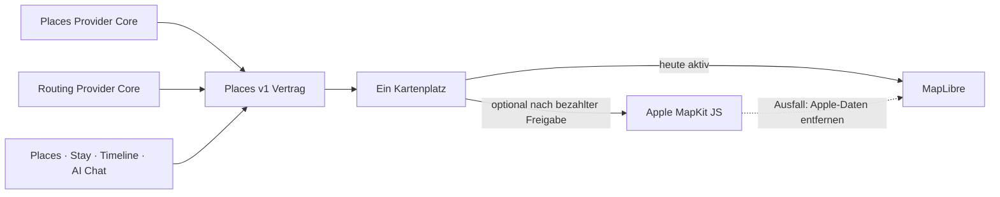

# P02 Apple MapKit Renderer Foundation

<!-- LUVIA-CURRENT-STATUS:START -->
## Aktueller Stand und nächster Schritt

**Stand 2026-09-08:** Integration **13.82.168.173**, Core **4.82.292**. P17/P19 aktiv und teilweise: App .172 / Core .291, Worker be6e88b6-5e13-4038-a9a0-717860c71f2f und Integration-Intelligence 4.42.0 sind öffentlich auf Integration; 22/22 Bytes stimmen. Der echte Valencia-Lauf erreichte 21 belegte Kandidaten in rund 12 Sekunden und danach den klar sichtbaren separaten trip.compose-Timeout. App .173 / Core .292 ist der aktive räumlich skalierte Recherchekandidat. Main und Production bleiben unverändert.

**Zuletzt geliefert:** Die veröffentlichte Laufzeit begrenzt Recherche, Komposition und Kosten sichtbar und setzt einen Auftrag nach Hintergrundwechsel fort. .172 skaliert den Zielpool mit Reisedauer und Interessen, schließt bekannte Provider-IDs in Ergänzungswellen aus und erlaubt ehrliche leichtere Tage bei kleiner Unterdeckung. Der öffentliche Valencia-Lauf bestätigte 21 Kandidaten statt zuvor 17, zeigte aber weiter denselben zu zentralen Provider-Suchanker. .173 ergänzt deshalb reale, im Bewegungsradius verteilte Suchanker, Rückprüfung gegen den Originalradius, mehr Wellen für längere Reisen und begrenzte Stützkategorien. Unbekannte Orte werden weiterhin niemals erfunden.

**Nächster Schritt (AKTIV): App .173 ausschließlich auf Integration veröffentlichen, räumlich breiten Valencia-Pool messen und danach trip.compose fortsetzbar verkleinern.** Der öffentliche .172-Lauf erreichte schnell 21 belegte Places, blieb durch wiederholte Provider-Abfragen am selben Stadtmittelpunkt aber unter seinem skalierten Forschungsziel. .173 muss belegen, dass räumlich versetzte, radiuskonforme Wellen mehr unterschiedliche Valencia-Kandidaten einschließlich Meer/Strand liefern. Der danach sichtbar eingetretene 50-Sekunden-Timeout wird getrennt durch kleinere fortsetzbare KI-Kompositionsarbeit gelöst.

**Abnahme dieses Schritts:**

- App .173 / Core .292 wird aus einem sauberen Commit ausschließlich auf Integration veröffentlicht; releasekritische Dateien sind zwischen Archiv, Stable und Immutable byteidentisch.
- Integration verwendet weiter die getrennte Intelligence 4.42.0; produktive Intelligence, Main und Production bleiben unverändert.
- Valencia-Recherche verschiebt spätere Suchwellen durch mehrere echte Koordinatensektoren innerhalb des freigegebenen Bewegungsradius und bezeichnet das Ergebnis wahrheitsgemäß als Kandidaten dieses Suchlaufs.
- 7, 14 und 21 Tage besitzen wachsende Rechercheziele und höchstens 2, 3 beziehungsweise 4 Ergänzungswellen; der gemeinsame Sicherheitsdeckel von 160 echten Kandidaten verhindert unkontrollierte Kosten.
- Ausdrückliche Wünsche wie Meer/Strand, Shopping, Nachtleben und Restaurants bleiben im Kategorienmix nachweisbar; passende Stützkategorien dürfen nur bei dünnem Pool ergänzen.
- Die Warteansicht zeigt reale Phasen, Gesamtzeit und aktive Arbeitsgegenstände; Vordergrund und Page-Restore verwenden denselben Auftrag.
- Ein trip.compose-Hänger endet nach 50 Sekunden; ein verwaister Job wird nach 60 Sekunden sichtbar terminal und ohne Nutzer-Neuversuch nicht erneut bezahlt.
- Der öffentliche Plan erreicht den ungespeicherten Review oder einen konkreten sichtbaren Fehler innerhalb des begrenzten Ablaufs.
- Tagespunkt und echter Places-Pin fokussieren sich gegenseitig; Kategorien behalten Compass-Farben und der aktive Eintrag zeigt den vollständigen Luvia-Spektrumrahmen.

**Danach:** Nach dem gemessenen mobilen Positivlauf folgen autoritative Ferienfenster und die fachliche Konfliktmoderation vor der Planung, danach die Abnahme von räumlicher Streuung, Strandabdeckung und Kategorienmix. Anschließend werden P16-Ablehnungsdiagnose, P15/P17-Kontoübernahme, Timeline-/Owner-Receipts, Archiv/Wiederherstellung und physische Geräte geschlossen. M17 friert die gemeinsame Produktsprache sowie die modulübergreifenden Intelligence-Verträge ein; M18 baut Collaboration, Attention, Wallet/Dokumente, Reviews, Admin, Social, Suche und Intelligence II aus.

**Weiter offen:** P17/P19: .171 samt Integration-Intelligence 4.42.0 öffentlich messen und den Gesamtplan bis zum ungespeicherten Review führen; automatische autoritativ belegte Ferienfenster, Konfliktvarianten, räumliche Streuung, Strandabdeckung und Kategorienmix fachlich abnehmen. Konto- und Timeline-Übernahme, physische Geräte sowie echte datierte Unterkunfts-, Routen-, Wetter-, Event-, Preis-, Öffnungs- und Buchbarkeitsbelege bleiben offen. P16: semantische Ablehnungsdiagnose. Kontextwellen, Reise-Schatten, Ziel-Zwillinge, Luvia Pulse und Gruppen-Sternbild bleiben offen.

Aktuelle Paketstände und nächste Abschlussnachweise: docs/planning/status-plan.v1.json. Nach jedem Arbeitsabschnitt Stand, Beleg, Restumfang und genau einen nächsten Schritt gemeinsam fortschreiben.
<!-- LUVIA-CURRENT-STATUS:END -->

Stand: 5. September 2026

## Ergebnis dieses Abschnitts

Luvia behält genau einen sichtbaren Kartenplatz. MapLibre bleibt für die kostenlose Providerstrategie der aktive und geplante Hauptrenderer. Apple MapKit JS ist ein optionaler kostenpflichtiger Kandidat, der erst nach einer ausdrücklichen Entscheidung für das Apple Developer Program, vollständiger Einrichtung, fachlicher Gleichwertigkeit und sichtbarer Desktop-/Mobilabnahme im selben Kartenplatz erprobt werden darf. MapLibre bleibt dabei der Rückfall; beide Renderer dürfen nie gleichzeitig sichtbar oder aktiv sein.

Die verbindliche Maschinenkonfiguration liegt in `config/luvia-map-renderers.v1.json`. Sie hält den aktuellen und den geplanten Renderer, die Aktivierungsgates und den atomaren Rückfall fest. Der Rückfall entfernt zuerst alle Apple-Kartendaten aus dem Arbeitsspeicher und lädt danach den für MapLibre zulässigen Providerbestand bei erhaltenem Kartenausschnitt und erhaltener Kategorie.

## Architektur

Apple wird nicht als zweites Kartenfenster ergänzt. Die Luvia-Navigation, Suche, Filter, Pins, Passend-Markierung, Detail-Sheet und Timeline-Aktionen bleiben Produktoberfläche; nur die Karte darunter wird über den gemeinsamen Renderer-Vertrag ausgewählt.

## Vorbereiteter Serveradapter

`supabase/functions/luvia-gateway/_shared/apple-maps.ts` bereitet Apple Maps Server API für Folgendes vor:

- Suche nach Orten innerhalb des Zielgebiets,
- Abruf eines konkreten Apple-Orts,
- Auto-, Fuß- und Fahrradrouten,
- serverseitig signierte ES256-Tokens aus Supabase-Secrets,
- zentrale Provider-Budgetreservierung vor jedem Apple-Aufruf,
- normalisierte Luvia-Orts- und Routenantworten mit Apple-Attribution.

Der Adapter ist absichtlich noch nicht in der automatischen Providerkaskade aktiv. Seine Policy `apple-maps-services` wird mit `enabled=false` und Nullbudget angelegt. Er akzeptiert Aufrufe nur mit `renderer=apple-mapkit` und `storage=transient`.

## Daten- und Darstellungsregeln

Apple-Ortsdaten dürfen in diesem Entwurf nur vorübergehend in der Apple-Kartenansicht gehalten werden. Sie werden nicht in den dauerhaften Luvia-Ortsbestand geschrieben, nicht mit MapLibre dargestellt und nicht zu einer abgeleiteten Ortsdatenbank zusammengeführt.

Apple-Ortsergebnisse liefern belastbar Name, Adresse, Koordinaten und Apple-POI-Kategorie. Sie liefern für Luvias fachliche Zusagen keine verlässliche Quelle für echte Place-Fotos, Bewertungen, Landesküche oder vegetarische beziehungsweise vegane Eignung. Deshalb gilt:

- kein Apple-Ort wird allein aufgrund eines allgemeinen Restauranttyps als `Passend` markiert,
- keine Landesküche wird aus Namen oder Vermutungen erfunden,
- Apple ist keine Lösung für den Anspruch „immer ein echtes Place-Bild“,
- fremde Providerdaten dürfen erst nach Prüfung ihrer Lizenzbedingungen auf Apple MapKit erscheinen.

## Apple-Kontingent

Apple dokumentiert für eine Apple-Developer-Program-Mitgliedschaft derzeit 250.000 Kartenaufrufe und 25.000 Serviceaufrufe pro Tag. Die Maps-ID und der private MapKit-Schlüssel stehen nur eingeschriebenen Mitgliedern oder berechtigten Mitgliedern eines eingeschriebenen Teams zur Verfügung. Das Apple Developer Program kostet derzeit 99 USD pro Mitgliedschaftsjahr beziehungsweise den regionalen Betrag. Maps Server API verwendet einen Maps-Identifier, Team-ID, Key-ID und privaten `.p8`-Schlüssel. Diese Werte fehlen; ohne sie meldet der Health-Endpunkt `configured=false` und kein Apple-Aufruf wird versucht. Für Luvias Free-first-Strategie bleibt Apple deshalb geparkt, bis die Mitgliedschaft ohnehin für eine native iOS-Veröffentlichung benötigt oder ausdrücklich separat beschlossen wird.

## Aktivierungsgates

Apple darf nur nach einer ausdrücklichen bezahlten Produktentscheidung als optionaler Renderer erprobt werden. Vor einer Aktivierung müssen alle Punkte erfüllt sein:

1. Eine aktive Apple-Developer-Program-Mitgliedschaft oder berechtigter Teamzugang ist belegt.
2. Maps-Identifier, Team-ID, Key-ID und privater Schlüssel liegen ausschließlich als Supabase-Secrets vor.
3. MapKit JS lädt auf Integration im Desktop-Browser und auf einem echten Mobilgerät.
4. Places und Stay zeigen dieselben Luvia-Pins, Filter, `Alle`/`Passend`, Detail-Sheets und Aktionen.
5. Timeline-Vorschläge und AI Chat konsumieren denselben `places.v1`-Bestand.
6. Attribution und Apple-Nutzungsbedingungen sind sichtbar eingehalten.
7. Die Anzeigeerlaubnis aller zusätzlich eingeblendeten Provider ist dokumentiert.
8. Der atomare Rückfall auf MapLibre ist sichtbar getestet, ohne zweite Karte und ohne verbliebene Apple-Daten.
9. Die vollständige Safe Regression ist grün.

## Offizielle Grundlagen

- Apple Maps Server API: https://developer.apple.com/documentation/applemapsserverapi
- Apple-Mitgliedschaften und Kosten: https://developer.apple.com/support/compare-memberships/
- Tokens für Maps Server API: https://developer.apple.com/documentation/applemapsserverapi/creating-and-using-tokens-with-maps-server-api
- Maps-Identifier und privater Schlüssel: https://developer.apple.com/help/account/capabilities/create-a-maps-identifier-and-private-key
- Apple-Ortssuche: https://developer.apple.com/documentation/applemapsserverapi/-v1-search
- Apple-Routen: https://developer.apple.com/documentation/applemapsserverapi/-v1-directions
- MapKit JS auf dem Web: https://developer.apple.com/maps/web/
- Apple Developer Program License Agreement, Attachment 6: https://developer.apple.com/support/terms/apple-developer-program-license-agreement/
