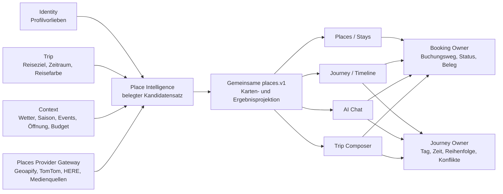

# Luvia Unified Place Intelligence und Trip Composer

<!-- LUVIA-CURRENT-STATUS:START -->
## Aktueller Stand und nächster Schritt

**Stand 2026-09-06:** Integration **13.82.168.102**, Core **4.82.221**. M16.5 Schritte 15–18 aktiv. App .102 / Core .221 ist der Integrationskandidat für den gebündelten P02/P03-Kaltlatenz- und Commons-Medienabschnitt; öffentlich bleibt bis zur abgeschlossenen Regression und Deployment-Abnahme App .101. P02/P03 bleiben teilweise bis zur breiten echten Foto-, vollständigen Filter- und kalten Latenzabnahme.

**Zuletzt geliefert:** Öffentlich belegt bleibt App .101 / Core .220. Der Kandidat .102 startet die kostenlose cachegestützte OSM-Kategoriesuche neben Geoapify, vermeidet bei strikten Taxonomien einen seriellen leeren Namenslauf und begrenzt die Providerwartezeiten. Der exakte Medienresolver erschließt verknüpfte Wikimedia-Commons-Kategorien, übernimmt nur lizenzierte bildartige Dateien und verwirft Logos, Karten, Pläne und Diagramme. Gezielte Tests für Providerorchestrierung, 82 Zuordnungen, 19 Landesküchen, Passend, OSM-Kontinuität und exakte Medien sind grün.

**Nächster Schritt (AKTIV): Reale Ortsbildabdeckung und kalte Providerlatenzen auf Zielwerte bringen.** Die gemeinsame Providerlogik, Spezialtypen, Kategorienkontinuität sowie Alle/Passend sind öffentlich reproduzierbar. Der größte sichtbare Qualitätsabstand bleibt, dass viele exakte Orte kein echtes Bild besitzen und der erste kalte Spezialpfad mit 5,58 Sekunden das Drei-Sekunden-Ziel verfehlt.

**Abnahme dieses Schritts:**

- Für alle 14 Kategorien und Stays wird die reale Bildtrefferquote providerweise gemessen; jedes Bild gehört zur exakten Provider-Place-ID oder einer verifizierten offiziellen Ortsquelle und trägt Lizenz, Herkunft, Frische und Fallbackstatus.
- Fremde, nur räumlich nahe und generische Stockbilder bleiben ausgeschlossen. Bildlose Orte bleiben ehrlich gekennzeichnet, bis ein exakter Beleg verfügbar ist.
- Cache-Treffer zeigen Pins spätestens nach 1,0 Sekunden und kalte Providerpfade spätestens nach 3,0 Sekunden; Kategorienwechsel, Reload, Ziehen und Zoomen zeigen keinen falschen Leerzustand.
- Alle sichtbaren Kategorien, 82 Zuordnungen, 19 Landesküchen und Sachfilter bestehen anschließend auf Desktop und Touch positive, negative, leere und teilweise Providerfälle.
- Passend bleibt fail-closed und identisch in Places, Stays, Timeline-Vorschlägen und AI Chat; Google bleibt bei höchstens 1.000 Aufrufen pro Tag, alle Anbieterbudgets bleiben beobachtbar und Safe Regression, NFR-0, sichtbare Browserabnahme und Byteidentität bleiben grün.

**Danach:** Nach dem P02/P03-Abschluss folgt P09/P10: dieselbe Places-Karte in allen Timeline-Vorschlägen, physische Langdruck-/Wackelmodus-Abnahme, 90-Minuten-Routenfluss sowie Booking- und Visit-AI-Parität.

**Weiter offen:** P02/P03 bleiben teilweise für breite echte Fotoabdeckung, vollständige reale Kategorie-/Sachfiltermatrix, positive Google-/Foursquare-Livepfade und kalte Ziel-Latenzen. P09/P10 bleiben teilweise für Booking-Provider-Weg, Visit-AI-Parität, 90-Minuten-Routenfluss und physische Langdruckabnahme. Danach folgen P12/P15/P17 Trip Composer; P19/P20/P22/P23/P26 Context Matrix; P33/P34/P35 AI-Parität. M18 bis M22 behalten Mitreisendenverwaltung, Administration, Social und Intelligence II. Alle 17 Karten-USPs bleiben verbindlich im Produktentscheid PD-2026-09-05 inventarisiert und über diese Blöcke sequenziert.

Aktuelle Paketstände und nächste Abschlussnachweise: docs/planning/status-plan.v1.json. Nach jedem Arbeitsabschnitt Stand, Beleg, Restumfang und genau einen nächsten Schritt gemeinsam fortschreiben.
<!-- LUVIA-CURRENT-STATUS:END -->

Status: **VERBINDLICHE PRODUKT- UND ARCHITEKTURENTSCHEIDUNG**

Aufgenommen: **2026-09-05**

Geltungsbereich: Places, Stays, Journey/Timeline, AI Chat, Trip-Erstellung, Booking, Events, Wetter und spätere Intelligence-II-Ausbaustufen

## 1. Produktentscheidung

Luvia verwendet für alle ortsbezogenen Erlebnisse eine gemeinsame **Place Intelligence**. Places, Stays, Timeline-Vorschläge, Reiseerstellung und AI Chat dürfen keine eigenen Kandidatenlisten, Profilregeln, Providerstrategien oder Ortsdetails entwickeln. Sie konsumieren dieselbe belegte Place-Menge und zeigen sie in ihrem jeweiligen Nutzungskontext.

Die Karte wird ebenfalls nicht kopiert. Die bestehende `places.v1`-Kartenprojektion wird in mehreren Oberflächen gemountet:

- Places und Stays als vollständige Discovery-Oberfläche;
- Journey/Timeline als Vorschlagskarte für einen Tag oder ein freies Zeitfenster;
- AI Chat als eingebettetes Rich Result für eine Such- oder Planungsaussage;
- Trip Composer als Auswahlfläche während der Reiseerstellung;
- später Events, Alternativen und Störungsplanung mit denselben Ortsidentitäten.

Ein Place bleibt über alle Oberflächen derselbe Place. Favorit, Vormerkung, Timeline-Planung, Besuch, Buchungsweg, Bild, Providerbeleg und Profilpassung dürfen sich deshalb nicht widersprechen.

## 2. Owner-Grenzen

Die Zuständigkeiten bleiben strikt:

- **Places** besitzt reale Ortsidentität, Discovery, Providerfakten, Kategorien, Filter, Geometrie und Medienreferenzen.
- **Identity** besitzt dauerhafte Profilvorlieben und deren bewusste Korrektur oder Löschung.
- **Trip** besitzt Reiseziel, Zeitraum, Teilnehmende, Reisefarbe, Reisesymbol und reisebezogene Wünsche.
- **Journey** besitzt Tage, Zeiten, Reihenfolge, freie Fenster, Konflikte und die abgeleitete Timeline.
- **Booking** besitzt Buchungs-, Reservierungs- und Einlasswege sowie Providerstatus und Belege.
- **Intelligence** gewichtet und erklärt öffentliche Owner-Projektionen. Sie erzeugt keine zweite Orts-, Reise-, Timeline- oder Buchungswahrheit.
- **Experience** stellt gemeinsame Karte, Karten, Sheets, Auswahlmuster und Animationen bereit.

## 3. Eine gemeinsame Place-Pipeline

Jede Oberfläche verwendet dieselbe fachliche Kette:

1. Aktive Reise und eindeutiges Reiseziel laden.
2. Relevanten Raum bestimmen: Reiseziel, sichtbarer Kartenausschnitt, Tagesroute oder bewusst freigegebener Standort.
3. Eine providerübergreifende Place-Kandidatenmenge laden.
4. Kategorien und sämtliche Filter mit Providerbelegen anwenden.
5. Harte Anforderungen wie Ernährung, Barrierefreiheit, Zeitraum und Budget fail-closed prüfen.
6. Profil-, Gruppen-, Reise- und Tagespassung auf derselben Kandidatenmenge berechnen.
7. Wetter, Saison, besondere Tage, Öffnungszeiten, Wege und Events als datierte Kontextbelege einbeziehen.
8. Ergebnis über dieselbe Karten- und Kartendarstellung ausgeben.
9. Favorisieren, Vormerken, Planen oder Buchen ausschließlich über den zuständigen Owner ausführen.
10. Ergebnis, Fehler, Teilstand, Herkunft, Aktualität und Rücknahme sichtbar machen.

`Alle` und `Passend` sind zwei Projektionen derselben Kandidatenmenge. `Passend` darf niemals eine getrennte Suche mit anderen Ortsidentitäten sein.

## 4. Timeline-Vorschläge

Die Timeline-Vorschlagsoberfläche wird als kontextgebundene Places-Karte aufgebaut:

- Der Reisetag oder das freie Zeitfenster setzt Datum, Start, Ende und vorhandene Timeline-Einträge.
- Die Karte startet am Reiseziel oder an der vorherigen bestätigten Station.
- Die sichtbaren Pins stammen aus `places.v1` und behalten Kategorie, Bild, Profilbeleg und Booking-Fähigkeit.
- Ein Pin fokussiert dieselbe Detailkarte wie in Places.
- Horizontales Wischen oder ein Pinwechsel synchronisiert Kartenfokus und Vorschlagskarte.
- Ein oder zwei belegte Treffer bleiben sichtbar; ein starres Soll von drei Treffern darf keinen falschen Gesamtausfall erzeugen.
- „Alle Richtungen entdecken“ öffnet dieselbe vollständige Places-Discovery im aktuellen Reise-, Tag- und Zeitkontext.
- „Zur Timeline“ erzeugt erst eine Journey-Vorschau. Ohne Bestätigung wird nichts gespeichert.

Timeline-Einträge wechseln auf Mobilgeräten durch längeres Drücken in den Bearbeitungsmodus. Bearbeitbare Einträge bewegen sich dann leicht wie iOS-App-Symbole. Reduced Motion deaktiviert die Animation. Ziehen, Pfeile und direkte Datum-/Uhrzeitwahl bleiben gleichwertige Bedienwege.

## 5. Nachtleben und Kategorie-Vollständigkeit

Die geringe Nachtleben-Abdeckung wird nicht als reale Ortslage akzeptiert, bevor die Provider- und Kategorienmatrix belegt ist. Die Prüfung erfolgt Kategorie für Kategorie und umfasst mindestens:

- Bars, Pubs, Cocktailbars und Weinbars;
- Clubs, Diskotheken und Tanzlokale;
- Lounges, Beachbars und Abendorte;
- Live-Musik, Musikvenues und Konzertorte;
- Casinos und ausdrücklich abendbezogene Entertainment-Orte;
- korrekte Abgrenzung zu Restaurants, Cafés, Hotels und allgemeinem Entertainment.

Für Timmendorfer Strand und Scharbeutz werden sichtbare UI-, AI-Chat- und Gateway-Proben mit Treffermenge, Provider, Radius, Dubletten, Kategoriebeleg und bewusstem Nullergebnis geführt. Ranking darf fehlende Providersegmente nicht verdecken.

## 6. Zustand nach Registrierung ohne Reise

Ein Account darf ohne aktive Reise existieren. Nach Abschluss des Profil-Onboardings zeigt Luvia einen leichten **Reisestart-Zustand** mit drei klaren Wegen:

1. **Meine erste Reise planen** – primäre Aktion zum Trip Composer.
2. **Luvia kennenlernen** – interaktive, unverbindliche Beispielreise ohne eigene Trip-Wahrheit.
3. **Mit Luvia sprechen** – AI Chat erklärt Möglichkeiten und kann nach Zustimmung den Trip Composer öffnen.

Die App erfindet keine aktive Reise und wechselt nicht automatisch in einen fremden oder historischen Trip. Inhalte ohne Reise bleiben Demonstration oder allgemeine Inspiration und werden deutlich als solche markiert.

## 7. Drei Einstiege, ein Trip Composer

Technisch gibt es genau einen Trip Composer mit drei Eingangsmodi. Die Modi verwenden dieselben Trip-, Identity-, Places-, Journey- und Booking-Contracts.

### 7.1 Geführt

Der vollständige bestehende Reise-Dialog wird ausgebaut:

- Reiseziel und eindeutige Ortsauflösung;
- Reisename;
- Reisefarbe und Reisesymbol;
- Reisezeitraum;
- Teilnehmende und Reisestil;
- Tempo, Mobilität, Interessen und harte Anforderungen;
- Budgetrahmen und gewünschte Ausgabenverteilung;
- Vorschlagsphase aus derselben Place Intelligence;
- Abschlussvorschau vor dem Anlegen oder Planen.

Nach Eingabe des Zeitraums zeigt Luvia erste belegte Vorschläge. Vorgeschlagene Bereiche richten sich nach Profil und Reisewunsch und umfassen unter anderem Essen und Trinken, Sehenswürdigkeiten, Natur, Aktivitäten, Shopping und Nachtleben.

### 7.2 Schnellstart

Der Schnellstart verlangt nur Reiseziel, Zeitraum und optional Teilnehmende. Luvia legt eine unvollständige, ehrlich gekennzeichnete Reise an und führt später schrittweise durch fehlende Angaben. Er ist sinnvoll für Menschen, die sofort speichern oder entdecken wollen, ohne das vollständige Onboarding zu durchlaufen.

### 7.3 Mit Luvia entwerfen

Der KI-gestützte Modus kombiniert Einfachauswahl, Mehrfachauswahl und Freitext. Mögliche Angaben sind:

- gewünschte Zahl und Art von Mahlzeiten, Cafés und Abendorten;
- Sehenswürdigkeiten, Natur, Kultur, Shopping und Aktivitäten;
- Ruhe, Dichte, spontane Zeit und Wegepräferenzen;
- Budget gesamt, pro Tag oder pro Kategorie;
- feste Termine, Muss-Orte und Ausschlüsse;
- Barrierefreiheit, Ernährung und Bedürfnisse der Gruppe;
- gewünschte Buchungsbereitschaft;
- persönliche Formulierungen wie „Wir möchten keinen durchgetakteten Urlaub“.

Die KI übersetzt diese Angaben in erklärbare Constraints. Harte und sensible Anforderungen werden deterministisch und quellengebunden geprüft. Das Ergebnis ist zunächst immer eine Vorschau, kein automatisch gespeicherter Reiseplan.

## 8. Vormerken und frühe Place-Auswahl

Vorschläge im Trip Composer haben drei sichere Aktionen:

- **Einplanen** – Tag, Uhrzeit und Dauer wählen; anschließend Journey-Vorschau und optional Booking-Prüfung.
- **Vormerken** – den Place ohne Datum als reisebezogene Merkliste speichern.
- **Nicht für diese Reise** – nur diese Vorschlagsrunde beeinflussen; dauerhaftes Lernen erfordert eine getrennte bewusste Bestätigung.

„Vorgemerkte Places“ erscheinen oberhalb der datierten Timeline in einem eigenen, einklappbaren Bereich. Sie bleiben Places-Owner-Wahrheit mit Trip-Bezug. Erst eine bestätigte Journey-Aktion erzeugt einen datierten Timeline-Eintrag.

## 9. KI-Reisepräsentation

Die vollautomatische Planung endet in einer visuellen Reisepräsentation:

- ein Tag nach dem anderen mit ruhigem Fade und der jeweiligen Reisefarbe;
- Karte, Route, Bilder und zentrale Tagesmomente;
- verständliche Begründung pro Auswahl;
- sichtbare Zeit-, Wege-, Öffnungs-, Budget-, Wetter- und Gruppenbelege;
- Alternativen und Unsicherheiten;
- bestätigte Buchungen getrennt von noch zu prüfenden Wegen.

Für jeden Tag und für die Gesamtreise gibt es vier Entscheidungen:

1. **So übernehmen** – erzeugt eine zusammenhängende Owner-Vorschau und speichert erst nach Bestätigung.
2. **Vorher anpassen** – Zeiten, Reihenfolge, Orte und freie Fenster bearbeiten.
3. **Alternative zeigen** – ersetzt noch nichts und nennt den Grund der Alternative.
4. **Diesen Teil verwerfen** – entfernt nur den Vorschlag aus dem Entwurf.

Die Präsentation darf nie behaupten, eine Buchung, Öffnung oder Eignung sei sicher, wenn der zuständige Owner dafür keinen aktuellen Beleg besitzt.

## 10. Äußere Einflüsse als Context Matrix

Luvia berücksichtigt äußere Einflüsse überall dort, wo sie eine Empfehlung oder Planung verändern. Jeder Kontext besitzt Quelle, Ort, Gültigkeitszeit, Aktualität und Unsicherheit.

### Zeit und Kalender

- Jahreszeit und Tageslicht;
- Wochentag und Uhrzeit;
- Schulferien und lokale Feiertage;
- Ostern, Weihnachten, Silvester, Halloween und weitere relevante Anlässe;
- Reisephase, Anreise, Abreise und Erholungstage.

### Wetter und Umwelt

- Temperatur, Niederschlag, Wind, Hitze, Kälte und Sicht;
- Sonnenaufgang und Sonnenuntergang;
- Strand-, Wasser-, Wander- und Fahrradbedingungen;
- wetterfeste Alternativen und bewusst freie Zeit.

### Reiseziel und Betrieb

- aktuelle Öffnungszeiten und saisonale Schließungen;
- verifizierte Veranstaltungen und temporäre Märkte;
- erwartete oder gemessene Auslastung, wenn eine lizenzierte Quelle existiert;
- Wege, Verkehr, ÖPNV, Fuß- und Fahrradrouten;
- lokale Besonderheiten, Distanzen und Tageslogik.

### Menschen und Reise

- Profil- und Trip-Vorlieben;
- Gruppenkonflikte und faire Abstimmung;
- Ernährung, Zugänglichkeit und Mobilität;
- Budget und Preisbelege;
- Tempo, Ruhe, Spontaneität und bereits geplante Momente.

Fehlt ein Beleg, markiert Luvia den Faktor als unbekannt. Die KI darf keine saisonalen Events, Öffnungszeiten, Preise oder Wetterlagen erfinden.

## 11. AI-Chat-Parität

Der AI Chat verwendet dieselben öffentlichen Reads und Commands wie die sichtbaren Oberflächen:

- dieselbe Destination und aktive Reise;
- dieselbe Place-Kandidatenmenge;
- dieselben Kategorien und Filter;
- dieselbe `Alle`-/`Passend`-Entscheidung;
- dieselbe Kartenprojektion und Detailkarte;
- dieselbe Vormerkliste und Timeline-Vorschau;
- denselben Booking-Koordinator;
- dieselben Kontextbelege für Wetter, Saison, Events, Öffnung, Budget und Wege.

Ein Chat-Ergebnis kann eine Karte öffnen oder ein Map-Rich-Result zeigen. Es darf kein Place-Ergebnis erzeugen, das in Places oder Timeline mit denselben Eingaben nicht nachvollzogen werden kann.

## 11.1 Verbindliches USP-Inventar der Karte

Die während der Kartenarbeit entwickelten Produktideen sind verbindlicher Fahrplanumfang. Sie werden nicht als lose Ideensammlung behandelt. Jede Idee besitzt einen Owner, einen P-Block und ein sichtbares Abnahmekriterium.

| USP | Nutzen | Fahrplan | Sichtbare Abnahme |
| --- | --- | --- | --- |
| **Eine lebende Place Intelligence** | Places, Stay, Timeline, Trip Composer und AI Chat zeigen denselben realen Ort mit derselben Provider-ID, denselben Fakten, Bildern und Aktionen. | P02, P03, P09, P17, P33–P35 | Derselbe Ort und dieselbe Erklärung sind flächenübergreifend nachweisbar; keine zweite Suche im Consumer. |
| **Passt für uns** | Harte Anforderungen und Profilvorlieben werden als belegte Entscheidung statt als undurchsichtiger Score dargestellt. | P02, P03, P15, P44 | Nur belegte Treffer erhalten „Passt“ und den laufenden Luvia-Spektrumrahmen; Unbekanntes bleibt unbekannt. |
| **Wie wäre unser Urlaub von hier aus?** | Die Karte entwirft aus einem gewählten Ausgangspunkt einen nachvollziehbaren Reiseverlauf. | P12, P17, P33, P40 | Vorschau zeigt Orte, Reihenfolge, Wege, Dauer, Begründung und getrennte Bestätigung. |
| **Wir haben noch 90 Minuten** | Freie Timeline-Fenster werden mit erreichbaren, geöffneten und passenden Momenten gefüllt. | P09, P10, P22, P23 | Zeitfenster, An-/Rückweg, Öffnung und Puffer sind sichtbar belegt; ein Teilstand bleibt nutzbar. |
| **Diesen Tag erleben** | Ein Reisetag wird als räumliche Geschichte auf der Karte abspielbar. | P12, P17, P26 | Tagwechsel, Kartenfokus, Route und Timeline bleiben synchron; Übernahme erfolgt erst nach Vorschau. |
| **Heute lieber anders** | Wetter, Stimmung oder Störung erzeugen sichere Alternativen, ohne den bestehenden Plan still zu ändern. | P13, P19, P20, P22, P40 | Vorher/Nachher, Grund, Auswirkungen, Booking-Folgen und getrennte Owner-Bestätigungen sind sichtbar. |
| **Moment- und Kontextkompass** | Wetter, Saison, Tageslicht, Feiertage, Events, Budget, Mobilität und Gruppensituation verändern Vorschläge nachvollziehbar. | P19, P20, P22, P23, P26, P44 | Jeder Einfluss zeigt Quelle, Ort, Zeit, Frische und Unsicherheit; fehlende Fakten werden nicht erfunden. |
| **Fairness für die Reisegruppe** | Luvia erklärt, für wen ein Vorschlag passt, erkennt Konflikte und verteilt Interessen über die Reise. | P15, P44, P47, M18 | Einzelne Personen werden nicht überstimmt; Kompromiss, Veto und Ausgleich sind erklärbar und änderbar. |
| **Kartenbasierter Trip Composer** | Geführt, Schnellstart und KI-Entwurf verwenden eine visuelle Karte, echte Bilder und dieselben Owner-Verträge. | P12, P15, P17 | Ein Entwurf kann vorgemerkt, datiert eingeplant, ersetzt oder verworfen werden, ohne Orts- oder Timeline-Dubletten. |
| **Routen als Erlebnisfaden** | Fuß-, Rad- und weitere passende Wege verbinden nicht nur Punkte, sondern erklären Reisezeit, Reihenfolge und erreichbare Alternativen. | P11, P12, P19, P26 | Reale Geometrie, Provider, Alter, Dauer und Unsicherheitsband sind sichtbar; Cache und Fallback bleiben messbar. |
| **Zeitreise auf der Karte** | Die Karte kann zwischen Reisetagen sowie Morgen, Tag und Abend wechseln und zeigt nur den jeweiligen Kontext. | P12, P17, P26 | Animierter, reduzierbarer Tageswechsel behält Auswahl, aktive Reise und Timeline-Wahrheit. |
| **Ruhige 3D-Reisekarte** | Dezente Gebäudehöhen, Perspektive und Tiefenstaffelung schaffen Orientierung und Eigenständigkeit. | P02, P26 und Experience-Gate | 3D ist standardmäßig aktiv, bleibt bedienbar, performant und mit 2D-Schalter sowie Reduced Motion zugänglich. |
| **Luvia-Pin-Sprache** | Ausgewählte Pins stehen immer vorn; passende Pins tragen ein dezentes Label und einen bewegten Kompass-Farbrahmen. | P02, P03 und Experience-Gate | Kein Durchblitzen überlagerter Pins; Fokus, Kontrast, Touch und Reduced Motion sind sichtbar geprüft. |
| **Echte Ortsbilder mit Herkunft** | Jeder Place versucht zuerst ein identitätsgebundenes Originalbild; Fallbacks sind kuratiert, kategoriespezifisch und ehrlich. | P02, P03, P18 | Bild gehört zur Provider-ID, Herkunft/Lizenz ist sichtbar, defekte Links wechseln kontrolliert und kein fremdes Bild wird zugeordnet. |
| **Reisefarbige Moment-Sheets** | Detail- und Aktionskarten fühlen sich wie Teil der aktiven Reise an und zeigen den nächsten sinnvollen Schritt. | P03, P09, P10 und Experience-Gate | Reisefarbe, Bild, lesbare Details, korrektes Datum und genau eine primäre Timeline-Aktion sind konsistent. |
| **Provider-Mesh mit Kostensteuerung** | Mehrere Spezialanbieter ergänzen sich über Fähigkeiten, Cache, Kontingente und Reserve statt bei jedem Kartenimpuls erneut zu suchen. | P01, P02, P11, P19 | Fähigkeitsrouting, Tages-/Monatsbudget, Reserve, Cooldown, Cache, Coalescing und ehrliche Teilstände sind diagnostizierbar. |
| **Destination Pulse** | Eine dezente Ebene macht sichtbar, was gerade und demnächst am Reiseziel besonders relevant ist. | P20, P22, P23, P40, M18 | Nur verifizierte zeitliche Signale erscheinen; Nutzer können Quelle, Zeitraum und Einfluss auf Vorschläge sehen. |

Dieses Inventar ist in `status-plan.v1.json` als Produktentscheidung referenziert. Neue Karten-USPs werden dort und hier gemeinsam ergänzt, bevor ihre Umsetzung beginnt.

## 12. Einordnung in den bestehenden Fahrplan

### Unmittelbar: P02/P03

- Vollständige Kategorien- und Filtermatrix einschließlich Nachtleben.
- Providerübergreifende Place-Menge und identische UI-/AI-Chat-Ergebnisse.
- Korrekte `Alle`-/`Passend`-Projektion.
- Echte, exakt identifizierte Ortsbilder und belegte Teilzustände.

### Danach im laufenden B1: P09/P10

- gemeinsame Places-Karte in Timeline-Vorschlägen;
- Karten-/Kartensynchronisation;
- iOS-artiger Langdruck-Bearbeitungsmodus;
- verständliche Vorschau, Konflikte, Booking-Weitergabe, Ergebnis und Rücknahme.

### B2: P12, P15 und P17

- ein gemeinsamer Trip Composer mit geführt, Schnellstart und KI-Entwurf;
- Account-ohne-Reise-Zustand;
- Profil-, Reise- und Anfragevorlieben sauber trennen;
- Vormerken, Einplanen und Reiseentwurf mit Owner-Belegen;
- visuelle Tages- und Gesamtreisevorschau.

### B2/B3: P19, P20, P22, P23 und P26

- ablaufendes Destination-Modell;
- verifizierte Eventquellen;
- Veranstaltungskalender und Karten-/Zeitfilter;
- freie Zeitfenster und saisonale Vorschläge;
- Wetter-, Event- und Zeitkontext ohne synthetische Fakten.

### B4: P33, P34 und P35

- vollständige Chat-Integration;
- Freitext und mehrere Wünsche;
- sichere AI-Aktionsabdeckung für Entwurf, Vormerken, Planen und Booking-Handoff.

### Nach den Owner-Gates: P40, P44 und P47 sowie M18 Intelligence II

- alternative Reiseverläufe;
- faire Gruppenplanung;
- Destination Pulse;
- systemweite proaktive, aber zustimmungsgebundene Orchestrierung.

## 13. Lieferreihenfolge

1. Aktuellen P02/P03-Filter-, Kategorie-, Passend- und Fotoabschluss liefern; Nachtleben erhält eine eigene reale Abnahme.
2. Den begonnenen P09/P10-Slice für Timeline-Vorschlagskarte, Teilstands-Recovery und mobilen Wackelmodus veröffentlichen und sichtbar testen.
3. Positive Booking-, Visit- und Memory-Owner-Wege in P09/P10 schließen.
4. P17 Trip-Capability und Account-ohne-Reise-Zustand abschließen.
5. Trip Composer v1 mit geführt und Schnellstart sowie Vormerkliste liefern.
6. KI-Entwurfsmodus mit Preview, Tagespräsentation und bestätigten Journey-Befehlen aufbauen.
7. Wetter-, Saison- und Eventmatrix nach den P20/P22-Quellengates zuschalten.
8. AI-Chat-Parität und vollständige Aktionsmatrix in P33/P34/P35 schließen.
9. Gruppen-, Social-, Administration- und Intelligence-II-Funktionen ab M18 anbinden.

## 14. Abnahmevertrag

Der Gesamtansatz ist erst erfüllt, wenn:

- derselbe Testfall in Places, Stays, Timeline, Trip Composer und AI Chat dieselben Place-Identitäten und belegten Filterentscheidungen liefert;
- ein kleiner echter Provider-Teilstand sichtbar bleibt und später ohne Zustandsverlust erweitert werden kann;
- Timeline-Vorschläge auf der gemeinsamen Places-Karte erscheinen;
- Nachtleben und jede weitere Kategorie reale Providerproben und nachvollziehbare Nullfälle besitzt;
- ein neuer Account ohne Reise einen klaren Reisestart erhält;
- alle drei Trip-Composer-Einstiege denselben Trip-Entwurf und dieselben Owner-Befehle nutzen;
- Vormerken und datiertes Planen fachlich getrennt sind;
- Wetter, Saison, Events, Budget und Öffnung nur mit datiertem Beleg einfließen;
- die KI-Reisepräsentation jede Übernahme oder Änderung als bestätigte Owner-Vorschau ausführt;
- physisches iPhone und Android, Desktop, Tastatur, Touch, Reduced Motion, Reload, Offline und Reisewechsel abgenommen sind.
