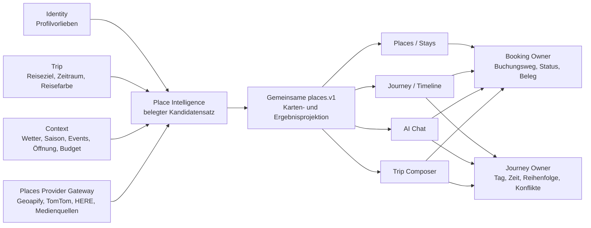

# Luvia Unified Place Intelligence und Trip Composer

## Verbindliche Präzisierung vom 06.09.: räumliche Reise und drei Ergebnisse

Diese Präzisierung ersetzt die frühere Annahme, dass ein Globus als Auftakt und anschließend bestehende Formularschritte die gewählte Gestaltung erfüllen. Der Nutzer findet diese Fortsetzung weiterhin unzureichend. .120 ist ein technischer Zwischenschritt; .121 korrigiert dessen Gestenfläche. Die folgende Gestaltung und die vollständige KI-Planung sind noch keine ausgelieferten Produkteigenschaften.

### Eine Welt, die mit der Reise wächst

Die Kartenbühne bleibt durch die gesamte Erstellung bestehen. Globus, Kontinent, Land, Region und Ort sind echte Navigationsstufen mit eigener Geometrie, Kameraposition und Rückweg. Das gewählte Gebiet rückt nach vorne; beim Übergang geht die räumliche Orientierung mit. Ein Land öffnet seine Regionen, eine Region ihre Orte. Rückkehr stellt die vorherige Kameraposition und Auswahl wieder her. Die direkte Orts-/Regionssuche bleibt als gleichwertiger kurzer Weg erreichbar. Ein Land oder eine Region darf selbst Reiseziel sein; der Nutzer muss nicht zwingend bis zu einer Stadt klicken.

Grenzen und Orte kommen aus belegbaren geografischen Quellen. Die globale Übersicht darf grob sein, die regionale Bühne benötigt angemessen detaillierte Geometrie. Fehlende Untergliederung wird offen übersprungen; erfundene Grenzpolygone sind ausgeschlossen. Kamerabewegungen, Drehung, Zwischenebenen und Lichtwechsel sind lokale Darstellung und verbrauchen keine Places- oder Routinganfrage. Ein geografisches Antippen ist zunächst Suchabsicht; verbindliches Reiseziel wird erst das Ergebnis des Destination-/Places-Vertrags.

Die gleiche Bühne führt weiter durch:

1. **Reisezeit:** Ein Datumsband und die sichtbare Jahreszeit verändern die Umgebung. Exakte Datumseingabe öffnet eine kleine ergänzende Auswahl. Saisonale Gestaltung ist keine Wettervorhersage. Kurzfristige Vorhersagen und langfristige saisonale Erwartungen werden fachlich getrennt.
2. **Reisegefühl und Mitreisende:** Interessen werden als Reisebausteine in die Welt aufgenommen; gewählte Bausteine bleiben sichtbar und lassen sich zurücknehmen. Profilkompass, Reisevorlieben und aktuelle Freitexte werden getrennt verarbeitet. Ernährungsrestriktionen sind keine locker gewichteten Interessen. KI fragt bei relevanten Widersprüchen gezielt nach.
3. **Tempo und Budget:** Entscheidungen verändern die sichtbare Dichte des Entwurfs, Freiraum, Wegstrecken und Kostenrahmen. Numerisches Budget, Währung, Personenzahl und Bezugszeitraum bleiben präzise editierbar. Ein dekorativer Regler ersetzt diese Angaben nicht.
4. **Reisepräsentation:** Tage werden räumlich und zeitlich nacheinander erlebbar. Links/rechts bedeutet vorheriger/nächster Tag, hinein/heraus bedeutet geografische Tiefe, von unten kommen lokale Entscheidungen. Tageswechsel aktualisiert dieselbe Places-Karte, die Timeline und Chat verwenden. Orte tauschen, verschieben, weglassen und vormerken bleiben unmittelbar erreichbar.
5. **Übernahme:** Der Nutzer sieht das konkrete Ergebnis und bestätigt die Owner-Aktionen. Ein Animationsende erzeugt keine Buchung, Reise oder dauerhafte Profiländerung.

Bewegung folgt dieser Bedeutung statt zufälligen Richtungen. Ruhephasen, reduzierte Bewegung, Tastatur-/Antippalternativen, kleine Geräte und Wiederaufnahme sind Bestandteil der Gestaltung. Die Globusfläche ist für Kamera-Gesten reserviert; außerhalb darf gescrollt werden. Globus- und Ortsbeschriftungen müssen denselben Gestenbesitzer haben.

### Drei fachlich unterschiedliche Ergebnisse

| Produktweg | Auftrag | Ergebnis vor Bestätigung | Übernahme |
|---|---|---|---|
| Nur anlegen | Ziel, Zeitraum, Teilnehmer und Reisesignatur | Leere Reise ohne vorgeschlagene/automatisch ausgewählte Orte | Nur Trip-Owner-Erstellung; keine Timeline- oder Vormerkungsaktion |
| Mit Vorschlägen gestalten | Zusätzlich Reisewünsche und Profilkontext | Vielfalt belegter Places; zunächst nichts ausgewählt | Nur ausdrücklich gewählte Orte, getrennt vormerken oder mit Datum/Uhrzeit einplanen |
| Luvia plant | Vollständiger strukturierter KI-Auftrag aus Profil, Reise, Freitext und Kontext | Zusammenhängender Entwurf für den gesamten Zeitraum mit Tagesrhythmus, Orten, Wegen, Pausen, Alternativen und verständlicher Begründung | Gemeinsame überprüfbare Bestätigung, einzelne Änderungen möglich, idempotente Owner-Aktionen |

Die existierenden technischen Einstiege `guided`, `quick`, `ai` und ihre Schrittanzahlen 9/5/7 sind **kein Beleg für diese drei Ergebnisse**. Die Zuordnung und Wiederaufnahme werden im kanonischen Trip-Auftrag explizit modelliert. Der Renderer besitzt keine zweite Planungswahrheit. Ein Wechsel des Weges muss zeigen, was erhalten bleibt, was nur Entwurf ist und welche Auswahl verworfen würde; keine stillen Kontoaktionen.

### Wann ein KI-Reiseplan als vollständig gelten darf

Der Kategorienlauf mit fünf Orten über acht Tage erfüllt diesen Anspruch nicht. Erfolg wird nicht durch eine feste Anzahl Karten oder gefüllte Animationen definiert. Abnahme verlangt pro Reisetag einen begründeten Tagesrhythmus, ausreichende Vielfalt gemäß Interessen, belegte harte Einschränkungen, realistische Wege/Puffer, bekannte Öffnungs- und Aufenthaltszeiten, expliziten Freiraum sowie einen nachvollziehbaren Budgetrahmen. An-/Abreisetage können bewusst kürzer sein. Wiederholungen benötigen einen Grund. Wetter, Saison, Feiertage und Veranstaltungen tragen Quellen-/Zeitkontext; unbekannte Tatsachen bleiben erkennbar unbekannt. Bei fehlenden Daten oder fehlender Modellverfügbarkeit wird kein vollständiger KI-Erfolg behauptet.

Places verantwortet Identität, Kategorien, verifizierte Eignung und Bildzuordnung. Journey prüft die zeitliche und räumliche Machbarkeit. Trip hält Auftrag und Entwurf. Intelligence interpretiert und orchestriert über die öffentlichen Verträge; Identity ändert globale Vorlieben nur nach eigener Bestätigung. Booking hält Anbieter-/Portal-/E-Mail-/manuelle Übergänge. Reale, identitätsgebundene Ortsbilder bleiben Pflichtziel; illustrative Konzeptkacheln sind kein Mediennachweis.

### Grafische Festhaltung und nächste Abnahme

Die interaktive Bewegungsstudie liegt im dauerhaften Visualisierungsverzeichnis dieses Gesprächs als `luvia-expedition-storyboard.html`. Sie zeigt die Beispielroute Welt → Europa → Deutschland → Schleswig-Holstein → Scharbeutz und führt danach auf derselben Kartenbühne durch Saison, Wünsche und die drei Ergebnisarten. Acht wechselbare Beispieltage erläutern die Inszenierung; weder deren Kategorien noch ihre Uhrzeiten sind echte KI-/Place- oder Verfügbarkeitsbelege. Die Studie verwendet veröffentlichte Natural-Earth-Geometrie (Admin 0 / Admin 1, Public Domain; https://www.naturalearthdata.com/downloads/10m-cultural-vectors/). Sie wird nicht als Produktcode ausgeliefert.

**Nächster zusammenhängender Arbeitsabschnitt:** Kartenhierarchie und drei Ergebnisarten im gemeinsamen Composer bis zur überprüfbaren Ergebnisvorschau implementieren. Der gemeinsame Auftrag, Rückkehr/Wiederaufnahme, eine leere Reise ohne Nebenaktionen und ausdrücklich gewählte Vorschläge müssen zuerst belegt sein. Die KI-Variante bekommt denselben sichtbaren Ablauf und ihre eigenen Vollständigkeitsgates. P15/P17 bleiben bis einschließlich echter KI, bestätigter Kontoübernahme, Identity-Trennung, Trip-Lifecycle und physischer Mobilabnahme teilweise.

<!-- LUVIA-CURRENT-STATUS:START -->
## Aktueller Stand und nächster Schritt

**Stand 2026-09-06:** Integration **13.82.168.121**, Core **4.82.240**. M16.5 Schritte 15–18: P15/P17 aktiv und teilweise. Der konkrete Globus-Scrollfehler ist in Kandidat .121 öffentlich geprüft behoben. Die neue Kartenhierarchie, durchgehende räumliche Gestaltung und drei fachlichen Reisearten sind verbindlich dokumentiert und als Konzept durchspielbar, noch nicht vollständig implementiert. Vollständiger KI-Plan, Kontext-/Kontoabschluss und physische Mobilabnahme bleiben offen. Stable bleibt .104.

**Zuletzt geliefert:** App .121 korrigiert die Globus-Gestenfläche: Canvas und Ortsbeschriftungen teilen Ziehen/Pinch, Trackpadbewegungen drehen die Welt und scrollen den Composer nicht. Ein Marker-Drag wählt keinen Ort, Antippen öffnet weiterhin die bestehende Zielsuche. Im angemeldeten öffentlichen Browser bei 390 Pixeln blieb ScrollTop während Trackpadrotation bei 0 und beim Marker-Drag bei 100; außerhalb änderte Scrollen den Wert von 0 auf 100. Toskana wurde danach per Antippen an die Ortsuche übergeben. 33/33 Geometrie-/Gestenprüfungen, 50 Composer-Prüfungen, 238/238 Regression, NFR-0 3/3 und 38/38 öffentliche Byteidentität sind grün. Physische Touchabnahme bleibt offen. Die neue Produktvorgabe ist im kanonischen Konzept und einer durchspielbaren Bewegungsstudie festgehalten: Welt → Kontinent → Land → Region → Ort, danach dieselbe Bühne für Reisezeit, Wünsche und Tage; drei unterschiedliche Ergebnisse Nur anlegen / Mit Vorschlägen / Luvia plant. Diese Hierarchie und vollständige KI-Planung sind noch keine ausgelieferten Laufzeitfunktionen.

**Nächster Schritt (AKTIV): Kartenhierarchie und drei fachliche Reisearten im gemeinsamen Composer umsetzen.** Der Nutzer bestätigt das Weltprinzip, lehnt aber die Formularfortsetzung und die geringe Planvielfalt ab. Navigationsstufen und fachliche Ergebnisse müssen zusammenhängend auf dem kanonischen Auftrag aufbauen.

**Abnahme dieses Schritts:**

- Globus, Kontinent, Land, Region und Ort mit angemessener belegbarer Geometrie, Rückweg und Wiederaufnahme umsetzen. Gebietsauswahl bleibt Suchabsicht bis zur kanonischen Destination-Bestätigung; direkte Suche und Regionen als Ziele bleiben möglich. Kamerabewegung löst keine Provideranfragen aus.
- Die drei Produktwege im bestehenden Trip-Auftrag unterscheiden: Nur anlegen erzeugt null Places-/Timeline-/Vormerkungsaktionen; Mit Vorschlägen übernimmt ausschließlich explizite Auswahl; Luvia plant liefert einen getrennt prüfbaren strukturierten Gesamtentwurf. Alte guided/quick/ai-Einstiegslabels reichen nicht als Beleg.
- Reisezeit, Wünsche, Mitreisende, Tempo und Budget auf derselben räumlichen Bühne fortführen. Präzise Werte bleiben zugänglich, Bewegung unterstützt Orientierung, Reduced Motion sowie Tastatur-/Antippbedienung bleiben vollständig.
- KI-Vollständigkeit an gesamten Reisetagen, belegten Restriktionen, Interessenvielfalt, Wegen/Puffern, Pausen, Zeit-/Budgetrahmen und Quellenkontext prüfen. Der frühere Lauf fünf Orte/acht Tage und die Bewegungsstudie gelten nicht als vollständiger Plan oder positiver realer KI-Nachweis.
- Reale Modellantwort und bestätigte idempotente Übernahme über Trip/Places/Journey getrennt positiv belegen; Identity-Änderungen bleiben eigenständig bestätigt. Fehlende Modellverfügbarkeit oder Fakten dürfen keinen vollständigen KI-Erfolg ergeben.
- Rückkehr, Wiederaufnahme, mobile Gesten auf physischem iOS/Android, öffentliches Verhalten und Releasegates am tatsächlich ausgegebenen Versionslink prüfen. P15/P17 bleiben bis zum vollständigen Abschluss ihrer Produktgates teilweise.

**Danach:** Danach die offenen P15/P17-Produktgates und erforderlichen Kontext-/Intelligence-Abhängigkeiten schließen. M18–M22 behalten Mitreisendenverwaltung, Administration, Social und Intelligence II; die 17 Karten-USPs bleiben verbindlich.

**Weiter offen:** P02/P03: Google-Berechtigung, breite echte Ortsbilder und physischer Mobil-Kaltstart. P07/P08: echte Booking-Provider. P09/P10/P11/P12: begrenzte interne Belege, physische Abnahme und echte Context-Signale fehlen. P15/P17: öffentlicher KI-Positivlauf wegen HTTP 429, vollständige Kontextplanung, finale interaktive Gestaltung, echte Kontoübernahme, dauerhafte Identity-Übergabe und Trip-Lifecycle offen. Die 17 Karten-USPs bleiben verbindlich; kein weiterer P-Block wird aufgrund des Teilnachweises als vollständig abgeschlossen markiert. Zusätzlich zeigte Supabase am 06.09. eine Fair-Use-Warnung wegen Egress im vorigen Abrechnungszyklus, Schonfrist bis 07.09.; im aktuellen Zyklus sind 2,517 von 5 GB genutzt. Keine Zahlung oder Planänderung vorgenommen.

Aktuelle Paketstände und nächste Abschlussnachweise: docs/planning/status-plan.v1.json. Nach jedem Arbeitsabschnitt Stand, Beleg, Restumfang und genau einen nächsten Schritt gemeinsam fortschreiben.
<!-- LUVIA-CURRENT-STATUS:END -->

Status: **VERBINDLICHE PRODUKT- UND ARCHITEKTURENTSCHEIDUNG**

Aufgenommen: **2026-09-05**

Geltungsbereich: Places, Stays, Journey/Timeline, AI Chat, Trip-Erstellung, Booking, Events, Wetter und spätere Intelligence-II-Ausbaustufen

## 1. Produktentscheidung

Luvia verwendet für alle ortsbezogenen Erlebnisse eine gemeinsame **Place Intelligence**. Places, Stays, Timeline-Vorschläge, Reiseerstellung und AI Chat dürfen keine eigenen Kandidatenlisten, Profilregeln, Providerstrategien oder Ortsdetails entwickeln. Sie konsumieren dieselbe belegte Place-Menge und zeigen sie in ihrem jeweiligen Nutzungskontext.

Die Karte wird ebenfalls nicht kopiert. Die bestehende `places.v1`-Kartenprojektion wird in mehreren Oberflächen gemountet:

- Places und Stays als vollständige Discovery-Oberfläche;
- Journey/Timeline als Vorschlagskarte für einen Tag oder ein freies Zeitfenster;
- AI Chat als eingebettetes Rich Result für eine Such- oder Planungsaussage;
- Trip Composer als Auswahlfläche während der Reiseerstellung;
- später Events, Alternativen und Störungsplanung mit denselben Ortsidentitäten.

Ein Place bleibt über alle Oberflächen derselbe Place. Favorit, Vormerkung, Timeline-Planung, Besuch, Buchungsweg, Bild, Providerbeleg und Profilpassung dürfen sich deshalb nicht widersprechen.

## 2. Owner-Grenzen

Die Zuständigkeiten bleiben strikt:

- **Places** besitzt reale Ortsidentität, Discovery, Providerfakten, Kategorien, Filter, Geometrie und Medienreferenzen.
- **Identity** besitzt dauerhafte Profilvorlieben und deren bewusste Korrektur oder Löschung.
- **Trip** besitzt Reiseziel, Zeitraum, Teilnehmende, Reisefarbe, Reisesymbol und reisebezogene Wünsche.
- **Journey** besitzt Tage, Zeiten, Reihenfolge, freie Fenster, Konflikte und die abgeleitete Timeline.
- **Booking** besitzt Buchungs-, Reservierungs- und Einlasswege sowie Providerstatus und Belege.
- **Intelligence** gewichtet und erklärt öffentliche Owner-Projektionen. Sie erzeugt keine zweite Orts-, Reise-, Timeline- oder Buchungswahrheit.
- **Experience** stellt gemeinsame Karte, Karten, Sheets, Auswahlmuster und Animationen bereit.

## 3. Eine gemeinsame Place-Pipeline

Jede Oberfläche verwendet dieselbe fachliche Kette:

1. Aktive Reise und eindeutiges Reiseziel laden.
2. Relevanten Raum bestimmen: Reiseziel, sichtbarer Kartenausschnitt, Tagesroute oder bewusst freigegebener Standort.
3. Eine providerübergreifende Place-Kandidatenmenge laden.
4. Kategorien und sämtliche Filter mit Providerbelegen anwenden.
5. Harte Anforderungen wie Ernährung, Barrierefreiheit, Zeitraum und Budget fail-closed prüfen.
6. Profil-, Gruppen-, Reise- und Tagespassung auf derselben Kandidatenmenge berechnen.
7. Wetter, Saison, besondere Tage, Öffnungszeiten, Wege und Events als datierte Kontextbelege einbeziehen.
8. Ergebnis über dieselbe Karten- und Kartendarstellung ausgeben.
9. Favorisieren, Vormerken, Planen oder Buchen ausschließlich über den zuständigen Owner ausführen.
10. Ergebnis, Fehler, Teilstand, Herkunft, Aktualität und Rücknahme sichtbar machen.

`Alle` und `Passend` sind zwei Projektionen derselben Kandidatenmenge. `Passend` darf niemals eine getrennte Suche mit anderen Ortsidentitäten sein.

## 4. Timeline-Vorschläge

Die Timeline-Vorschlagsoberfläche wird als kontextgebundene Places-Karte aufgebaut:

- Der Reisetag oder das freie Zeitfenster setzt Datum, Start, Ende und vorhandene Timeline-Einträge.
- Die Karte startet am Reiseziel oder an der vorherigen bestätigten Station.
- Die sichtbaren Pins stammen aus `places.v1` und behalten Kategorie, Bild, Profilbeleg und Booking-Fähigkeit.
- Ein Pin fokussiert dieselbe Detailkarte wie in Places.
- Horizontales Wischen oder ein Pinwechsel synchronisiert Kartenfokus und Vorschlagskarte.
- Ein oder zwei belegte Treffer bleiben sichtbar; ein starres Soll von drei Treffern darf keinen falschen Gesamtausfall erzeugen.
- „Alle Richtungen entdecken“ öffnet dieselbe vollständige Places-Discovery im aktuellen Reise-, Tag- und Zeitkontext.
- „Zur Timeline“ erzeugt erst eine Journey-Vorschau. Ohne Bestätigung wird nichts gespeichert.

Timeline-Einträge wechseln auf Mobilgeräten durch längeres Drücken in den Bearbeitungsmodus. Bearbeitbare Einträge bewegen sich dann leicht wie iOS-App-Symbole. Reduced Motion deaktiviert die Animation. Ziehen, Pfeile und direkte Datum-/Uhrzeitwahl bleiben gleichwertige Bedienwege.

## 5. Nachtleben und Kategorie-Vollständigkeit

Die geringe Nachtleben-Abdeckung wird nicht als reale Ortslage akzeptiert, bevor die Provider- und Kategorienmatrix belegt ist. Die Prüfung erfolgt Kategorie für Kategorie und umfasst mindestens:

- Bars, Pubs, Cocktailbars und Weinbars;
- Clubs, Diskotheken und Tanzlokale;
- Lounges, Beachbars und Abendorte;
- Live-Musik, Musikvenues und Konzertorte;
- Casinos und ausdrücklich abendbezogene Entertainment-Orte;
- korrekte Abgrenzung zu Restaurants, Cafés, Hotels und allgemeinem Entertainment.

Für Timmendorfer Strand und Scharbeutz werden sichtbare UI-, AI-Chat- und Gateway-Proben mit Treffermenge, Provider, Radius, Dubletten, Kategoriebeleg und bewusstem Nullergebnis geführt. Ranking darf fehlende Providersegmente nicht verdecken.

## 6. Zustand nach Registrierung ohne Reise

Ein Account darf ohne aktive Reise existieren. Nach Abschluss des Profil-Onboardings zeigt Luvia einen leichten **Reisestart-Zustand** mit drei klaren Wegen:

1. **Meine erste Reise planen** – primäre Aktion zum Trip Composer.
2. **Luvia kennenlernen** – interaktive, unverbindliche Beispielreise ohne eigene Trip-Wahrheit.
3. **Mit Luvia sprechen** – AI Chat erklärt Möglichkeiten und kann nach Zustimmung den Trip Composer öffnen.

Die App erfindet keine aktive Reise und wechselt nicht automatisch in einen fremden oder historischen Trip. Inhalte ohne Reise bleiben Demonstration oder allgemeine Inspiration und werden deutlich als solche markiert.

## 7. Drei Einstiege, ein Trip Composer

Technisch gibt es genau einen Trip Composer mit drei Eingangsmodi. Die Modi verwenden dieselben Trip-, Identity-, Places-, Journey- und Booking-Contracts.

### 7.1 Geführt

Der vollständige bestehende Reise-Dialog wird ausgebaut:

- Reiseziel und eindeutige Ortsauflösung;
- Reisename;
- Reisefarbe und Reisesymbol;
- Reisezeitraum;
- Teilnehmende und Reisestil;
- Tempo, Mobilität, Interessen und harte Anforderungen;
- Budgetrahmen und gewünschte Ausgabenverteilung;
- Vorschlagsphase aus derselben Place Intelligence;
- Abschlussvorschau vor dem Anlegen oder Planen.

Nach Eingabe des Zeitraums zeigt Luvia erste belegte Vorschläge. Vorgeschlagene Bereiche richten sich nach Profil und Reisewunsch und umfassen unter anderem Essen und Trinken, Sehenswürdigkeiten, Natur, Aktivitäten, Shopping und Nachtleben.

### 7.2 Schnellstart

Der Schnellstart verlangt nur Reiseziel, Zeitraum und optional Teilnehmende. Luvia legt eine unvollständige, ehrlich gekennzeichnete Reise an und führt später schrittweise durch fehlende Angaben. Er ist sinnvoll für Menschen, die sofort speichern oder entdecken wollen, ohne das vollständige Onboarding zu durchlaufen.

### 7.3 Mit Luvia entwerfen

Der KI-gestützte Modus kombiniert Einfachauswahl, Mehrfachauswahl und Freitext. Mögliche Angaben sind:

- gewünschte Zahl und Art von Mahlzeiten, Cafés und Abendorten;
- Sehenswürdigkeiten, Natur, Kultur, Shopping und Aktivitäten;
- Ruhe, Dichte, spontane Zeit und Wegepräferenzen;
- Budget gesamt, pro Tag oder pro Kategorie;
- feste Termine, Muss-Orte und Ausschlüsse;
- Barrierefreiheit, Ernährung und Bedürfnisse der Gruppe;
- gewünschte Buchungsbereitschaft;
- persönliche Formulierungen wie „Wir möchten keinen durchgetakteten Urlaub“.

Die KI übersetzt diese Angaben in erklärbare Constraints. Harte und sensible Anforderungen werden deterministisch und quellengebunden geprüft. Das Ergebnis ist zunächst immer eine Vorschau, kein automatisch gespeicherter Reiseplan.

## 8. Vormerken und frühe Place-Auswahl

Vorschläge im Trip Composer haben drei sichere Aktionen:

- **Einplanen** – Tag, Uhrzeit und Dauer wählen; anschließend Journey-Vorschau und optional Booking-Prüfung.
- **Vormerken** – den Place ohne Datum als reisebezogene Merkliste speichern.
- **Nicht für diese Reise** – nur diese Vorschlagsrunde beeinflussen; dauerhaftes Lernen erfordert eine getrennte bewusste Bestätigung.

„Vorgemerkte Places“ erscheinen oberhalb der datierten Timeline in einem eigenen, einklappbaren Bereich. Sie bleiben Places-Owner-Wahrheit mit Trip-Bezug. Erst eine bestätigte Journey-Aktion erzeugt einen datierten Timeline-Eintrag.

## 9. KI-Reisepräsentation

Die vollautomatische Planung endet in einer visuellen Reisepräsentation:

- ein Tag nach dem anderen mit ruhigem Fade und der jeweiligen Reisefarbe;
- Karte, Route, Bilder und zentrale Tagesmomente;
- verständliche Begründung pro Auswahl;
- sichtbare Zeit-, Wege-, Öffnungs-, Budget-, Wetter- und Gruppenbelege;
- Alternativen und Unsicherheiten;
- bestätigte Buchungen getrennt von noch zu prüfenden Wegen.

Für jeden Tag und für die Gesamtreise gibt es vier Entscheidungen:

1. **So übernehmen** – erzeugt eine zusammenhängende Owner-Vorschau und speichert erst nach Bestätigung.
2. **Vorher anpassen** – Zeiten, Reihenfolge, Orte und freie Fenster bearbeiten.
3. **Alternative zeigen** – ersetzt noch nichts und nennt den Grund der Alternative.
4. **Diesen Teil verwerfen** – entfernt nur den Vorschlag aus dem Entwurf.

Die Präsentation darf nie behaupten, eine Buchung, Öffnung oder Eignung sei sicher, wenn der zuständige Owner dafür keinen aktuellen Beleg besitzt.

## 10. Äußere Einflüsse als Context Matrix

Luvia berücksichtigt äußere Einflüsse überall dort, wo sie eine Empfehlung oder Planung verändern. Jeder Kontext besitzt Quelle, Ort, Gültigkeitszeit, Aktualität und Unsicherheit.

### Zeit und Kalender

- Jahreszeit und Tageslicht;
- Wochentag und Uhrzeit;
- Schulferien und lokale Feiertage;
- Ostern, Weihnachten, Silvester, Halloween und weitere relevante Anlässe;
- Reisephase, Anreise, Abreise und Erholungstage.

### Wetter und Umwelt

- Temperatur, Niederschlag, Wind, Hitze, Kälte und Sicht;
- Sonnenaufgang und Sonnenuntergang;
- Strand-, Wasser-, Wander- und Fahrradbedingungen;
- wetterfeste Alternativen und bewusst freie Zeit.

### Reiseziel und Betrieb

- aktuelle Öffnungszeiten und saisonale Schließungen;
- verifizierte Veranstaltungen und temporäre Märkte;
- erwartete oder gemessene Auslastung, wenn eine lizenzierte Quelle existiert;
- Wege, Verkehr, ÖPNV, Fuß- und Fahrradrouten;
- lokale Besonderheiten, Distanzen und Tageslogik.

### Menschen und Reise

- Profil- und Trip-Vorlieben;
- Gruppenkonflikte und faire Abstimmung;
- Ernährung, Zugänglichkeit und Mobilität;
- Budget und Preisbelege;
- Tempo, Ruhe, Spontaneität und bereits geplante Momente.

Fehlt ein Beleg, markiert Luvia den Faktor als unbekannt. Die KI darf keine saisonalen Events, Öffnungszeiten, Preise oder Wetterlagen erfinden.

## 11. AI-Chat-Parität

Der AI Chat verwendet dieselben öffentlichen Reads und Commands wie die sichtbaren Oberflächen:

- dieselbe Destination und aktive Reise;
- dieselbe Place-Kandidatenmenge;
- dieselben Kategorien und Filter;
- dieselbe `Alle`-/`Passend`-Entscheidung;
- dieselbe Kartenprojektion und Detailkarte;
- dieselbe Vormerkliste und Timeline-Vorschau;
- denselben Booking-Koordinator;
- dieselben Kontextbelege für Wetter, Saison, Events, Öffnung, Budget und Wege.

Ein Chat-Ergebnis kann eine Karte öffnen oder ein Map-Rich-Result zeigen. Es darf kein Place-Ergebnis erzeugen, das in Places oder Timeline mit denselben Eingaben nicht nachvollzogen werden kann.

## 11.1 Verbindliches USP-Inventar der Karte

Die während der Kartenarbeit entwickelten Produktideen sind verbindlicher Fahrplanumfang. Sie werden nicht als lose Ideensammlung behandelt. Jede Idee besitzt einen Owner, einen P-Block und ein sichtbares Abnahmekriterium.

| USP | Nutzen | Fahrplan | Sichtbare Abnahme |
| --- | --- | --- | --- |
| **Eine lebende Place Intelligence** | Places, Stay, Timeline, Trip Composer und AI Chat zeigen denselben realen Ort mit derselben Provider-ID, denselben Fakten, Bildern und Aktionen. | P02, P03, P09, P17, P33–P35 | Derselbe Ort und dieselbe Erklärung sind flächenübergreifend nachweisbar; keine zweite Suche im Consumer. |
| **Passt für uns** | Harte Anforderungen und Profilvorlieben werden als belegte Entscheidung statt als undurchsichtiger Score dargestellt. | P02, P03, P15, P44 | Nur belegte Treffer erhalten „Passt“ und den laufenden Luvia-Spektrumrahmen; Unbekanntes bleibt unbekannt. |
| **Wie wäre unser Urlaub von hier aus?** | Die Karte entwirft aus einem gewählten Ausgangspunkt einen nachvollziehbaren Reiseverlauf. | P12, P17, P33, P40 | Vorschau zeigt Orte, Reihenfolge, Wege, Dauer, Begründung und getrennte Bestätigung. |
| **Wir haben noch 90 Minuten** | Freie Timeline-Fenster werden mit erreichbaren, geöffneten und passenden Momenten gefüllt. | P09, P10, P22, P23 | Zeitfenster, An-/Rückweg, Öffnung und Puffer sind sichtbar belegt; ein Teilstand bleibt nutzbar. |
| **Diesen Tag erleben** | Ein Reisetag wird als räumliche Geschichte auf der Karte abspielbar. | P12, P17, P26 | Tagwechsel, Kartenfokus, Route und Timeline bleiben synchron; Übernahme erfolgt erst nach Vorschau. |
| **Heute lieber anders** | Wetter, Stimmung oder Störung erzeugen sichere Alternativen, ohne den bestehenden Plan still zu ändern. | P13, P19, P20, P22, P40 | Vorher/Nachher, Grund, Auswirkungen, Booking-Folgen und getrennte Owner-Bestätigungen sind sichtbar. |
| **Moment- und Kontextkompass** | Wetter, Saison, Tageslicht, Feiertage, Events, Budget, Mobilität und Gruppensituation verändern Vorschläge nachvollziehbar. | P19, P20, P22, P23, P26, P44 | Jeder Einfluss zeigt Quelle, Ort, Zeit, Frische und Unsicherheit; fehlende Fakten werden nicht erfunden. |
| **Fairness für die Reisegruppe** | Luvia erklärt, für wen ein Vorschlag passt, erkennt Konflikte und verteilt Interessen über die Reise. | P15, P44, P47, M18 | Einzelne Personen werden nicht überstimmt; Kompromiss, Veto und Ausgleich sind erklärbar und änderbar. |
| **Kartenbasierter Trip Composer** | Geführt, Schnellstart und KI-Entwurf verwenden eine visuelle Karte, echte Bilder und dieselben Owner-Verträge. | P12, P15, P17 | Ein Entwurf kann vorgemerkt, datiert eingeplant, ersetzt oder verworfen werden, ohne Orts- oder Timeline-Dubletten. |
| **Routen als Erlebnisfaden** | Fuß-, Rad- und weitere passende Wege verbinden nicht nur Punkte, sondern erklären Reisezeit, Reihenfolge und erreichbare Alternativen. | P11, P12, P19, P26 | Reale Geometrie, Provider, Alter, Dauer und Unsicherheitsband sind sichtbar; Cache und Fallback bleiben messbar. |
| **Zeitreise auf der Karte** | Die Karte kann zwischen Reisetagen sowie Morgen, Tag und Abend wechseln und zeigt nur den jeweiligen Kontext. | P12, P17, P26 | Animierter, reduzierbarer Tageswechsel behält Auswahl, aktive Reise und Timeline-Wahrheit. |
| **Ruhige 3D-Reisekarte** | Dezente Gebäudehöhen, Perspektive und Tiefenstaffelung schaffen Orientierung und Eigenständigkeit. | P02, P26 und Experience-Gate | 3D ist standardmäßig aktiv, bleibt bedienbar, performant und mit 2D-Schalter sowie Reduced Motion zugänglich. |
| **Luvia-Pin-Sprache** | Ausgewählte Pins stehen immer vorn; passende Pins tragen ein dezentes Label und einen bewegten Kompass-Farbrahmen. | P02, P03 und Experience-Gate | Kein Durchblitzen überlagerter Pins; Fokus, Kontrast, Touch und Reduced Motion sind sichtbar geprüft. |
| **Echte Ortsbilder mit Herkunft** | Jeder Place versucht zuerst ein identitätsgebundenes Originalbild; Fallbacks sind kuratiert, kategoriespezifisch und ehrlich. | P02, P03, P18 | Bild gehört zur Provider-ID, Herkunft/Lizenz ist sichtbar, defekte Links wechseln kontrolliert und kein fremdes Bild wird zugeordnet. |
| **Reisefarbige Moment-Sheets** | Detail- und Aktionskarten fühlen sich wie Teil der aktiven Reise an und zeigen den nächsten sinnvollen Schritt. | P03, P09, P10 und Experience-Gate | Reisefarbe, Bild, lesbare Details, korrektes Datum und genau eine primäre Timeline-Aktion sind konsistent. |
| **Provider-Mesh mit Kostensteuerung** | Mehrere Spezialanbieter ergänzen sich über Fähigkeiten, Cache, Kontingente und Reserve statt bei jedem Kartenimpuls erneut zu suchen. | P01, P02, P11, P19 | Fähigkeitsrouting, Tages-/Monatsbudget, Reserve, Cooldown, Cache, Coalescing und ehrliche Teilstände sind diagnostizierbar. |
| **Destination Pulse** | Eine dezente Ebene macht sichtbar, was gerade und demnächst am Reiseziel besonders relevant ist. | P20, P22, P23, P40, M18 | Nur verifizierte zeitliche Signale erscheinen; Nutzer können Quelle, Zeitraum und Einfluss auf Vorschläge sehen. |

Dieses Inventar ist in `status-plan.v1.json` als Produktentscheidung referenziert. Neue Karten-USPs werden dort und hier gemeinsam ergänzt, bevor ihre Umsetzung beginnt.

## 12. Einordnung in den bestehenden Fahrplan

### Unmittelbar: P02/P03

- Vollständige Kategorien- und Filtermatrix einschließlich Nachtleben.
- Providerübergreifende Place-Menge und identische UI-/AI-Chat-Ergebnisse.
- Korrekte `Alle`-/`Passend`-Projektion.
- Echte, exakt identifizierte Ortsbilder und belegte Teilzustände.

### Danach im laufenden B1: P09/P10

- gemeinsame Places-Karte in Timeline-Vorschlägen;
- Karten-/Kartensynchronisation;
- iOS-artiger Langdruck-Bearbeitungsmodus;
- verständliche Vorschau, Konflikte, Booking-Weitergabe, Ergebnis und Rücknahme.

### B2: P12, P15 und P17

- ein gemeinsamer Trip Composer mit geführt, Schnellstart und KI-Entwurf;
- Account-ohne-Reise-Zustand;
- Profil-, Reise- und Anfragevorlieben sauber trennen;
- Vormerken, Einplanen und Reiseentwurf mit Owner-Belegen;
- visuelle Tages- und Gesamtreisevorschau.

### B2/B3: P19, P20, P22, P23 und P26

- ablaufendes Destination-Modell;
- verifizierte Eventquellen;
- Veranstaltungskalender und Karten-/Zeitfilter;
- freie Zeitfenster und saisonale Vorschläge;
- Wetter-, Event- und Zeitkontext ohne synthetische Fakten.

### B4: P33, P34 und P35

- vollständige Chat-Integration;
- Freitext und mehrere Wünsche;
- sichere AI-Aktionsabdeckung für Entwurf, Vormerken, Planen und Booking-Handoff.

### Nach den Owner-Gates: P40, P44 und P47 sowie M18 Intelligence II

- alternative Reiseverläufe;
- faire Gruppenplanung;
- Destination Pulse;
- systemweite proaktive, aber zustimmungsgebundene Orchestrierung.

## 13. Lieferreihenfolge

1. Aktuellen P02/P03-Filter-, Kategorie-, Passend- und Fotoabschluss liefern; Nachtleben erhält eine eigene reale Abnahme.
2. Den begonnenen P09/P10-Slice für Timeline-Vorschlagskarte, Teilstands-Recovery und mobilen Wackelmodus veröffentlichen und sichtbar testen.
3. Positive Booking-, Visit- und Memory-Owner-Wege in P09/P10 schließen.
4. P17 Trip-Capability und Account-ohne-Reise-Zustand abschließen.
5. Trip Composer v1 mit geführt und Schnellstart sowie Vormerkliste liefern.
6. KI-Entwurfsmodus mit Preview, Tagespräsentation und bestätigten Journey-Befehlen aufbauen.
7. Wetter-, Saison- und Eventmatrix nach den P20/P22-Quellengates zuschalten.
8. AI-Chat-Parität und vollständige Aktionsmatrix in P33/P34/P35 schließen.
9. Gruppen-, Social-, Administration- und Intelligence-II-Funktionen ab M18 anbinden.

## 14. Abnahmevertrag

Der Gesamtansatz ist erst erfüllt, wenn:

- derselbe Testfall in Places, Stays, Timeline, Trip Composer und AI Chat dieselben Place-Identitäten und belegten Filterentscheidungen liefert;
- ein kleiner echter Provider-Teilstand sichtbar bleibt und später ohne Zustandsverlust erweitert werden kann;
- Timeline-Vorschläge auf der gemeinsamen Places-Karte erscheinen;
- Nachtleben und jede weitere Kategorie reale Providerproben und nachvollziehbare Nullfälle besitzt;
- ein neuer Account ohne Reise einen klaren Reisestart erhält;
- alle drei Trip-Composer-Einstiege denselben Trip-Entwurf und dieselben Owner-Befehle nutzen;
- Vormerken und datiertes Planen fachlich getrennt sind;
- Wetter, Saison, Events, Budget und Öffnung nur mit datiertem Beleg einfließen;
- die KI-Reisepräsentation jede Übernahme oder Änderung als bestätigte Owner-Vorschau ausführt;
- physisches iPhone und Android, Desktop, Tastatur, Touch, Reduced Motion, Reload, Offline und Reisewechsel abgenommen sind.
# Ergänzung 06.09.2026: Interaktive Reiseerstellung und tatsächliche KI-Planung

Verbindlicher Nutzerauftrag: Die Reiseerstellung soll lebendig, frisch und interaktiv wirken. Die gemeinsame Places-Karte gehört in den Entwurf. Bewegung und Effekte unterstützen die Orientierung. Der KI-Einstieg muss Wünsche verstehen und eine nachvollziehbare Reise planen.

Die Produktabnahme verlangt dafür:

1. Reiseziel, Reisezeichen, Zeitraum und Reisefarbe formen während der Eingabe eine fortlaufende Reiseübersicht. Geführt, Schnellstart und KI verwenden weiterhin denselben Trip Composer.
2. Die vorhandene Places-Karte bleibt beim Bearbeiten erhalten. Karte und Vorschläge fokussieren einander; ausgewählte, vorgemerkte und weggelassene Orte bleiben unterscheidbar. Echte Ortsbilder tragen Herkunft; illustrative Testbilder zählen nicht als produktive Bildabdeckung.
3. Kurze Schrittübergänge, sichtbare Auswahlreaktionen und zurückhaltende Bewegungen des Kompasses unterstützen die Bedienung. Reduced Motion, Tastatur, Bildschirmleser und mobile Touch-Ziele gehören zur selben Abnahme. Dauerbewegung darf weder Lesbarkeit noch Kartenleistung verschlechtern.
4. Freitext muss über den Intelligence Owner in einen überprüfbaren Reiseauftrag mit Prioritäten und Restriktionen übersetzt werden. Unklare oder widersprüchliche Wünsche lösen gezielte Rückfragen aus. Ein bloßes Speichern des Texts zählt nicht als KI-Verständnis.
5. Der geplante Zeitraum, Profilrestriktionen, Budget, reale Wegzeiten, Aufenthaltsdauer, Öffnungszeiten, Saison, Wetter und Mitreisendeninteressen beeinflussen die Auswahl nach verfügbarer Quellenlage. Fehlende Daten bleiben sichtbar offen. Begründungen müssen die tatsächliche Auswahl erklären; automatisch erzeugte allgemeine Begründungen zählen nicht als Nachweis.
6. Die Reise wird tageweise präsentiert und lässt sich vor der Bestätigung ändern, teilweise übernehmen oder vormerken. Datumswechsel, Alternativen, Teilfehler, Reload und Rückkehr müssen die zuletzt bestätigte Auswahl erhalten. Erst bestätigte Owner-Belege ergeben einen gespeicherten Erfolg.

Einordnung: P15/P17 bleibt das aktive Produktpaket. Die für eine echte KI-Reiseerstellung nötigen Teile aus P19/P20/P22/P23/P26 und P33/P34/P35 müssen vor dessen vollständiger Produktfreigabe angebunden und geprüft werden. Ein einzelner Composer-Teilschritt schließt diese abhängigen P-Blöcke nicht automatisch. Die bisherige Vorschau von höchstens drei Tagen ist ein begrenzter Teilnachweis; vollständige Freitext-Orchestrierung, gesamte Reisedauer, getrennte Profilbestätigung und Trip-Lifecycle bleiben offene Gates.

## Gestaltungsentscheidung 06.09.2026: spielbare Reisewelt statt Slider

Die Rückmeldung des Nutzers ersetzt die bisherige gestalterische Abnahmeannahme: Ein Slider mit Reisegefühlen ist zu wenig. Gewünscht ist eine kleine interaktive Weltkarte, auf der Entscheidungen wie in einem hochwertig gestalteten kleinen Videospiel getroffen werden. Die Dynamik des Luvia-Einstiegs ist die Referenz, nicht dessen Kompassobjekt. Die folgenden drei Konzepte waren die Auswahlvorlage. Der Nutzer hat anschließend ausdrücklich A+B gewählt. Die erste Welt-/Ziel-/Tagessequenz ist in App .120 umgesetzt; die vollständige Szenengestaltung der mittleren Schritte und die übrigen Produktgates bleiben offen.

### A. Eure kleine Reisewelt — empfohlene Hauptrichtung

Eine räumliche, stilisierte Weltkarte füllt den mobilen Bildschirm. Kontinente und Küsten sind tatsächlich geografisch zugeordnet. Berühren und Zoomen führt vom Kontinent zur Region und schließlich in die gemeinsame Places-Karte. Wer Rom schon kennt, kann jederzeit direkt suchen und erhält dieselbe kanonische Zielauswahl.

Nach der Zielwahl wird die Umgebung zur Bühne der Reise: Die gewählte Reisezeit verändert die saisonale Gestaltung. Stadt, Strand, Kultur und Natur sind berührbare Interessenorte. Wenn eine Vorliebe gewählt wird, reagiert die Szene und die echte Kandidatenauswahl wird neu gewichtet. Ein ruhiger Urlaub erhält bewusst freie Flächen im Tagesplan; viele Wünsche machen den verfügbaren Zeitraum sichtbar enger. Bestätigte Ernährungsvorgaben bleiben verbindlich. Eine hübsche Animation darf nie vegetarische Eignung, gutes Wetter oder einen geöffneten Ort vortäuschen.

Die KI spricht nur bei einer entscheidenden Rückfrage: etwa ob ein geplanter Tag eher Strand oder Altstadt sein soll. Beide Optionen zeigen auf der Karte, welche Orte und Wege sich konkret ändern. Die Kamera bewegt sich anschließend durch die geplanten Tage. Dies macht abstrakte Eingaben räumlich verständlich und hält Zielwahl, Places und Tagesplan in einer gemeinsamen Welt.

### B. Die Reise entsteht unter euren Fingern — Schwerpunkt selbst gestalten

Die Region liegt als räumliches Modell vor euch. Unterkunft oder Startpunkt setzen den Ausgangspunkt. Reale Place-Karten lassen sich auf einen Reisetag legen; ein alternativ bedienbarer Auswahlknopf führt exakt dieselbe Aktion aus. Zwischen den Orten erscheinen nur belegte Routen. Freie Zeit, Budget und zu lange Wege werden beim Zusammenstellen unmittelbar sichtbar.

Luvia kann einen fehlenden Baustein anbieten: ein passendes Mittagessen zwischen zwei Stopps, eine ruhigere Alternative oder eine Idee für einen freien Nachmittag. Jede Alternative zeigt ihre Auswirkung vor der Übernahme. Ein Ort kann auch ohne Zeitfestlegung vorgemerkt werden. Dieses Konzept vermittelt besonders gut, dass die Reise wirklich aus den eigenen Entscheidungen entsteht. Als alleiniger Einstieg erfordert es mehr Mitgestaltung; die KI kann auf Wunsch einen ersten Entwurf liefern.

### C. Eine spielbare Reisegeschichte — Schwerpunkt entdecken und entscheiden

Ihr beginnt in einer kurzen räumlichen Szene am Ziel. Luvia stellt eine konkrete Situation: ein freier Morgen, ein gemeinsamer Abend oder ein ganzer Tag. Ihr entscheidet durch Berühren sichtbarer Orte und Wege, etwa Marktviertel, Küste oder Museum. Jede Antwort verändert die nächste Szene und einen einsehbaren Reiseauftrag. Freitext ergänzt die Auswahl jederzeit.

Nach wenigen Entscheidungen entsteht ein begründeter Entwurf aller Reisetage. Er wird tageweise als kurze Reisevorschau präsentiert, kann angehalten und verändert werden. Hier liegt die Stärke in Entdeckung und Dramaturgie. Die Gefahr einer zu langen Inszenierung wird mit direktem Einstieg und jederzeit sichtbarem Plan vermieden.

### Empfehlung und Umsetzungsschnitt

A ist der rote Faden; die tageweise Bearbeitung aus B ergänzt ihn. C liefert kurze erzählerische Übergänge und Rückfragen, wird aber kein zusätzlicher Pflichtweg. Der erste sichtbare Prototyp umfasst nur eine zusammenhängende, bereits fachlich angebundene Sequenz: Welt/Region wählen, Ziel bestätigen, zwei Reiseentscheidungen treffen, reale Places entdecken und einen Tag sichtbar umstellen. Anschließend wird diese Sprache auf Zeitraum, Budget, Mitreisende und gesamte Reisevorschau übertragen.

Die Welt reagiert auf Touch, direktes Antippen und Tastatur. Keine Bedienhandlung darf ausschließlich präzises Ziehen voraussetzen. Niedrige Bewegungsintensität stellt denselben Entscheidungsfluss ohne Kamerafahrten bereit. Auf dem Handy sind große Trefferflächen, zugängliche Suche, fortsetzbarer Entwurf, reduzierte Grafiklast und schnelles erstes Bild verbindlich. Räumliche Effekte werden gestuft geladen; rein visuelle Bewegungen verbrauchen keine Places-/Routen-API-Anfragen. Die Weltgestaltung wird klar von echten Ortsfotos getrennt. Es gibt weiterhin nur einen Trip-Entwurf und die gemeinsame Places-/Journey-/Intelligence-Logik.

P15/P17 bleibt teilweise. Die erste .119-Tagesdarstellung zeigt inzwischen den gesamten Zeitraum; der ältere Dreitagesnachweis oben ist historisch. Der Slider wird nicht als fertige Produktausarbeitung gewertet. Echte KI-Planung, volle Kontextintegration, Kontoübernahme und physische native Abnahme bleiben offene Produktgates.

## Gelieferter erster A+B-Slice .120

Die ausdrücklich gewählte Mischung aus kleiner Reisewelt und direktem Reisebauen ist als erster bedienbarer Slice in App .120 umgesetzt. Ein lokal gerenderter Globus mit geografischen Ländern/Regionen, Licht und Schatten, Kamerafahrten und direkter Ortsuche ersetzt den abgelehnten Slider. Globusrotation und Tageszuordnung lösen keine neue Places-Suche aus. Im angemeldeten öffentlichen Browser wurden Toskana und Lissabon gesucht und bestätigt; in der exakten neuen Kandidaten-Origin wurde Rom über places.v1 gesucht und kanonisch ausgewählt. Der reale Kategorienpfad lieferte fünf Lissabon-Orte über acht Reisetage. Yuki Ramen wurde auf den 19.06.2027 (Tag 8) gelegt: Die gemeinsame MapLibre-Karte wechselte von fünf Pins auf genau einen. Nach Reload blieb das neue Datum erhalten. Eine teilweise nicht erreichbare Kulturquelle wird offen ausgewiesen. Lokale Bedienbelege umfassen Globusauswahl, Tastatur, Antippen, Abbrechen, Zeiger-Langdruck und Ziehen, Reduced Motion sowie 390-Pixel-Geometrie ohne horizontalen Überlauf. Die vollständige gestalterische Fortsetzung, echte KI und physische Geräteabnahme bleiben offen.

Die Länder- und Regionsgeometrie stammt aus lokal ausgelieferten Natural-Earth-Daten (Public Domain), siehe assets/composer/NOTICE.md. Sie ist eine geografische Illustration und kein Ortsfoto. Der Globus benötigt im Leerlauf keine fortlaufende Render-Schleife; Kontinentschwenks, Tastatur und Pinch ändern nur den Kamerazustand. Die direkte Places-Suche und das verbindliche Bestätigen eines Suchvorschlags bleiben bestehen. Tageszuordnung verwendet denselben Draft-Befehl wie das vorhandene Datumsfeld; das endgültige Speichern bleibt ausdrücklich bestätigt.

Damals geplanter Gestaltungsschnitt (.120): Reisezeit, Wünsche und Budget räumlich zusammenführen. Die anschließende Nutzerpräzisierung erweitert diesen Schnitt um die echte Kartenhierarchie und drei fachlich unterschiedliche Ergebnisse; verbindlich sind der aktuelle Statusblock und die Präzisierung am Anfang dieses Dokuments. P15/P17 bleibt teilweise.
